# AIPC Platform Architecture Documentation

## Table of Contents

- [System Overview](#system-overview)
- [Architecture Layers](#architecture-layers)
- [Core Components](#core-components)
- [Data Flow](#data-flow)
- [Service Interaction Diagram](#service-interaction-diagram)
- [Deployment Architecture](#deployment-architecture)
- [Security Design](#security-design)
- [Extensibility](#extensibility)
- [Performance Considerations](#performance-considerations)

## System Overview

AIPC is a generic edge AI computing platform designed for smart IP cameras, industrial cameras, and edge boxes.

### Core Objectives

1. **Cross-SoC Portability**: Supports multiple hardware platforms through the HAL abstraction layer
2. **Open Architecture**: Supports third-party models and application containers
3. **Secure Isolation**: Container-based sandboxing mechanism
4. **Unified Inference**: Centralized AI compute management
5. **Peripheral Control**: Unified hardware peripheral management through MCU

### Supported SoCs

- **Hailo-15** (launch platform)
- RK3588 / RK3576
- NVIDIA Jetson Orin Nano / NX
- Others (via HAL adaptation)

## Architecture Layers

### Layered Architecture Diagram

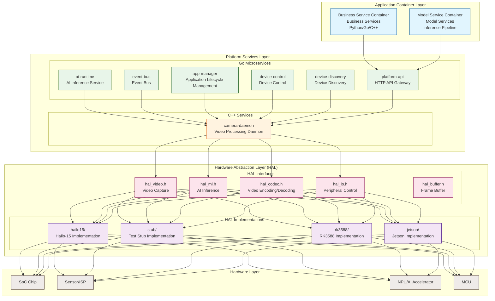

### Layer Responsibilities

#### 1. Application Container Layer

- Runs user-defined applications
- Divided into two categories: business services and model services
- Accesses platform capabilities through SDK
- Fully sandboxed and isolated

#### 2. Platform Services Layer

- **ai-runtime**: AI inference service management, model loading and scheduling, NPU compute quota control
- **camera-daemon**: C++ media pipeline management, outputs Raw/Encoded streams, RTSP server
- **event-bus**: Local event bus, supports wildcard patterns, low latency (< 1ms)
- **app-manager**: Container lifecycle management, manifest parsing, resource quotas
- **device-control**: MCU/peripheral control, light, PTZ, GPIO management
- **device-discovery**: Network device discovery and management (CT-Disc protocol)
- **platform-api**: Web API Gateway, HTTP to gRPC forwarding

#### 3. HAL Layer

Unified hardware interfaces with dynamic loading of platform-specific implementations:
- `hal_video.h`: Camera/ISP management
- `hal_ml.h`: NPU/AI accelerator interface
- `hal_codec.h`: Hardware encoding/decoding (H.264/H.265)
- `hal_io.h`: MCU/GPIO/peripheral control
- `hal_buffer.h`: Unified frame buffer management with DMA-BUF zero-copy support

#### 4. Hardware Layer

- SoC chips and drivers
- Sensor, ISP, NPU
- MCU (controls peripherals)

## Core Components

### Camera Daemon

**Responsibilities:**
- Manages GStreamer Pipeline
- Outputs Raw SHM (for AI use)
- Outputs encoded streams (H.264/H.265)
- Dynamically adjusts ISP parameters
- Supports multiple video sources

**Tech Stack:** C++ + GStreamer

### AI Runtime

**Responsibilities:**
- Model loading and management
- Inference request scheduling
- Compute quota control
- Interacts with HAL.ML
- Supports session management

**Tech Stack:** Go + C++ (HAL binding)

**Key Features:**
- Unary Infer
- Stream Infer
- Multi-model concurrency
- QPS/priority control
- Compute quota management

### Event Bus

**Responsibilities:**
- Local Pub/Sub message bus
- AI result distribution
- Application event reporting
- System event notification

**Tech Stack:** Go

**Features:**
- Topic wildcard support (`*` and `>`)
- Persistence (optional)
- Low latency (< 1ms)
- Batch publishing

### App Manager

**Responsibilities:**
- Container lifecycle management
- Manifest parsing and permission control
- Resource quotas (CPU/memory/AI)
- Security sandbox configuration
- Container image management

**Tech Stack:** Go + containerd

### Device Control

**Responsibilities:**
- MCU communication (UART protocol)
- Light control (white light/IR/IR-Cut)
- PTZ control
- Zoom and focus
- GPIO control
- Device status monitoring

**Tech Stack:** Go + HAL.IO

## Data Flow

### Video Stream Processing

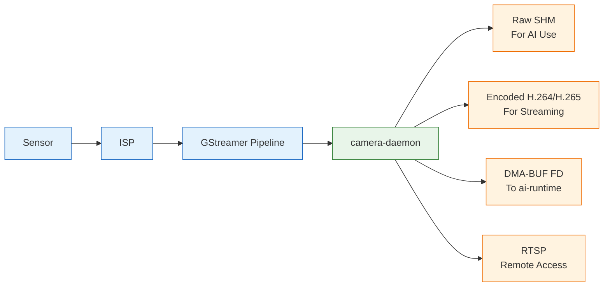

### AI Inference Flow

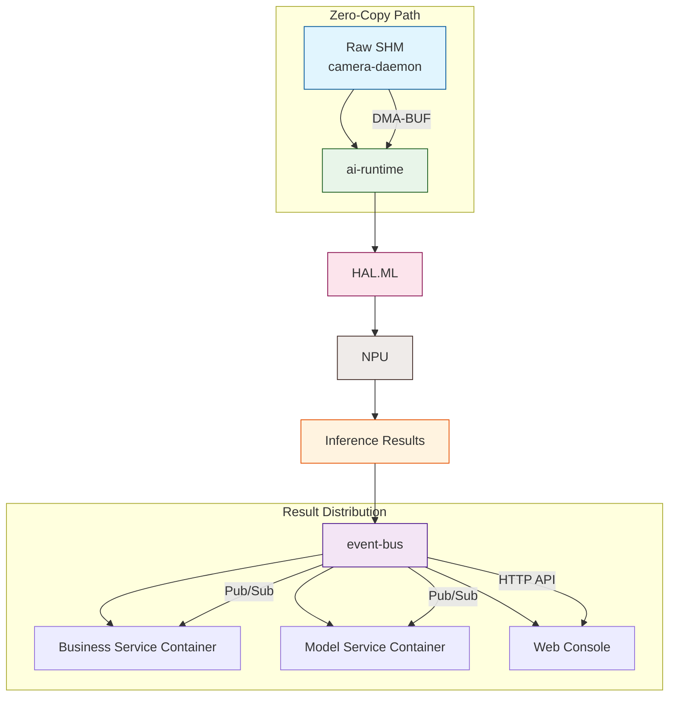

### Event Flow

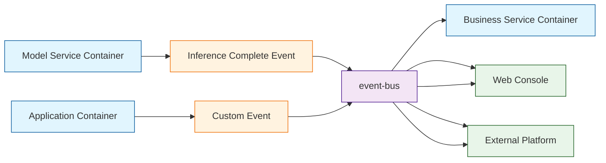

### Peripheral Control Flow

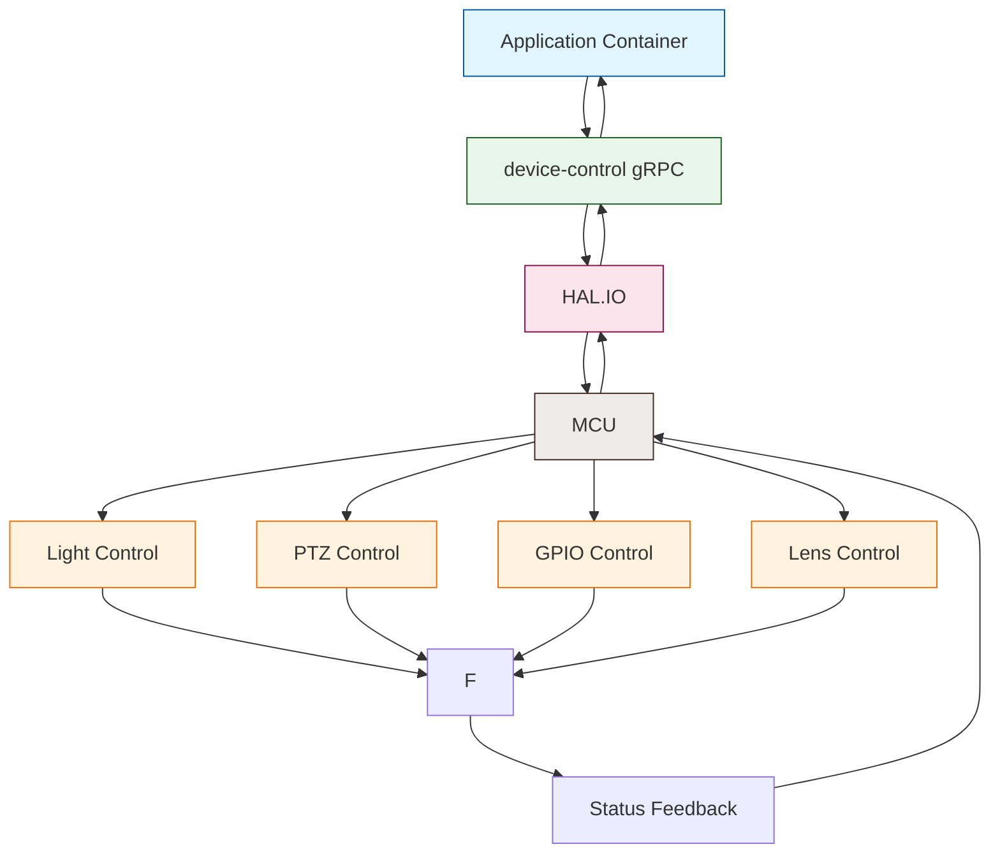

## Service Interaction Diagram

### Microservice Communication Architecture

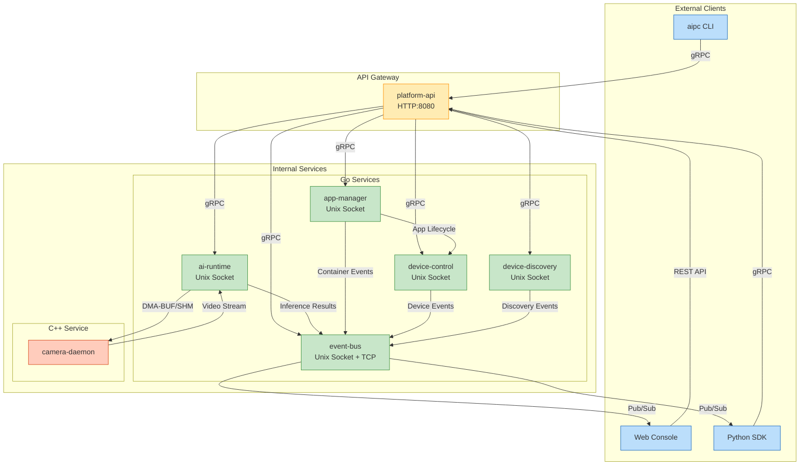

## Deployment Architecture

### SystemD Service Dependencies

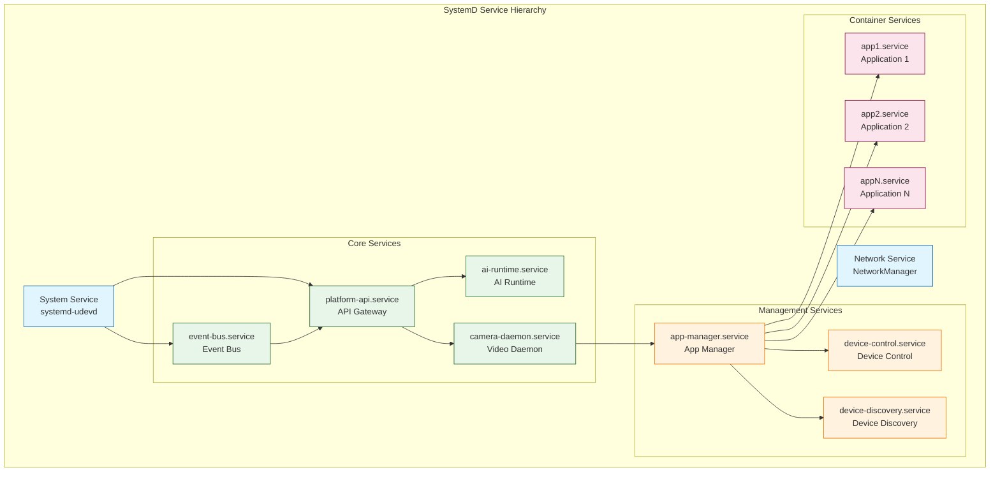

## Security Design

### Container Isolation Architecture

```mermaid
graph TB
    subgraph "Host System"
        HostKernel[Linux Kernel]

        subgraph "Namespace Isolation"
            NamespacePID[PID Namespace]
            NamespaceNET[NET Namespace]
            NamespaceIPC[IPC Namespace]
            NamespaceMNT[MNT Namespace]
            NamespaceUTS[UTS Namespace]
        end

        subgraph "Cgroup Limits"
            CGroupCPU[CPU Quota]
            CGroupMem[Memory Limit]
            CGroupIO[IO Throttle]
        end

        subgraph "Security Modules"
            Seccomp[Seccomp Filtering]
            Capabilities[Capabilities Trimming]
            AppArmor[AppArmor Profile]
        end
    end

    subgraph "Container Runtime"
        Containerd[containerd]
        subgraph "Sandboxed Containers"
            Container1[Application Container 1]
            Container2[Model Container 2]
            ContainerN[Container N]
        end
    end

    subgraph "Platform Services"
        Platform[Go Microservices<br/>No Container]
    end

    %% Isolation Mechanisms
    HostKernel --> NamespacePID
    HostKernel --> NamespaceNET
    HostKernel --> NamespaceIPC
    HostKernel --> NamespaceMNT
    HostKernel --> NamespaceUTS
    HostKernel --> CGroupCPU
    HostKernel --> CGroupMem
    HostKernel --> CGroupIO
    HostKernel --> Seccomp
    HostKernel --> Capabilities
    HostKernel --> AppArmor

    %% Runtime
    NamespacePID --> Containerd
    NamespaceNET --> Containerd
    NamespaceIPC --> Containerd
    NamespaceMNT --> Containerd
    NamespaceUTS --> Containerd
    Containerd --> Container1
    Containerd --> Container2
    Containerd --> ContainerN
    Seccomp --> Platform
    Capabilities --> Platform
    AppArmor --> Platform

    style HostKernel fill:#37474f,stroke:#263238
    style Containerd fill:#607d8b,stroke:#455a64
    style Container1 fill:#e1f5fe,stroke:#01579b
    style Container2 fill:#e1f5fe,stroke:#01579b
    style ContainerN fill:#e1f5fe,stroke:#01579b
    style Platform fill:#e8f5e9,stroke:#1b5e20
```

### Permission Model

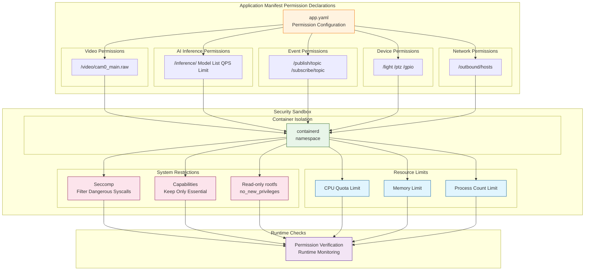

## Extensibility

### Adding a New SoC Flow

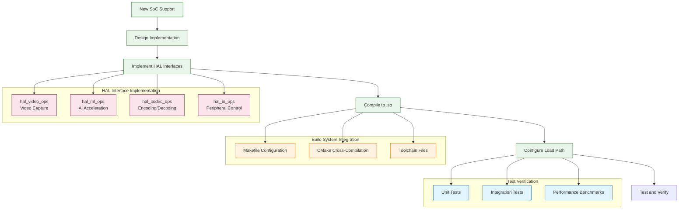

## Performance Considerations

### Zero-Copy Optimization Architecture

```mermaid
graph TB
    subgraph "Video Pipeline"
        subgraph "Sensor Capture"
            Sensor[Sensor<br/>Physical Camera]
        end

        subgraph "Zero-Copy Transfer"
            ISP[ISP<br/>Image Signal Processing]
            DMABUF1[DMA-BUF<br/>Zero-Copy Sharing]
            HAL_V[HAL.Video<br/>Video Abstraction]
        end

        subgraph "Processing Units"
            Camera[Camera-Daemon<br/>GStreamer]
            AI[AI Runtime<br/>Inference Service]
            Codec[HAL.Codec<br/>Encoder]
        end

        subgraph "Output"
            SHM[SHM Memory<br/>Application Container]
            RTSP[RTSP<br/>Streaming]
        end
    end

    %% Zero-Copy Path
    Sensor --> ISP
    ISP --> DMABUF1
    DMABUF1 --> HAL_V
    HAL_V --> Camera
    Camera --> DMABUF1 --> AI
    AI --> DMABUF1 --> Codec

    %% Normal Copy Path
    Camera --> SHM
    Codec --> RTSP

    style Sensor fill:#37474f,stroke:#263238
    style ISP fill:#455a64,stroke:#37474f
    style DMABUF1 fill:#ffeb3b,stroke:#f57f17,bold
    style HAL_V fill:#64b5f6,stroke:#1976d2
    style Camera fill:#81c784,stroke:#388e3c
    style AI fill:#81c784,stroke:#388e3c
    style Codec fill:#81c784,stroke:#388e3c
    style SHM fill:#ffb74d,stroke:#f57c00
    style RTSP fill:#ffb74d,stroke:#f57c00
```

### Concurrent Processing Architecture

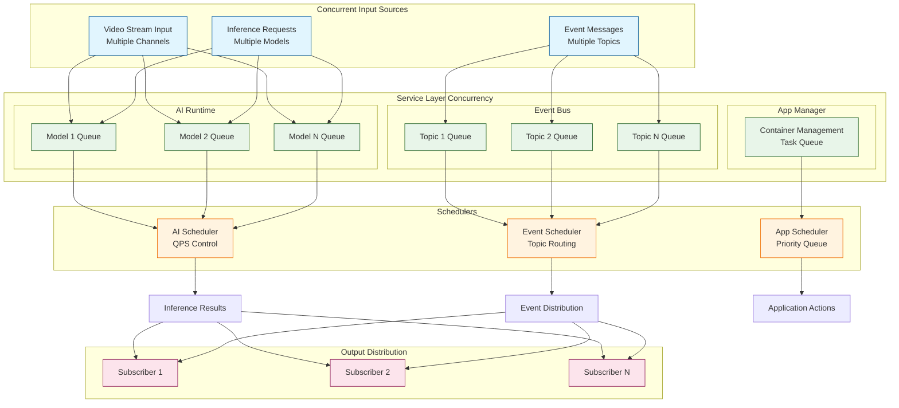

## Reference Documentation

- [HAL Interface Specification](../hal/interfaces.md)
- [Protobuf Protocol](../api/protobuf.md)
- [SDK Development Guide](../sdk/README.md)
- [MCU Communication Protocol](../mcu_protocol/README.md)
