# NE503 AIPC Platform Architecture Analysis Report

## 1. Overall Directory Structure

```mermaid
graph TB
    A[home/work/ne503] --> B[platform/]
    A --> C[hal/]
    A --> D[sdk/]
    A --> E[configs/]
    A --> F[apps/]
    A --> G[web/]
    A --> H[tests/]
    A --> I[tools/]
    A --> J[scripts/]
    A --> K[docker/]
    A --> L[systemd/]
    A --> M[docs/]
    A --> N[build/]

    subgraph "Platform Services Layer"
        B --> B1[ai-runtime/]
        B --> B2[app-manager/]
        B --> B3[event-bus/]
        B --> B4[device-control/]
        B --> B5[device-discovery/]
        B --> B6[platform-api/]
        B --> B7[camera-daemon/]
        B --> B8[common/]
    end

    subgraph "HAL Layer"
        C --> C1[include/]
        C --> C2[accel/hailo15/]
        C --> C3[media/hailo15/]
        C --> C4[media/stub/]
        C --> C5[codec/hailo15/]
        C --> C6[board/hailo15/]
        C --> C7[common/]
    end

    subgraph "SDK Layer"
        D --> D1[python/]
    end

    subgraph "Configuration Layer"
        E --> E1[platform/]
        E --> E2[ai/]
        E --> E3[security/]
        E --> E4[platform-api.yaml]
    end

    subgraph "Application Layer"
        F --> F1[template/]
        F --> F2[examples/]
    end

    subgraph "Web Layer"
        G --> G1[src/]
    end

    subgraph "Test Layer"
        H --> H1[unit/]
        H --> H2[integration/]
    end

    subgraph "Tools Layer"
        I --> I1[aipc-cli/]
        I --> I2[performance-test/]
    end

    subgraph "Scripts Layer"
        J --> J1[build_all.sh]
        J --> J2[test_all.sh]
        J --> J3[start_mvp.sh]
    end

    subgraph "Deployment Layer"
        K --> K1[Dockerfile]
        L --> L1[aipc.target]
    end

    style A fill:#37474f
```

---

## 2. Platform Services Layer

### 2.1 Service Architecture

| Service | Language | Responsibility | Listen Address |
|---------|----------|----------------|----------------|
| **ai-runtime** | Go | AI inference service management | `unix:///run/aipc/ai-runtime.sock` |
| **app-manager** | Go | Container application lifecycle management | `unix:///run/aipc/app-manager.sock` |
| **event-bus** | Go | Event publish/subscribe | `unix:///run/aipc/event-bus.sock` + TCP `127.0.0.1:50053` |
| **device-control** | Go | Device control (light/PTZ/GPIO) | `unix:///run/aipc/device-control.sock` |
| **platform-api** | Go | HTTP API gateway | `:8080` |
| **camera-daemon** | C++ | Video capture/encoding/publishing | - |
| **device-discovery** | Go | Network device discovery and management | `unix:///run/aipc/device-discovery.sock` |

### 2.2 Service Dependency Graph

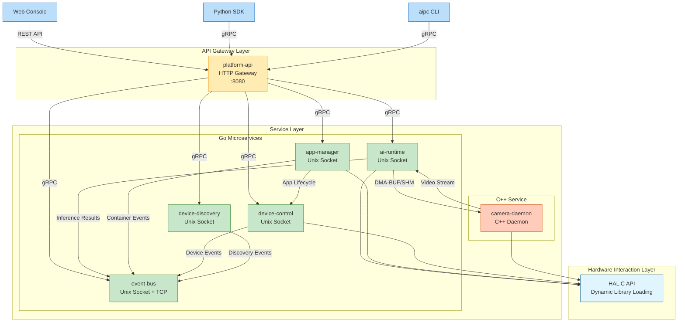

### 2.3 gRPC API Definitions

**inference.proto** (`platform/ai-runtime/proto/inference.proto`):
- `RegisterModel` / `UnregisterModel` / `ListModels` / `GetModelInfo`
- `Infer` - Unary inference
- `StreamInfer` - Streaming inference (subscribe to video stream)
- `CreateSession` / `DestroySession` - Session management
- `GetStats` - Statistics

**app.proto** (`platform/app-manager/proto/app.proto`):
- `InstallApp` / `StartApp` / `StopApp` / `UninstallApp`
- `ListApps` / `GetApp` / `GetAppStats` / `GetAppLogs`

**event.proto** (`platform/event-bus/proto/event.proto`):
- `Publish` / `PublishBatch` - Publish events
- `Subscribe` / `Unsubscribe` - Subscribe to events (supports wildcard `*`)
- `ListTopics` / `GetTopicStats`

**device.proto** (`platform/device-control/proto/device.proto`):
- Light control: `SetWhiteLight`, `SetIrLed`, `SetIrCut`
- PTZ control: `Pan`, `Tilt`, `PTZStop`, `SavePreset`, `CallPreset`
- Lens control: `Zoom`, `Focus`, `SetAutofocus`
- GPIO: `GPIOWrite`, `GPIORead`
- Status queries: `GetDeviceStatus`, `SubscribeEvents`

**camera.proto** (`platform/camera-daemon/proto/camera.proto`):
- Video capture and encoding pipeline management
- RTSP streaming, SHM publishing, DMA-BUF FD publishing
- OSD overlay and AI result rendering

**lens_hal.proto** (`platform/camera-daemon/proto/lens_hal.proto`):
- Lens HAL bridge for zoom, focus, and autofocus control

**discovery.proto** (`platform/device-discovery/proto/discovery.proto`):
- CT-Disc network device discovery protocol
- Device registration and status management

---

## 3. HAL Hardware Abstraction Layer

### 3.1 HAL Interface Design

HAL uses a **function pointer table (Ops)** pattern, supporting runtime dynamic loading of different platform implementations:

| Header | Core Struct | Purpose |
|--------|-------------|---------|
| `hal_video.h` | `HalVideoOps` | Video capture |
| `hal_ml.h` | `HalMLOps` | AI inference |
| `hal_codec.h` | `HalCodecOps` | Video encoding (H264/H265) + OSD |
| `hal_io.h` | `HalIOOps` | MCU peripheral control |
| `hal_buffer.h` | `HalFrameBuffer` | Unified frame buffer (cross-module sharing) |
| `hal_ml_post.h` | `HalMLPostOps` | Post-processing |
| `hal_ml_overlay.h` | `HalMLOverlayOps` | AI result overlay rendering |

### 3.2 HAL Implementation Hierarchy

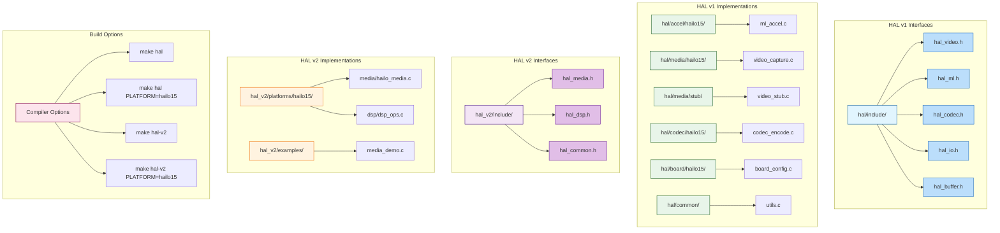

### 3.3 Core Data Structures

**HalFrameBuffer** (`hal/include/hal_buffer.h`):
```c
typedef struct {
    uint64_t sequence, timestamp_ns;
    uint32_t width, height;
    HalPixelFormat format;          // NV12, RGB24, etc.
    HalFrameMemoryType memory_type; // DMA_BUF or CPU_MEMORY
    int      dma_fds[3];            // DMA-BUF fd (zero-copy)
    uint8_t *planes[3];             // CPU pointers
    uint32_t strides[3], sizes[3];
    void    *priv;                  // Reference counting + platform private data
} HalFrameBuffer;
```

**Zero-Copy Mechanism**:
- `HalFrameBuffer` supports reference counting (`hal_frame_buffer_ref` / `hal_frame_buffer_release`)
- Video -> ML -> Codec can share the same DMA-BUF without memory copies

---

## 4. SDK Layer

### 4.1 Python SDK Tech Stack

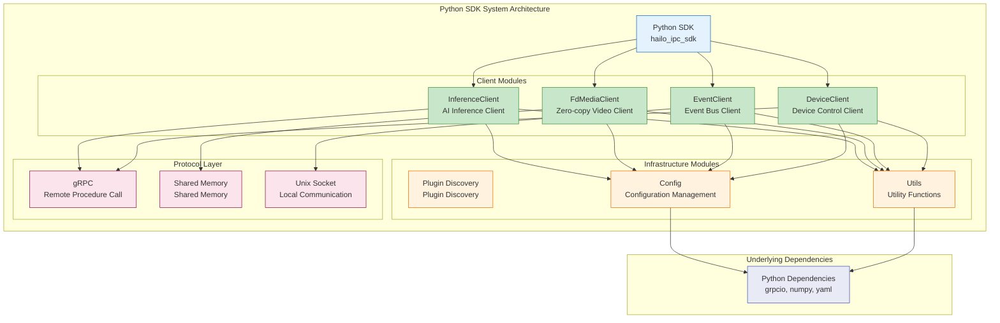

### 4.2 Python SDK Module Functions

| Module | Function |
|--------|----------|
| `inference.py` | `InferenceClient` - AI inference client |
| `media.py` | `FdMediaClient` - Zero-copy video stream client |
| `events.py` | `EventClient` - Event bus client |
| `device.py` | `DeviceClient` - Device control client |
| `plugin.py` | `PluginDiscovery`, `PluginServer` - Plugin system |
| `config.py` | `Config` - Configuration management |

**Usage Example**:
```python
from hailo_ipc_sdk import InferenceClient, EventClient

with InferenceClient() as inf:
    result = inf.infer(image, model_id="person_v1")

events = EventClient()
events.publish("app/alert", {"type": "person_detected"})
```

---

## 5. Web Console

### 5.1 React + TypeScript Architecture

```mermaid
graph TD
    subgraph "Web Console Architecture"
        WC[React + TypeScript + Vite]

        subgraph "Frontend Framework"
            UI1[React Router<br/>Route Management]
            UI2[Zustand<br/>State Management]
            UI3[TanStack Query<br/>Data Fetching]
            UI4[shadcn/ui + Radix<br/>UI Components]
        end

        subgraph "API Layer"
            API1[API Client<br/>gRPC Client]
            API2[HTTP Client<br/>REST API]
            API3[WebSocket<br/>Real-time Communication]
        end

        subgraph "Page Components"
            PG1[Dashboard]
            PG2[Model Management<br/>Models]
            PG3[App Management<br/>Apps]
            PG4[Device Control<br/>Devices]
            PG5[Event Monitoring<br/>Events]
        end

        subgraph "Utility Libraries"
            LIB1[TypeScript<br/>Type Definitions]
            LIB2[ESLint + Prettier<br/>Code Standards]
            LIB3[Vitest<br/>Unit Testing]
        end
    end

    %% Build Output
    subgraph "Build Pipeline"
        BUILD[Vite Build<br/>Bundle Optimization]
        BUILD --> OUT[Static Files<br/>/dist/]
    end

    WC --> UI1
    WC --> UI2
    WC --> UI3
    WC --> UI4
    WC --> API1
    WC --> API2
    WC --> API3
    WC --> PG1
    WC --> PG2
    WC --> PG3
    WC --> PG4
    WC --> PG5
    WC --> LIB1
    WC --> LIB2
    WC --> LIB3
    WC --> BUILD

    style WC fill:#e8f5e9,stroke:#1b5e20
    style UI1 fill:#fff3e0,stroke:#ef6c00
    style UI2 fill:#fff3e0,stroke:#ef6c00
    style UI3 fill:#fff3e0,stroke:#ef6c00
    style UI4 fill:#fff3e0,stroke:#ef6c00
    style API1 fill:#fce4ec,stroke:#880e4f
    style API2 fill:#fce4ec,stroke:#880e4f
    style API3 fill:#fce4ec,stroke:#880e4f
    style PG1 fill:#e1f5fe,stroke:#01579b
    style PG2 fill:#e1f5fe,stroke:#01579b
    style PG3 fill:#e1f5fe,stroke:#01579b
    style PG4 fill:#e1f5fe,stroke:#01579b
    style PG5 fill:#e1f5fe,stroke:#01579b
    style LIB1 fill:#f3e5f5,stroke:#4a148c
    style LIB2 fill:#f3e5f5,stroke:#4a148c
    style LIB3 fill:#f3e5f5,stroke:#4a148c
    style BUILD fill:#e0f2f1,stroke:#00695c
    style OUT fill:#e0f2f1,stroke:#00695c
```

**Directory Structure**: `web/` (React 19 + TypeScript + Vite)

**Build**: `make web`

**Features**:
- System information/status display
- Model management
- Application management
- Device control
- Event monitoring

---

## 6. Configuration System

### 6.1 Configuration File Structure

```mermaid
graph TB
    subgraph "Configuration Directory Structure"
        CONFIG[configs/]

        subgraph "Platform Service Configuration"
            PLAT[platform/]
            PLAT --> PLAT1[app-manager.yaml]
            PLAT --> PLAT2[camera-daemon.yaml]
            PLAT --> PLAT3[device-control.yaml]
            PLAT --> PLAT4[event-bus.yaml]
        end

        subgraph "AI Service Configuration"
            AI[ai/]
            AI --> AI1[ai-runtime.yaml]
        end

        subgraph "Security Configuration"
            SEC[security/]
            SEC --> SEC1[seccomp-default.json]
        end

        subgraph "Global Configuration"
            GLOBAL[platform-api.yaml]
        end
    end

    subgraph "Configuration Hierarchy"
        subgraph "Global Configuration"
            GLOBAL --> GLB_SERVER[Server Configuration]
            GLOBAL --> GLB_LOG[Logging Configuration]
            GLOBAL --> GLB_PERF[Performance Configuration]
        end

        subgraph "Service Configuration"
            PLAT1 --> SVC_APP[Container Management Configuration]
            PLAT1 --> SVC_SSEC[Security Policy Configuration]
            PLAT1 --> SVC_RES[Resource Limit Configuration]

            PLAT2 --> SVC_CAM[Video Pipeline Configuration]
            PLAT2 --> SVC_ENC[Encoder Configuration]
            PLAT2 --> SVC_RTSP[RTSP Configuration]

            AI1 --> SVC_AI[Model Path Configuration]
            AI1 --> SVC_SCHED[Scheduler Configuration]
        end
    end

    style CONFIG fill:#e1f5fe,stroke:#01579b
    style PLAT fill:#c8e6c9,stroke:#388e3c
    style AI fill:#c8e6c9,stroke:#388e3c
    style SEC fill:#c8e6c9,stroke:#388e3c
    style GLOBAL fill:#c8e6c9,stroke:#388e3c
    style PLAT1 fill:#fff3e0,stroke:#ef6c00
    style PLAT2 fill:#fff3e0,stroke:#ef6c00
    style PLAT3 fill:#fff3e0,stroke:#ef6c00
    style PLAT4 fill:#fff3e0,stroke:#ef6c00
    style AI1 fill:#fff3e0,stroke:#ef6c00
    style SEC1 fill:#fff3e0,stroke:#ef6c00
```

### 6.2 Key Configuration Items

**app-manager.yaml** (`configs/platform/app-manager.yaml`):
- Containerd connection configuration
- Security policies (seccomp, capabilities)
- Resource limits (CPU/memory/PIDs)
- AI Runtime / Event Bus integration

**ai-runtime.yaml** (`configs/ai/ai-runtime.yaml`):
- HAL ML library path
- Model repository configuration
- Inference scheduler configuration
- Auto-inference pipeline configuration

---

## 7. Build System

### 7.1 Makefile Target Dependency Graph

```mermaid
graph TB
    subgraph "Makefile Build Targets"
        subgraph "Top-level Targets"
            ALL[all<br/>Default Build]
            TEST[test<br/>Run Tests]
            CLEAN[clean<br/>Clean Build]
            INSTALL[install<br/>System Install]
        end

        subgraph "Build Phases"
            PHASE1[proto<br/>Compile Protobuf]
            PHASE2[hal<br/>Build HAL Library]
            PHASE3[platform<br/>Build Platform Services]
            PHASE4[web<br/>Build Web Console]
            PHASE5[sdk<br/>Build SDK]
        end

        subgraph "Service Builds"
            SVC1[ai-runtime<br/>Go Inference Service]
            SVC2[app-manager<br/>Go App Manager]
            SVC3[event-bus<br/>Go Event Bus]
            SVC4[device-control<br/>Go Device Control]
            SVC5[platform-api<br/>Go API Gateway]
            SVC6[camera-daemon<br/>C++ Daemon]
        end

        subgraph "Test Builds"
            UNIT[unit<br/>Unit Tests]
            INTE[integration<br/>Integration Tests]
            MVP[mvp<br/>MVP Verification]
        end
    end

    %% Build Flow
    ALL --> PHASE1
    ALL --> PHASE2
    ALL --> PHASE3
    PHASE1 --> PHASE2
    PHASE2 --> PHASE3
    PHASE3 --> SVC1
    PHASE3 --> SVC2
    PHASE3 --> SVC3
    PHASE3 --> SVC4
    PHASE3 --> SVC5
    PHASE3 --> SVC6
    PHASE3 --> PHASE4
    PHASE4 --> PHASE5
    TEST --> UNIT
    TEST --> INTE
    TEST --> MVP

    %% Output Directory
    subgraph "Build Output Directory"
        BUILD[build/output/]

        subgraph "Executables"
            BUILD --> EXE1[ai-runtime]
            BUILD --> EXE2[app-manager]
            BUILD --> EXE3[event-bus]
            BUILD --> EXE4[device-control]
            BUILD --> EXE5[platform-api]
            BUILD --> EXE6[camera-daemon]
        end

        subgraph "HAL Libraries"
            BUILD --> HAL[hal/]
            HAL --> HAL1[stub/libhal*.so]
            HAL --> HAL2[hailo15/libhal*.so]
            HAL --> HAL3[Test Tools]
        end
    end

    SVC1 --> EXE1
    SVC1 --> EXE2
    SVC1 --> EXE3
    SVC1 --> EXE4
    SVC1 --> EXE5
    SVC1 --> EXE6
    SVC2 --> EXE1
    SVC2 --> EXE2
    SVC2 --> EXE3
    SVC2 --> EXE4
    SVC2 --> EXE5
    SVC2 --> EXE6
    SVC3 --> EXE1
    SVC3 --> EXE2
    SVC3 --> EXE3
    SVC3 --> EXE4
    SVC3 --> EXE5
    SVC3 --> EXE6
    SVC4 --> EXE1
    SVC4 --> EXE2
    SVC4 --> EXE3
    SVC4 --> EXE4
    SVC4 --> EXE5
    SVC4 --> EXE6
    SVC5 --> EXE1
    SVC5 --> EXE2
    SVC5 --> EXE3
    SVC5 --> EXE4
    SVC5 --> EXE5
    SVC5 --> EXE6
    SVC6 --> EXE1
    SVC6 --> EXE2
    SVC6 --> EXE3
    SVC6 --> EXE4
    SVC6 --> EXE5
    SVC6 --> EXE6

    style ALL fill:#e8f5e9,stroke:#1b5e20
    style TEST fill:#e8f5e9,stroke:#1b5e20
    style CLEAN fill:#e8f5e9,stroke:#1b5e20
    style INSTALL fill:#e8f5e9,stroke:#1b5e20
    style PHASE1 fill:#fff3e0,stroke:#ef6c00
    style PHASE2 fill:#fff3e0,stroke:#ef6c00
    style PHASE3 fill:#fff3e0,stroke:#ef6c00
    style PHASE4 fill:#fff3e0,stroke:#ef6c00
    style PHASE5 fill:#fff3e0,stroke:#ef6c00
    style SVC1 fill:#e1f5fe,stroke:#01579b
    style SVC2 fill:#e1f5fe,stroke:#01579b
    style SVC3 fill:#e1f5fe,stroke:#01579b
    style SVC4 fill:#e1f5fe,stroke:#01579b
    style SVC5 fill:#e1f5fe,stroke:#01579b
    style SVC6 fill:#e1f5fe,stroke:#01579b
    style UNIT fill:#fce4ec,stroke:#880e4f
    style INTE fill:#fce4ec,stroke:#880e4f
    style MVP fill:#fce4ec,stroke:#880e4f
    style BUILD fill:#f3e5f5,stroke:#4a148c
    style EXE1 fill:#e1bee7,stroke:#6a1b9a
    style EXE2 fill:#e1bee7,stroke:#6a1b9a
    style EXE3 fill:#e1bee7,stroke:#6a1b9a
    style EXE4 fill:#e1bee7,stroke:#6a1b9a
    style EXE5 fill:#e1bee7,stroke:#6a1b9a
    style EXE6 fill:#e1bee7,stroke:#6a1b9a
    style HAL fill:#e1bee7,stroke:#6a1b9a
    style HAL1 fill:#ce93d8,stroke:#7b1fa2
    style HAL2 fill:#ce93d8,stroke:#7b1fa2
    style HAL3 fill:#ce93d8,stroke:#7b1fa2
```

### 7.2 Build Output

```
build/output/
├── ai-runtime
├── app-manager
├── event-bus
├── device-control
├── platform-api
├── camera-daemon
└── hal/{stub,hailo15}/
    ├── libhal*.so
    └── hello_world, video_test, ...
```

---

## 8. Test System

### 8.1 Test Architecture

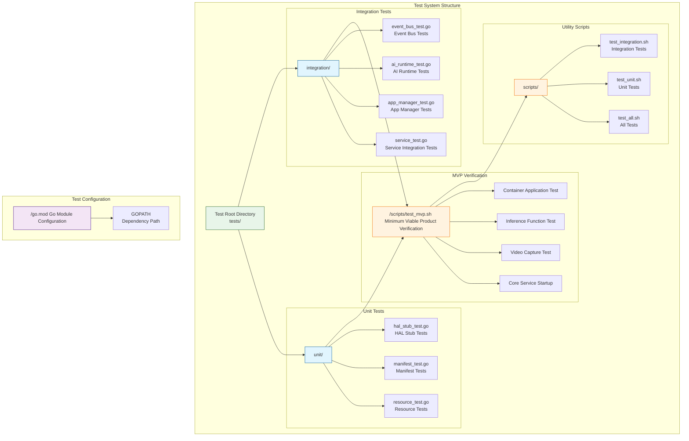

**Running Tests**:
- `make test` - All tests
- `make test-unit` - Unit tests
- `make test-integration` - Integration tests

---

## 9. Camera Daemon (C++)

### 9.1 Camera Daemon Architecture

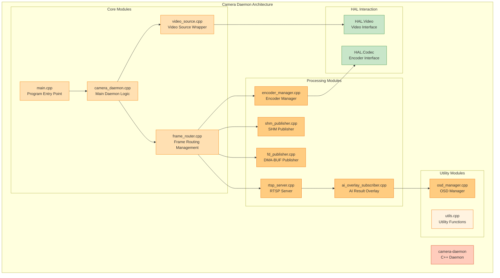

**Source Files** (`platform/camera-daemon/src/`):

| File | Function |
|------|----------|
| `main.cpp` | Entry point, loads configuration, signal handling |
| `camera_daemon.cpp` | Main daemon logic |
| `video_source.cpp` | HAL.Video wrapper |
| `encoder_manager.cpp` | HAL.Codec encoder management |
| `frame_router.cpp` | Frame routing (Video -> ML/Encoder) |
| `shm_publisher.cpp` | Raw frame SHM publishing |
| `fd_publisher.cpp` | DMA-BUF FD publishing (for ai-runtime) |
| `encoded_publisher.cpp` | Encoded frame publishing |
| `rtsp_server.cpp` | RTSP streaming server |
| `ai_overlay_subscriber.cpp` | Subscribe to AI results for OSD overlay |
| `osd_manager.cpp` | OSD management |

---

## 10. Application Container System

### 10.1 Container Lifecycle Management

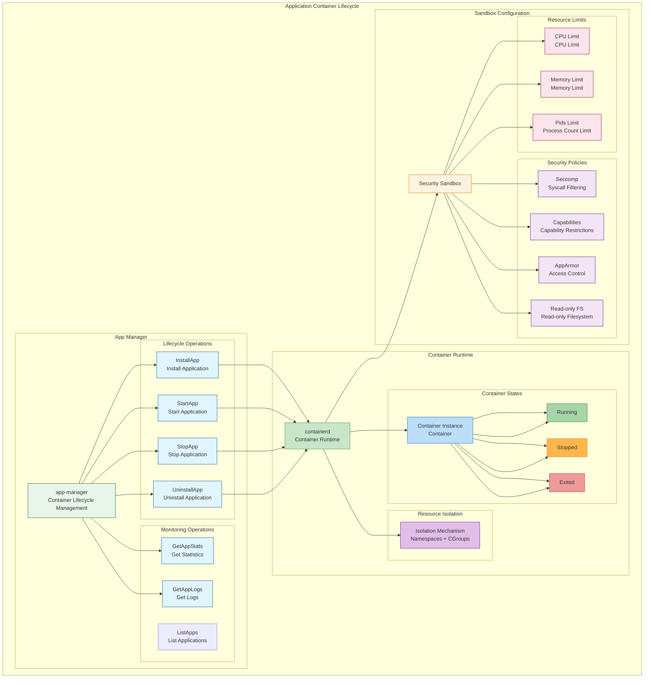

### 10.2 Application Manifest

**Application Manifest** (`apps/template/app.yaml`):
```yaml
metadata:
  id: my_app
  name: My Application
  version: 1.0.0

spec:
  image: registry.local/my-app:1.0.0
  resources:
    cpu: "50%"
    memory: "256Mi"

  permissions:
    video: [cam0_main.raw]
    inference:
      models: [person_v1]
      max_qps: 30
    events:
      publish: [app/my_app/*]
      subscribe: [model/*/detections]
    device:
      light: true
      ptz: false
```

**Security Isolation** (`configs/platform/app-manager.yaml`):
- Seccomp profile
- Capabilities trimming
- Namespace isolation
- Read-only root filesystem
- `no_new_privileges`

---

## 11. Dependency Summary

### 11.1 Dependency Architecture

```mermaid
graph TB
    subgraph "External Dependencies"
        EXTERNAL[External Dependencies]

        subgraph "Go Dependencies"
            GO_DEP[gRPC, containerd, Viper, Cobra, gorilla/websocket]
        end

        subgraph "C++ Dependencies"
            CPP_DEP[Hailo SDK, OpenCV, gRPC]
        end

        subgraph "Python Dependencies"
            PY_DEP[grpcio, numpy, pyyaml]
        end

        subgraph "Frontend Dependencies"
            WEB_DEP[React, TypeScript, Vite]
        end
    end

    subgraph "Platform Services Layer"
        PLATFORM[Platform Services Layer]

        subgraph "Go Microservices"
            GO_SERVICE[Go Microservices]
            GO_SERVICE --> GO1[ai-runtime]
            GO_SERVICE --> GO2[event-bus]
            GO_SERVICE --> GO3[app-manager]
            GO_SERVICE --> GO4[device-control]
            GO_SERVICE --> GO5[device-discovery]
            GO_SERVICE --> GO6[platform-api]
        end

        subgraph "C++ Service"
            CPP_SERVICE[camera-daemon]
        end
    end

    subgraph "HAL Layer"
        HAL[HAL Layer]

        subgraph "HAL Implementations"
            HAL_IMPL[HAL Implementations]
            HAL_IMPL --> HAL1[stub]
            HAL_IMPL --> HAL2[hailo15]
            HAL_IMPL --> HAL3[rk3588]
            HAL_IMPL --> HAL4[jetson]
        end
    end

    %% Dependency Relationships
    EXTERNAL --> GO_DEP
    EXTERNAL --> CPP_DEP
    EXTERNAL --> PY_DEP
    EXTERNAL --> WEB_DEP
    GO_DEP --> GO_SERVICE
    CPP_DEP --> CPP_SERVICE
    PY_DEP --> PYTHON_SDK
    WEB_DEP --> WEB_CONSOLE

    GO_SERVICE --> PLATFORM
    CPP_SERVICE --> PLATFORM
    PLATFORM --> HAL
    HAL --> HAL_IMPL

    style EXTERNAL fill:#37474f,stroke:#263238
    style GO_DEP fill:#e8f5e9,stroke:#1b5e20
    style CPP_DEP fill:#e8f5e9,stroke:#1b5e20
    style PY_DEP fill:#e8f5e9,stroke:#1b5e20
    style WEB_DEP fill:#e8f5e9,stroke:#1b5e20
    style PLATFORM fill:#c8e6c9,stroke:#388e3c
    style GO_SERVICE fill:#c8e6c9,stroke:#388e3c
    style CPP_SERVICE fill:#ffccbc,stroke:#d84315
    style HAL fill:#bbdefb,stroke:#1565c0
    style HAL_IMPL fill:#bbdefb,stroke:#1565c0
```

---

## 12. Technology Stack Analysis

### 12.1 Technology Stack Mind Map

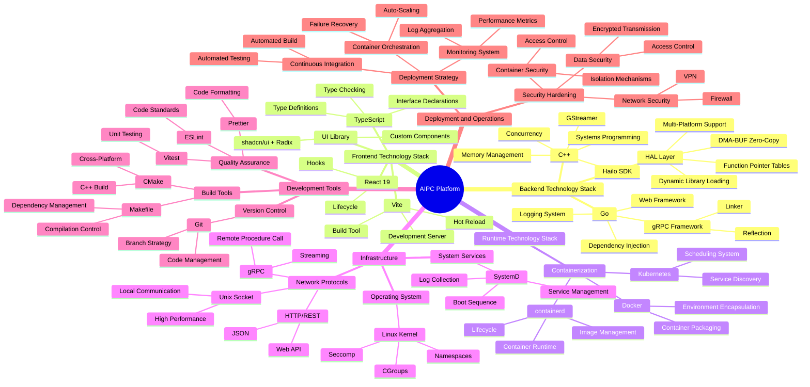

---

## 13. Key Technical Features

### 13.1 Zero-Copy Optimization Implementation

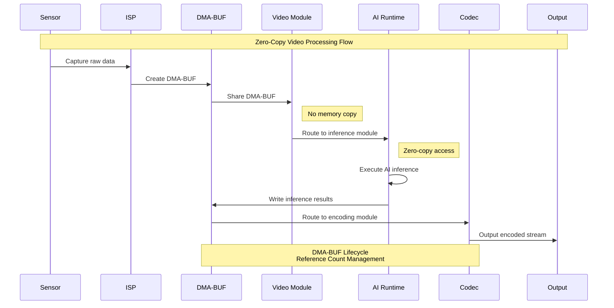

### 13.2 Container Isolation Architecture

```mermaid
graph TD
    subgraph "Host System"
        HOST[Linux Host]

        subgraph "Kernel Features"
            KERNEL[Kernel Features]
            KERNEL --> NS[Namespaces<br/>Isolation]
            KERNEL --> CG[CGroups<br/>Limits]
            KERNEL --> SEC[Security<br/>Modules]
        end

        subgraph "Platform Services"
            PLATFORM[Go Microservices<br/>Running Without Containers]
        end
    end

    subgraph "Container Runtime"
        subgraph "Containerd Runtime"
            RUNTIME[containerd<br/>Container Runtime]
            RUNTIME --> SANDBOX[Sandbox Environment]

            subgraph "Isolated Containers"
                CONTAINER1[Application Container 1<br/>Isolated Space]
                CONTAINER2[Model Container 2<br/>Isolated Space]
                CONTAINERN[Container N<br/>Isolated Space]
            end
        end
    end

    %% Isolation Mechanisms
    KERNEL --> NS
    KERNEL --> CG
    KERNEL --> SEC

    NS --> RUNTIME
    RUNTIME --> SANDBOX
    SANDBOX --> CONTAINER1
    SANDBOX --> CONTAINER2
    SANDBOX --> CONTAINERN

    KERNEL --> SEC --> PLATFORM

    style HOST fill:#37474f,stroke:#263238
    style KERNEL fill:#455a64,stroke:#37474f
    style PLATFORM fill:#4caf50,stroke:#2e7d32
    style RUNTIME fill:#607d8b,stroke:#455a64
    style SANDBOX fill:#90a4ae,stroke:#546e7a
    style CONTAINER1 fill:#e1f5fe,stroke:#01579b
    style CONTAINER2 fill:#e1f5fe,stroke:#01579b
    style CONTAINERN fill:#e1f5fe,stroke:#01579b
```

### 13.3 Multi-Platform Support Architecture

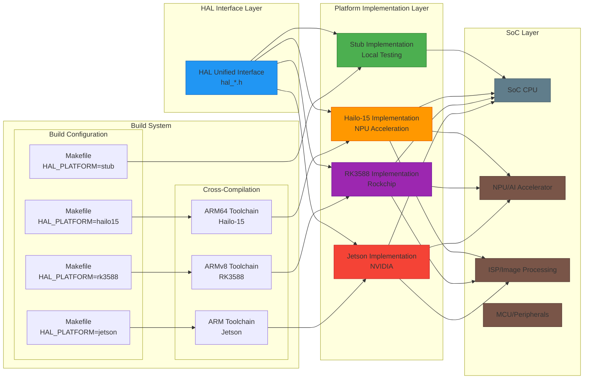

---

## 14. Summary

The AIPC Platform is a comprehensive edge AI computing platform with the following key features:

1. **Zero-Copy Optimization** - DMA-BUF enables copy-free transmission for Video->ML->Codec
2. **Container Isolation** - containerd + seccomp + capabilities security isolation
3. **Multi-Platform Support** - HAL Ops pattern supports Hailo-15/RK3588/Jetson
4. **Event-Driven** - Pub/Sub pattern for inter-service communication
5. **gRPC Communication** - Unix Socket for efficient local IPC
6. **Shared Memory** - SHM for video frame transmission

Through this architecture design, the AIPC Platform achieves a high-performance, highly secure, and highly scalable edge AI computing platform that meets the requirements of various edge AI applications including smart IP cameras, industrial cameras, and edge boxes.
