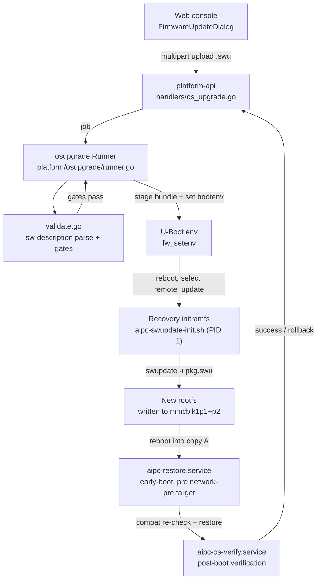
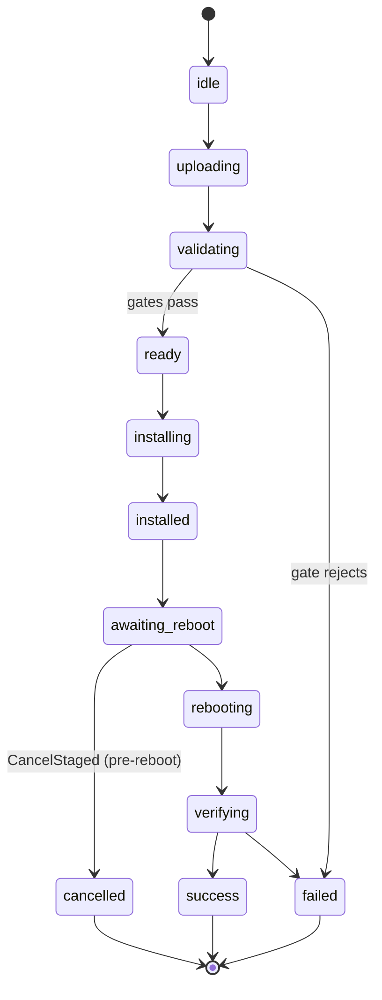

# OS Image Upgrade & AIPC Restore — Design

> Companion to [`os-upgrade.md`](./os-upgrade.md), which covers the operational /
> deployment view. This document is the **design view**: the recovery subsystem,
> the A/B vs single-recovery flows, and the compatibility gates that govern
> whether an upgrade is allowed to proceed.
>
> All references are `file:line` against the current tree. Values shown
> (`1.12.0`, compat-level `1`, etc.) reflect the image under
> `/opt/meta-hailo-os` at the time of writing.

---

## 1. Two things called "recovery" — disambiguate first

The BSP layer contains two unrelated artifacts that both carry the word
"recovery". They are easy to confuse and operate at completely different
layers.

| | OS-upgrade recovery (this document) | SoC UART recovery-fw |
|---|---|---|
| Recipe | `meta-hailo-camthink/recipes-extended/images/swupdate-image.bbappend` + `aipc-swupdate-init.sh` | `meta-hailo-soc/.../recipes-bsp/recovery-fw/recovery-fw.bb` |
| Physical form | initramfs (kernel FIT + minimal gzip rootfs) | single binary `hailo15_uart_recovery_fw.bin` |
| Origin | built locally by BitBake | downloaded from AWS, signed via `hailo15_scu_firmware_sign` |
| Purpose | rewrite the rootfs to complete an OS upgrade | recover a bricked SoC over UART/USB at the SCU level |
| Referenced by | `recovery.go`, `min-recovery-version`, `/data/aipc/recovery` | boot ROM / on-chip SCU — **never** the OS-upgrade flow |

Everything below refers to the **OS-upgrade recovery**.

---

## 2. Architecture overview



The upgrade crosses four execution contexts: the running OS (platform-api +
osupgrade), the U-Boot environment, the recovery initramfs (PID 1), and the
booted new OS (aipc-restore then aipc-os-verify). State is persisted on the
`/data` partition so it survives every context switch.

---

## 3. The recovery bundle

A self-contained mini-Linux whose only job is to run SWUpdate once and rewrite
the rootfs, because a running rootfs cannot safely replace itself.

### 3.1 On-device layout

```text
/data/aipc/recovery/
├── manifest.json                       # metadata + checksums
├── fitImage-hailo15-ne503.bin          # kernel + dtb (FIT)
└── swupdate-image-hailo15-ne503.ext4.gz # recovery rootfs (gzip), contains init
```

`DefaultRecoveryDir = "/data/aipc/recovery"` (`recovery.go:17`).

### 3.2 manifest.json schema

`RecoveryManifest` (`recovery.go:27-36`):

```json
{
  "format": 1,
  "machine": "hailo15-ne503",
  "bsp_version": "1.12.0",
  "recovery_version": "1.12.0",
  "local_update_protocol": "single-recovery",
  "secure_boot_key_id": "<optional>",
  "fit_image":  { "file": "fitImage-...",      "sha256": "...", "size": 0 },
  "rootfs":     { "file": "swupdate-image-...", "sha256": "...", "size": 0 }
}
```

### 3.3 Build

`aipc-bootstrap_1.0.bb:89-102` stages the fitImage (from kernel `do_deploy`)
and the recovery rootfs (from `swupdate-image` `do_image_complete`) into
`${RECOVERY_DIR}` and writes `manifest.json` with `recovery_version = OS_VERSION`.
If either artifact is missing the build **aborts** with `bbfatal` — the recipe
comment is explicit: a missing bundle bricks devices on the next single-recovery
upgrade, so it must not silent-skip.

### 3.4 Load-time verification

`LoadRecoveryBundle` (`recovery.go:45`) rejects the bundle unless:

- `manifest.format == 1`
- `manifest.machine == expectedMachine`
- `manifest.local_update_protocol == "single-recovery"` (`SingleRecoveryMarker`)
- `recovery_version` is non-empty
- both artifacts exist, are regular files, and match the recorded **size + SHA-256**
  (`validateRecoveryArtifact`)
- the rootfs is valid gzip **and** its decompressed stream contains the literal
  `AIPC_LOCAL_RECOVERY_V1` marker (`recoveryContainsMarker`) — proving it really
  is the AIPC recovery init, not a same-named file

`RecoveryBundle.Compatible(target)` (`recovery.go:92`) then applies the
`min-recovery-version` and `secure-boot-key-id` gates (see §6).

---

## 4. Single-recovery upgrade flow

NE503 ships the legacy single-copy partition layout
(`p1=boot, p2=rootfs, p3=data`). The dual A/B path exists in code but the
deployed devices use single-recovery; this section tracks that path.

### 4.1 Job state machine



States are defined at `store.go:18-30`. `Job.Terminal()`
(`store.go:68-70`) is `success | failed | cancelled`. Note `rollback` is a
state but **not** terminal — it indicates a verification-driven boot-copy flip
still in progress.

### 4.2 Staging — `installSingleRecovery` (`runner.go:197-274`)

1. `LoadRecoveryBundle(RecoveryDir, Machine)` — load + verify the bundle (§3.4).
2. `ensureRecoveryBootMounted()` — mount the boot partition at
   `/run/aipc-os-recovery-boot`.
3. `stageBundledRecovery()` — back up the existing boot files into
   `JobDir/boot-backup/`, then atomically copy the bundled `fitImage` and
   recovery rootfs onto the boot partition. A captured `restoreBoot` closure
   undoes this on any later failure.
4. Resolve the uploaded `.swu` as a path **relative to `/data`** and prefix
   `local:` — the recovery init uses this prefix to pick `run_local_update`
   over TFTP.
5. Capture a snapshot of the current U-Boot values (`saveBootEnvSnapshot`) so
   cancel/restore can replay them exactly.
6. `fw_setenv` three keys:
   - `swupdate_update_filename = local:/<rel>/<job>.swu`
   - `swupdate_update_modes = copy-a`
   - `setup_swupdate_update_filename = true` — neutralizes the U-Boot helper
     that would otherwise reset the filename to its TFTP default during recovery
     boot; without it the initramfs never finds the uploaded SWU and falls back
     to a stale bundled image.
7. `setCopy("remote_update")` — select the recovery boot image.
8. `sync`, then `job.State = awaiting_reboot`, `RebootRequired = true`.

### 4.3 Recovery PID-1 — `aipc-swupdate-init.sh`

Installed as `/sbin/init.initscripts-hailo-swupdate` by `swupdate-image.bbappend`.
Deliberately minimal (no bash process substitution, runs on minimal images).
`run_local_update`:

1. `mount /dev/mmcblk1p3 /data` — find the uploaded package.
2. Resolve `SWUPDATE_UPDATE_FILENAME=local:...` to `/data/.../<job>.swu`.
3. `swupdate -i <pkg>.swu -v -m -M -e "stable,copy-a"` — write `p1`+`p2`.
4. `/etc/set_sw_image.sh a` — select copy A for next boot.
5. `echo ok > recovery.success` → `reboot -f`.

On any failure it drops into `recovery_shell`: writes
`<JobDir>/recovery.failed`, starts an emergency shell on the recovery console,
and **never exits PID 1** (exiting would panic the kernel). The verify phase
reads `recovery.failed` / `recovery.success` to determine outcome.

### 4.4 Verify — post-reboot

`checkBootedCompatibility` (`runner.go:678-697`) and the surrounding verify
logic confirm:

- `recovery.success` present, `recovery.failed` absent
- the actually-booted copy matches the expected one
- the booted OS version equals the target version exactly
- `aipc-restore` has run to completion (restore-done marker)
- platform services stay healthy for the watch window (~60 s)

On failure the boot copy is flipped back and the job is marked failed.

### 4.5 Cancel — `cancelSingleRecovery` (`runner.go:746-804`)

Undoes staging before the device reboots:

1. Restore the boot-partition files from `JobDir/boot-backup/`.
2. Restore the exact U-Boot environment captured before staging.
3. Restore `PreviousCopy` as the selected boot copy.
4. Remove the env snapshot and the boot-backup directory (only after every
   boot-env operation has succeeded, so a partial cancellation stays
   recoverable).

> **Known hardcoding:** `cancelSingleRecovery` (runner.go:764-765) references
> the artifact names `fitImage` and `swupdate-image-hailo15-ne503.ext4.gz`
> literally, while the loader (`recoveryArtifactPath`) only requires the
> `fitImage` / `swupdate-image` prefixes. This is recorded as-is; it is not
> changed by this document.

---

## 5. AIPC restore — the early-boot reconciliation

`aipc-restore.service` ships inside the OS image and runs before
`network-pre.target`. Its job is to reconcile the persistent `/data` runtime
with a freshly written rootfs. Source:
`meta-hailo-camthink/recipes-apps/aipc-bootstrap/files/aipc-restore` (201 lines).

### 5.1 Phases

| # | Phase | Behavior |
|---|---|---|
| 1 | No-op guard | If `current` symlink is absent, no upgrade backup is selected → `exit 0`. |
| 2 | Traversal guard | Resolved `BACKUP_DIR` must live under `BACKUP_ROOT`, else fail. |
| 3 | Idempotency | `STATE_ROOT/<job>.done` present → already restored on this OS, skip. |
| 4 | Backup integrity | Require `manifest.json`, `SHA256SUMS`, `status == ready`; then `sha256sum -c`. |
| 5 | Device identity | `safe_extract network.tar.gz`, `ssh.tar.gz` (each archive scanned for absolute / `..` paths first). |
| 6 | **Compatibility re-check** | `check_compatibility /data/aipc/app-manifest.json` — re-runs all four gates in shell. Failure → maintenance mode. |
| 7 | Runtime extract | `safe_extract aipc.tar.gz`, `runtime.tar.gz`, `systemd.tar.gz`. |
| 8 | OS-owned units | Never let a backup override `aipc-restore/firstboot/autostart/os-verify.service`; the vendor copy from the new rootfs always wins. |
| 9 | `/usr/bin` rebuild | Re-point `/usr/bin/<svc>` → `/data/aipc/bin/<svc>` for the ordered service list + `aipc-cli`. |
| 10 | `/usr/libexec` rebuild | Re-point `aipc-os-updater`, `aipc-compat-check` → `/data/aipc/libexec/*`. Boot helpers (`aipc-restore/firstboot/autostart`) stay real files baked into the image. |
| 11 | Finalize | `daemon-reload`, re-enable OS units, `ldconfig`. Fail if `platform-api` is still missing. |
| 12 | Commit | Write `.done`, clear `last-error` and the maintenance marker, `sync`. |

### 5.2 Maintenance mode

Any failure calls `fail()`, which writes `STATE_ROOT/last-error` and creates
`/run/aipc-maintenance-marker`. The device stays in a maintenance state rather
than booting into an inconsistent runtime. Phase 6 (the compatibility
re-check) is the most common cause of maintenance mode — it is the
defense-in-depth gate that catches a mismatch even if the Go-side verify was
somehow bypassed.

### 5.3 Why restore exists separately from SWUpdate

The AIPC release tree (binaries, libraries, configs, models, applications)
lives under the canonical `/data/aipc` root on persistent `/data`, so it
**survives the rootfs rewrite in place** and is no longer backed up. Only
`/usr/bin` and `/usr/libexec` symlinks (which live on the rewritten rootfs)
need deterministic rebuilding — that is what phases 9-10 do. The backup under
`/data/backups/aipc-os-upgrade/` carries only the independently versioned
application units plus device-specific `network`/`ssh` and the `app-manifest`.

---

## 6. Compatibility gates

Four gates decide whether an upgrade is allowed. Each compares values drawn
from up to four sources:

- **SWU package** — fields parsed from `sw-description` by regexes in
  `validate.go:51-62`
- **Booted OS** — `/etc/aipc-os-release` (read by `LoadOSCompatibility`,
  `compatibility.go:49`)
- **App** — `/data/aipc/app-manifest.json` (read by `LoadAppManifest`,
  `compatibility.go:76`; resolved robustly by `ResolveAppManifestPath` across
  `/data/aipc`, `/opt/aipc`, `/data` roots)
- **On-disk data** — `/data/aipc-data/schema-version` (single integer, read by
  `ReadDataSchema`, `compatibility.go:154`)

### 6.1 Summary

| Gate | Semantics | Locks | Sources | Error code |
|---|---|---|---|---|
| `aipc-compat-level` | strict `==` | binary / runtime interface (HAL, proto, sysfs, container ABI) | SWU + OS + App | `APP_COMPAT_LEVEL_MISMATCH` |
| `data-schema` | `==` + range `∈` | persistent data serialization format | SWU + OS + App + on-disk | `APP_DATA_SCHEMA_UNSUPPORTED` |
| `min-recovery-version` | range `>=` | recovery toolchain forward-compat | SWU + bundled recovery | (recovery.go:99-105) |
| `machine` / `product` | strict `==` | hardware identity | SWU + OS + App | `APP_MACHINE_MISMATCH` / `APP_PRODUCT_MISMATCH` |

### 6.2 `aipc-compat-level` — paired release contract

- SWU: `aipc-compat-level = "1"`  (parsed by `compatLevelRE`, validate.go:61)
- OS: `AIPC_COMPAT_LEVEL=1` in `/etc/aipc-os-release`
- App: `required_compat_level: 1` in `app-manifest.json`

Enforced at `compatibility.go:178` as **strict equality** —
`target.CompatLevel != app.RequiredCompatLevel` → `APP_COMPAT_LEVEL_MISMATCH`.

Why `==` and not `>=`: compat-level is a *pairing* contract, not a
forward-compat range. The OS runtime interface surface must be *exactly* the
one the App was compiled against. Either side changing the interface forces a
bump and a coordinated re-release.

### 6.3 `data-schema` — range + migration

- SWU: `data-schema = "1"`
- OS: `DATA_SCHEMA=1` in `/etc/aipc-os-release`
- On-disk: integer in `/data/aipc-data/schema-version`
- App: `target_data_schema: 1` + `supported_data_schema: [1]` in
  `app-manifest.json`

Unlike compat-level, the App declares a **list** of schemas it can read. The
gate at `compatibility.go:188-199` fails unless **all three** hold:

1. `target.DataSchema == currentSchema` — OS schema matches what is on disk
2. `app.TargetDataSchema == target.DataSchema` — App and OS agree on the target
3. `currentSchema ∈ app.SupportedDataSchema` — App can actually parse the data

This range semantics enables migration: bump the schema, ship a migrator in
`aipc-restore`, and keep the old schema in `supported_data_schema` until all
data is converted. compat-level cannot do this — it is a hard generational
break.

### 6.4 `min-recovery-version` — recovery toolchain floor

- SWU: `min-recovery-version = "1.0.1"`
- Bundled recovery: `recovery_version` in `/data/aipc/recovery/manifest.json`

Enforced at `recovery.go:99-105`: if
`compareNumericVersions(bundled.recovery_version, target.min_recovery_version) < 0`,
the upgrade is rejected. This protects against an *old* recovery initramfs
trying to install a *new* package whose `sw-description` / partition layout /
SCU-bootloader steps it does not understand — the recovery that actually
rewrites the rootfs must be new enough to handle the target.

### 6.5 `machine` / `product`

`compatibility.go:166-177`. `machine` is mandatory and compared
case-insensitively; `product` is compared only when both sides declare it.

### 6.6 Enforcement matrix

| Gate | validate (presence) | install pre | verify post-reboot | aipc-restore (shell) |
|---|---|---|---|---|
| compat-level | validate.go:199 | runner.go:659 | runner.go:691 | aipc-restore:55,74 |
| data-schema | validate.go:199 | runner.go:664 | runner.go:694 | aipc-restore:72-77 |
| min-recovery-version | os_upgrade.go:243 (→ recovery.go:99-105) | — | — | — |
| machine / product | — | runner.go:659 | runner.go:697 | aipc-restore:65-70 |

validate.go:199 is a shared presence check: when `RequireCompatibility` is set,
the SWU must carry **both** `aipc-compat-level` and `data-schema` or it is
rejected before anything else runs.

---

## 7. Job record — key fields

`Job` struct (`store.go:33-65`). The fields that drive the flow:

```text
State                       idle...cancelled (see §4.1)
UpgradeMode                 "single" | "dual"
CurrentCopy / TargetCopy / PreviousCopy   boot-copy tracking
RecoveryVersion             bundled recovery version (from manifest)
CompatLevel / DataSchema    parsed from sw-description, replayed at verify
CompatibilityValid          gates passed at install time
SignatureValid              sw-description.sig verified
RebootRequired              staging complete, awaiting user reboot
```

`CompatLevel` and `DataSchema` are persisted on the job
(`handlers/os_upgrade.go:312`, `store.go:56-57`) so the post-reboot verify can
compare the booted OS against exactly what was validated, not a re-read.

---

## 8. File and layout reference

### Persistent (`/data`, survives rootfs rewrite)

```text
/data/aipc-os-upgrade/                upgrade workspace (incoming, packages, jobs, active-job, install.lock)
/data/backups/aipc-os-upgrade/        pre-upgrade backup (current -> <job>, with manifest/SHA256SUMS/status)
/data/aipc/recovery/                  bundled recovery (manifest.json + fitImage + rootfs)
/data/aipc-data/schema-version        on-disk data schema integer
/data/aipc/app-manifest.json          App manifest (required_compat_level, supported_data_schema, ...)
/data/aipc/bin, /data/aipc/libexec    persistent runtime; /usr/bin + /usr/libexec re-point here
```

### Baked into the OS image (rewritten on upgrade)

```text
/etc/aipc-os-release                  OS_VERSION, AIPC_COMPAT_LEVEL, DATA_SCHEMA, MACHINE, PRODUCT, AIPC_BOOTSTRAP_OWNER
/usr/libexec/aipc-restore             restore entry point
/usr/libexec/aipc-firstboot           firstboot entry point
/sbin/init.initscripts-hailo-swupdate recovery PID-1 (aipc-swupdate-init.sh)
```

### Notable environment variables (platform-api.service)

```text
AIPC_RECOVERY_DIR=/data/aipc/recovery
AIPC_DATA_SCHEMA_FILE=/data/aipc-data/schema-version
AIPC_APP_MANIFEST=/data/aipc/app-manifest.json
AIPC_BACKUP_ROOT=/data/backups/aipc-os-upgrade
AIPC_OS_MACHINE=hailo15-ne503
AIPC_OS_PRODUCT=ne503
AIPC_OS_REQUIRE_SIGNATURE=true
AIPC_OS_REQUIRE_BUILD_TIME=true
```

---

## 9. Verification

### Unit tests

```bash
make test-unit    # platform/osupgrade/{validate,recovery,compatibility,runner,store}_test.go
```

The compatibility gates, recovery bundle loading, and validation regexes all
have direct test coverage under `platform/osupgrade/`.

### End-to-end (device)

Reference the validated single-recovery flow on 93.72: upload SWU → job reaches
`success`/`verified`, all platform services active post-reboot, `aipc-os-verify`
exits 0, and the recovery bundle is non-empty. The four gates each have a
negative case (mismatched compat-level, unsupported data-schema, recovery too
old, wrong machine) that should land the job in `failed` without touching the
boot copy.

### Read-only self-check on device

```bash
/data/aipc/scripts/aipc-os-layout-check.sh
```

Confirms the partition layout matches the upgrade mode before either validate
or install proceeds — a boot-copy / root-mount mismatch or a mounted inactive
A/B partition stops the job before any rootfs write.
