# CamThink Device Discovery & Management Protocol (CT-Disc)

**Version**: 1.1.0
**Status**: Draft
**Date**: 2026-05-20

---

## 1. Overview

CT-Disc is the CamThink device self-discovery and management protocol, used to automatically discover CamThink series products on LAN/WAN and provide a unified device management channel. Covered products:

| Product | Platform | Network Method | Discovery Channel | Management Channel |
|---------|----------|---------------|-------------------|-------------------|
| NE503 | Linux / Go | Ethernet, WiFi | CT-Disc multicast + mDNS | HTTP/gRPC direct |
| NE301 | STM32 / FreeRTOS / lwIP | Ethernet | CT-Disc multicast | HTTP direct |
| NE101 | ESP32-S3 / ESP-IDF / FreeRTOS | WiFi, HaLow | CT-Disc multicast + optional mDNS | HTTP direct |
| NE101 | ESP32-S3 / ESP-IDF / FreeRTOS | CAT1 cellular | MQTT registration reporting | MQTT control commands |

Protocol design goals:

- **Cross-platform compatibility**: Linux (Go), FreeRTOS/lwIP (C), ESP-IDF (C)
- **Lightweight and efficient**: Runnable on MCU-class devices, memory footprint < 2KB
- **Zero-configuration discovery**: Devices automatically broadcast after connecting to the network; management endpoints auto-discover
- **Unified management channel**: Discovery channel determines management channel; same subnet uses direct connection, cross-subnet uses MQTT
- **Network adaptation**: Ethernet, WiFi, HaLow use multicast; cellular networks use MQTT outbound connections
- **Extensible**: Supports seamless integration of future new products

---

## 2. Terminology Definitions

| Term | Meaning |
|------|---------|
| **Device** | Any CamThink hardware product (NE503/NE301/NE101, etc.) |
| **Scanner** | Management endpoint running the device-discovery service (NE503/PC/Cloud) |
| **Announce** | Periodic broadcast/report packet sent by the device, carrying its own information |
| **Registry** | List of discovered devices maintained on the Scanner side |
| **SN** | Device serial number, globally unique identifier, used as device primary key |
| **NetType** | Current network type of the device: `wifi` / `eth` / `cat1` / `halow` |
| **Business MQTT** | Device's existing MQTT connection for business data upload (images, sensor data, etc.), connecting to user-configured Broker |
| **CT-Disc MQTT** | MQTT transport channel for the CT-Disc protocol, connecting to CamThink management platform Broker, for device discovery registration and management command delivery |

---

## 3. System Architecture

### 3.1 Overall Architecture

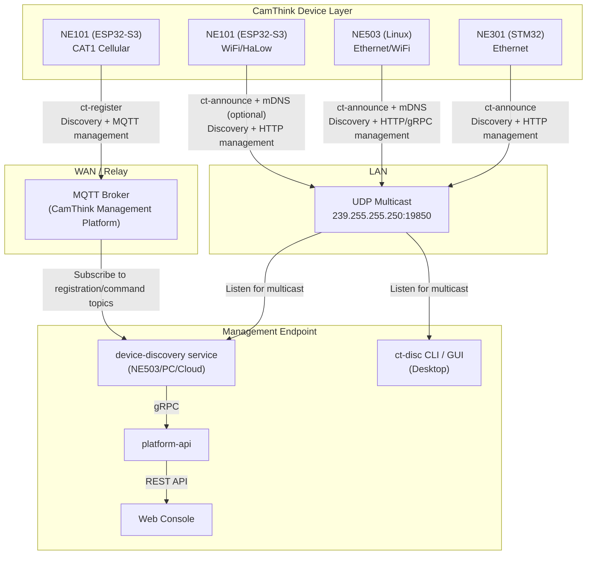
```mermaid
graph TB
    subgraph "CamThink Device Layer"
        D1["NE301 (STM32)<br/>Ethernet"]
        D2["NE503 (Linux)<br/>Ethernet/WiFi"]
        D3["NE101 (ESP32-S3)<br/>WiFi/HaLow"]
        D4["NE101 (ESP32-S3)<br/>CAT1 Cellular"]
    end

    subgraph "LAN"
        MC["UDP Multicast<br/>239.255.255.250:19850"]
    end

    subgraph "WAN / Relay"
        MQ["MQTT Broker<br/>(CamThink Management Platform)"]
    end

    subgraph "Management Endpoint"
        S1["device-discovery service<br/>(NE503/PC/Cloud)"]
        S2["platform-api"]
        S3["Web Console"]
        S4["ct-disc CLI / GUI<br/>(Desktop)"]
    end

    D1 -->|"ct-announce<br/>Discovery + HTTP management"| MC
    D2 -->|"ct-announce + mDNS<br/>Discovery + HTTP/gRPC management"| MC
    D3 -->|"ct-announce + mDNS (optional)<br/>Discovery + HTTP management"| MC
    D4 -->|"ct-register<br/>Discovery + MQTT management"| MQ

    MC -->|"Listen for multicast"| S1
    MC -->|"Listen for multicast"| S4
    MQ -->|"Subscribe to registration/command topics"| S1
    S1 -->|"gRPC"| S2
    S2 -->|"REST API"| S3
```

### 3.2 Protocol Layering

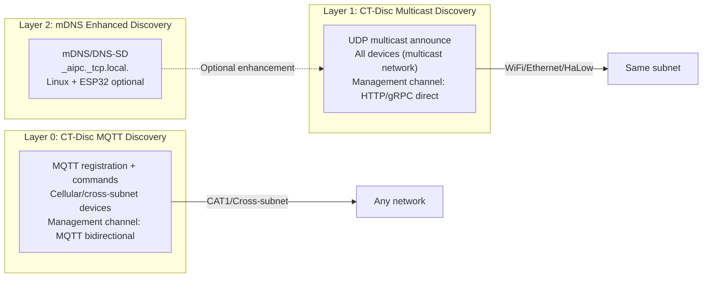
```mermaid
graph LR
    subgraph "Layer 2: mDNS Enhanced Discovery"
        M["mDNS/DNS-SD<br/>_aipc._tcp.local.<br/>Linux + ESP32 optional"]
    end

    subgraph "Layer 1: CT-Disc Multicast Discovery"
        C["UDP multicast announce<br/>All devices (multicast network)<br/>Management channel: HTTP/gRPC direct"]
    end

    subgraph "Layer 0: CT-Disc MQTT Discovery"
        Q["MQTT registration + commands<br/>Cellular/cross-subnet devices<br/>Management channel: MQTT bidirectional"]
    end

    M -.->|"Optional enhancement"| C
    C -->|"WiFi/Ethernet/HaLow"| NET1["Same subnet"]
    Q -->|"CAT1/Cross-subnet"| NET2["Any network"]
```

- **Layer 1 (Multicast, same subnet)**: All devices on multicast-reachable networks use UDP multicast broadcasting. Management endpoints connect directly to devices via HTTP/gRPC for management
- **Layer 0 (MQTT, cross-subnet/cellular)**: Cellular or cross-subnet devices connect outbound to Broker via MQTT. Management endpoints deliver commands via MQTT topics
- **Layer 2 (mDNS, optional enhancement)**: Linux and ESP32 devices can additionally register mDNS, supporting system-native discovery
- **Core principle: Discovery channel determines management channel**

### 3.3 Management Channel Selection Strategy

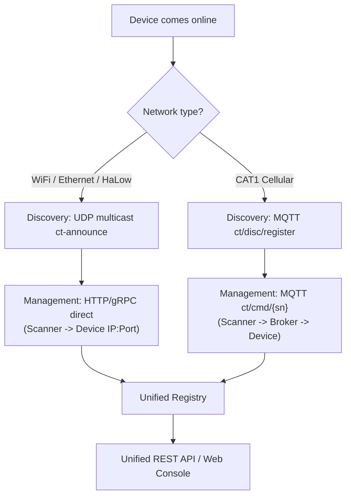
```mermaid
flowchart TD
    DEV["Device comes online"] --> CHECK{"Network type?"}

    CHECK -->|"WiFi / Ethernet / HaLow"| MC["Discovery: UDP multicast ct-announce"]
    MC --> MGMT1["Management: HTTP/gRPC direct<br/>(Scanner -> Device IP:Port)"]

    CHECK -->|"CAT1 Cellular"| MQ["Discovery: MQTT ct/disc/register"]
    MQ --> MGMT2["Management: MQTT ct/cmd/{sn}<br/>(Scanner -> Broker -> Device)"]

    MGMT1 --> REG["Unified Registry"]
    MGMT2 --> REG

    REG --> API["Unified REST API / Web Console"]
```

---

## 4. Interaction Scenarios

### 4.1 Scenario 1: Device Power-on Auto Discovery (Multicast)

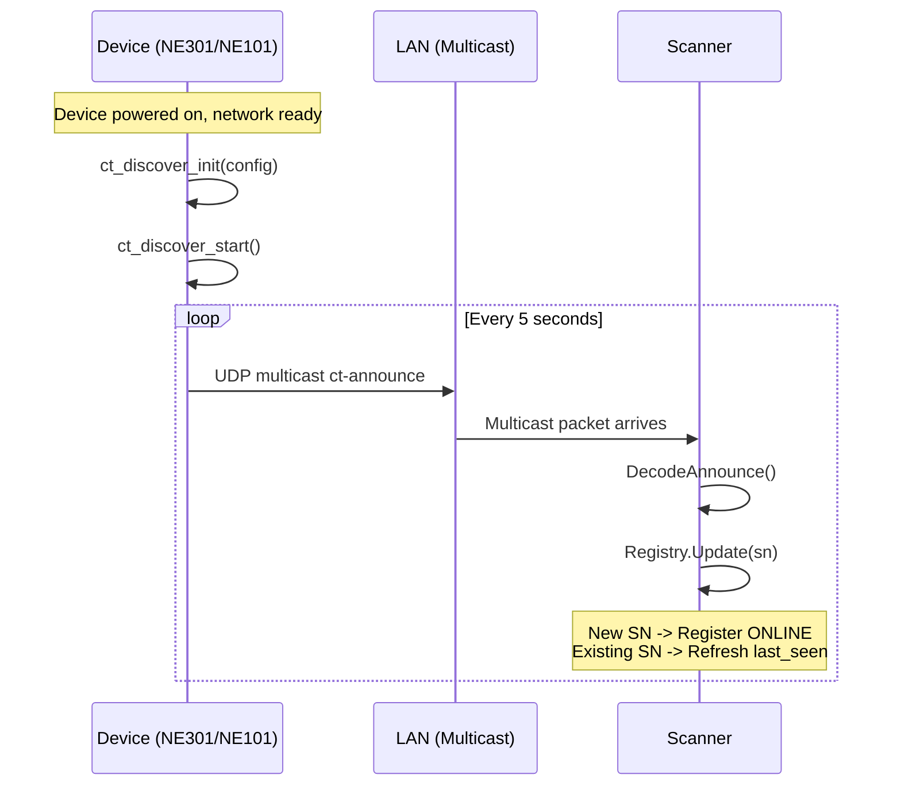
```mermaid
sequenceDiagram
    participant D as Device (NE301/NE101)
    participant N as LAN (Multicast)
    participant S as Scanner

    Note over D: Device powered on, network ready

    D->>D: ct_discover_init(config)
    D->>D: ct_discover_start()

    loop Every 5 seconds
        D->>N: UDP multicast ct-announce
        N->>S: Multicast packet arrives
        S->>S: DecodeAnnounce()
        S->>S: Registry.Update(sn)
        Note over S: New SN -> Register ONLINE<br/>Existing SN -> Refresh last_seen
    end
```

### 4.2 Scenario 2: Multiple Devices Coming Online Simultaneously

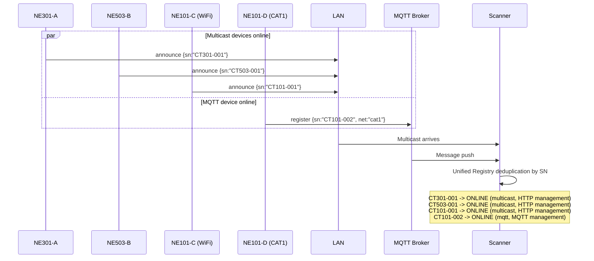
```mermaid
sequenceDiagram
    participant D1 as NE301-A
    participant D2 as NE503-B
    participant D3 as NE101-C (WiFi)
    participant D4 as NE101-D (CAT1)
    participant N as LAN
    participant MQ as MQTT Broker
    participant S as Scanner

    par Multicast devices online
        D1->>N: announce {sn:"CT301-001"}
        D2->>N: announce {sn:"CT503-001"}
        D3->>N: announce {sn:"CT101-001"}
    and MQTT device online
        D4->>MQ: register {sn:"CT101-002", net:"cat1"}
    end

    N->>S: Multicast arrives
    MQ->>S: Message push

    S->>S: Unified Registry deduplication by SN
    Note over S: CT301-001 -> ONLINE (multicast, HTTP management)<br/>CT503-001 -> ONLINE (multicast, HTTP management)<br/>CT101-001 -> ONLINE (multicast, HTTP management)<br/>CT101-002 -> ONLINE (mqtt, MQTT management)
```

### 4.3 Scenario 3: Device IP Change

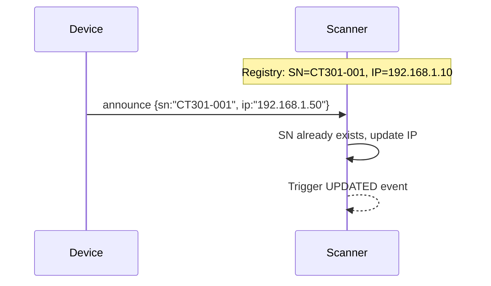
```mermaid
sequenceDiagram
    participant D as Device
    participant S as Scanner

    Note over S: Registry: SN=CT301-001, IP=192.168.1.10

    D->>S: announce {sn:"CT301-001", ip:"192.168.1.50"}
    S->>S: SN already exists, update IP
    S-->>S: Trigger UPDATED event
```

### 4.4 Scenario 4: Device Offline Detection

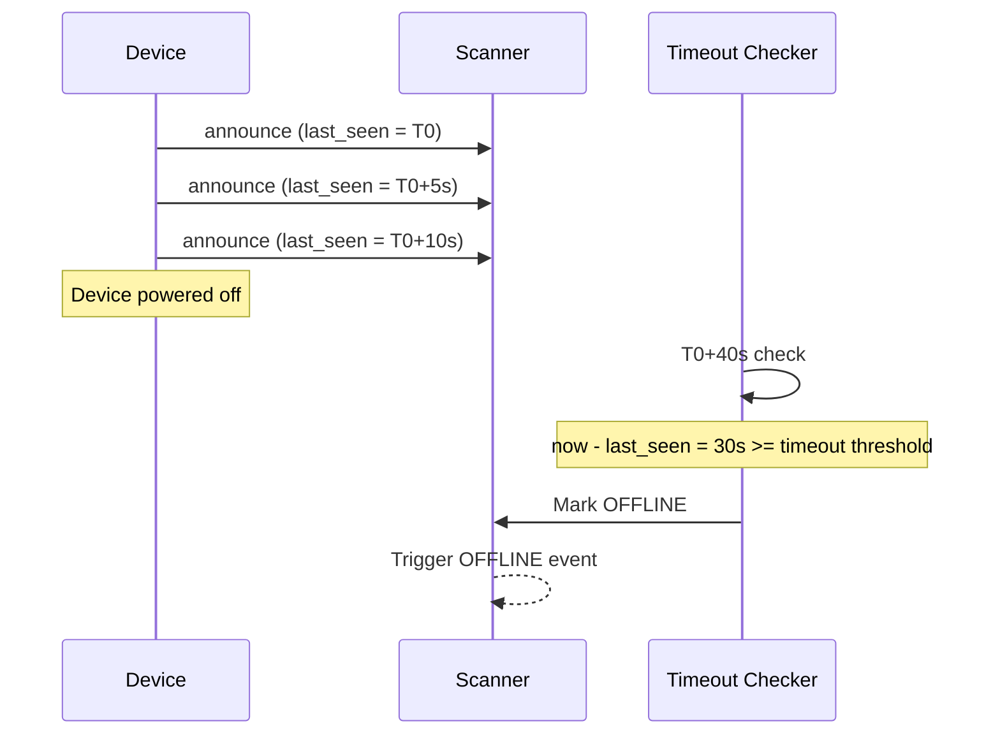
```mermaid
sequenceDiagram
    participant D as Device
    participant S as Scanner
    participant C as Timeout Checker

    D->>S: announce (last_seen = T0)
    D->>S: announce (last_seen = T0+5s)
    D->>S: announce (last_seen = T0+10s)

    Note over D: Device powered off

    C->>C: T0+40s check
    Note over C: now - last_seen = 30s >= timeout threshold
    C->>S: Mark OFFLINE
    S-->>S: Trigger OFFLINE event
```

### 4.5 Scenario 5: Device Comes Back Online

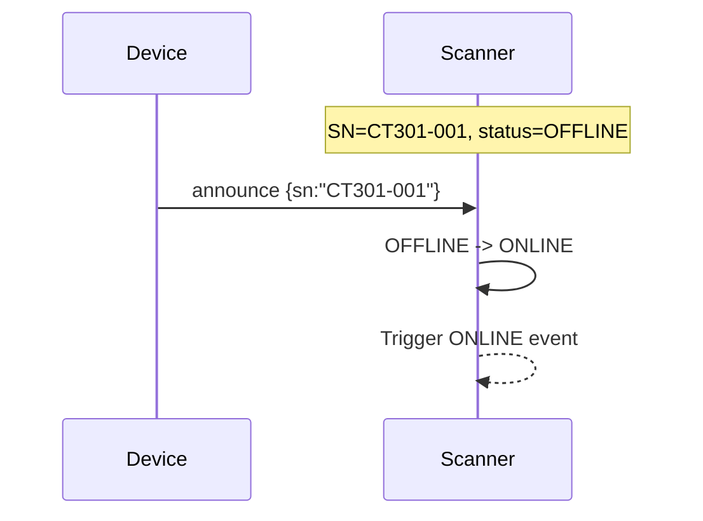
```mermaid
sequenceDiagram
    participant D as Device
    participant S as Scanner

    Note over S: SN=CT301-001, status=OFFLINE

    D->>S: announce {sn:"CT301-001"}
    S->>S: OFFLINE -> ONLINE
    S-->>S: Trigger ONLINE event
```

### 4.6 Scenario 6: Same-Subnet Device Management (HTTP Direct)

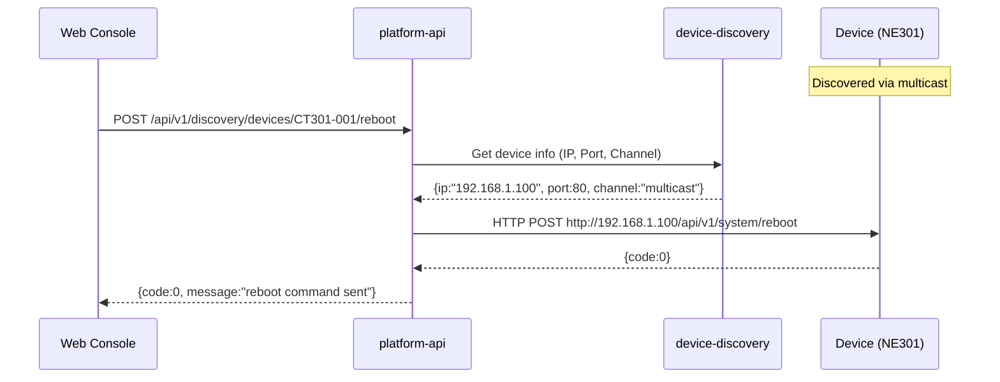
```mermaid
sequenceDiagram
    participant W as Web Console
    participant API as platform-api
    participant DS as device-discovery
    participant D as Device (NE301)

    Note over D: Discovered via multicast

    W->>API: POST /api/v1/discovery/devices/CT301-001/reboot
    API->>DS: Get device info (IP, Port, Channel)
    DS-->>API: {ip:"192.168.1.100", port:80, channel:"multicast"}
    API->>D: HTTP POST http://192.168.1.100/api/v1/system/reboot
    D-->>API: {code:0}
    API-->>W: {code:0, message:"reboot command sent"}
```

### 4.7 Scenario 7: Cross-Subnet Device Management (MQTT Commands)

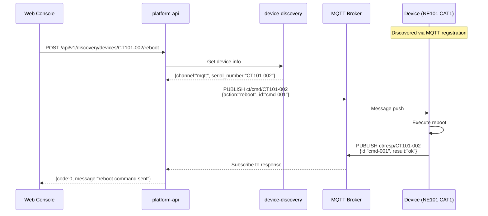
```mermaid
sequenceDiagram
    participant W as Web Console
    participant API as platform-api
    participant DS as device-discovery
    participant MQ as MQTT Broker
    participant D as Device (NE101 CAT1)

    Note over D: Discovered via MQTT registration

    W->>API: POST /api/v1/discovery/devices/CT101-002/reboot
    API->>DS: Get device info
    DS-->>API: {channel:"mqtt", serial_number:"CT101-002"}
    API->>MQ: PUBLISH ct/cmd/CT101-002<br/>{action:"reboot", id:"cmd-001"}
    MQ-->>D: Message push

    D->>D: Execute reboot

    D->>MQ: PUBLISH ct/resp/CT101-002<br/>{id:"cmd-001", result:"ok"}
    MQ-->>API: Subscribe to response
    API-->>W: {code:0, message:"reboot command sent"}
```

### 4.8 Scenario 8: NE101 WiFi Online Discovery

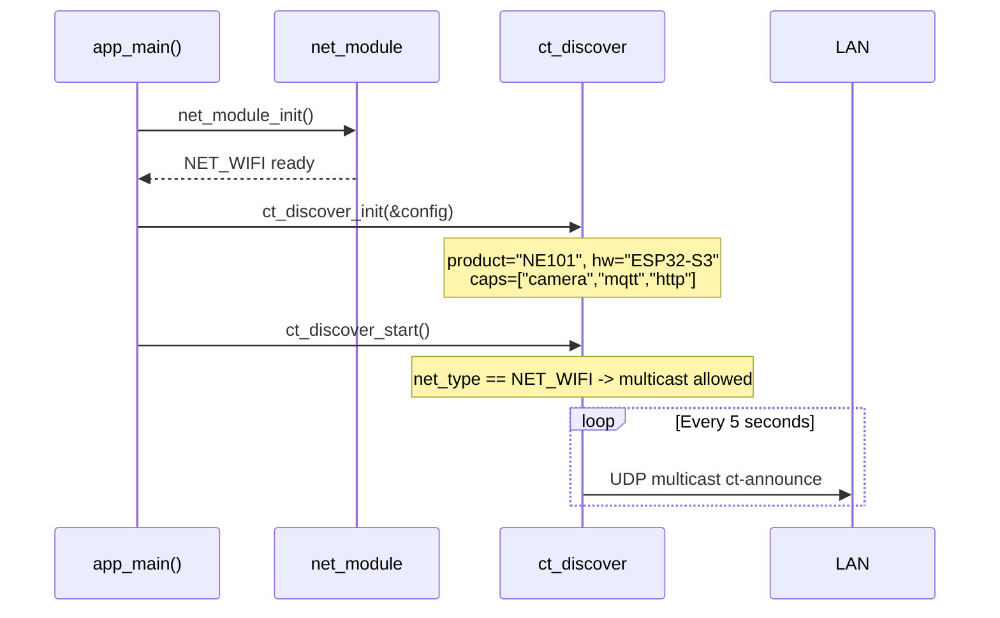
```mermaid
sequenceDiagram
    participant MAIN as app_main()
    participant NM as net_module
    participant CTD as ct_discover
    participant N as LAN

    MAIN->>NM: net_module_init()
    NM-->>MAIN: NET_WIFI ready

    MAIN->>CTD: ct_discover_init(&config)
    Note over CTD: product="NE101", hw="ESP32-S3"<br/>caps=["camera","mqtt","http"]

    MAIN->>CTD: ct_discover_start()
    Note over CTD: net_type == NET_WIFI -> multicast allowed

    loop Every 5 seconds
        CTD->>N: UDP multicast ct-announce
    end
```

### 4.9 Scenario 9: NE101 CAT1 Cellular Network Discovery and Management

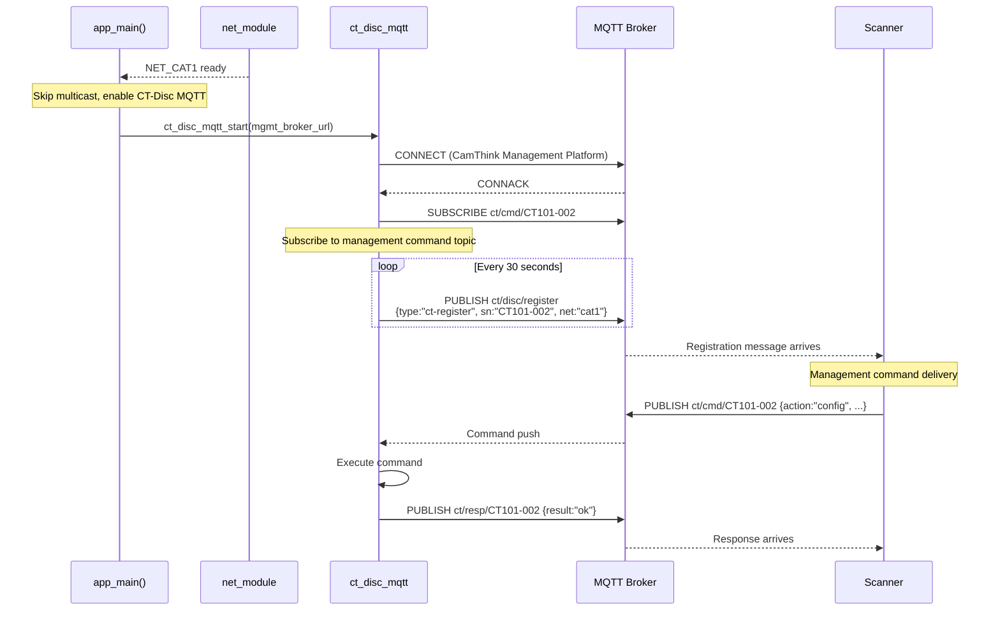
```mermaid
sequenceDiagram
    participant MAIN as app_main()
    participant NM as net_module
    participant CDM as ct_disc_mqtt
    participant MQ as MQTT Broker
    participant S as Scanner

    NM-->>MAIN: NET_CAT1 ready
    Note over MAIN: Skip multicast, enable CT-Disc MQTT

    MAIN->>CDM: ct_disc_mqtt_start(mgmt_broker_url)
    CDM->>MQ: CONNECT (CamThink Management Platform)
    MQ-->>CDM: CONNACK

    CDM->>MQ: SUBSCRIBE ct/cmd/CT101-002
    Note over CDM: Subscribe to management command topic

    loop Every 30 seconds
        CDM->>MQ: PUBLISH ct/disc/register<br/>{type:"ct-register", sn:"CT101-002", net:"cat1"}
    end

    MQ-->>S: Registration message arrives

    Note over S: Management command delivery
    S->>MQ: PUBLISH ct/cmd/CT101-002 {action:"config", ...}
    MQ-->>CDM: Command push
    CDM->>CDM: Execute command
    CDM->>MQ: PUBLISH ct/resp/CT101-002 {result:"ok"}
    MQ-->>S: Response arrives
```

### 4.10 Scenario 10: NE101 Network Type Switching

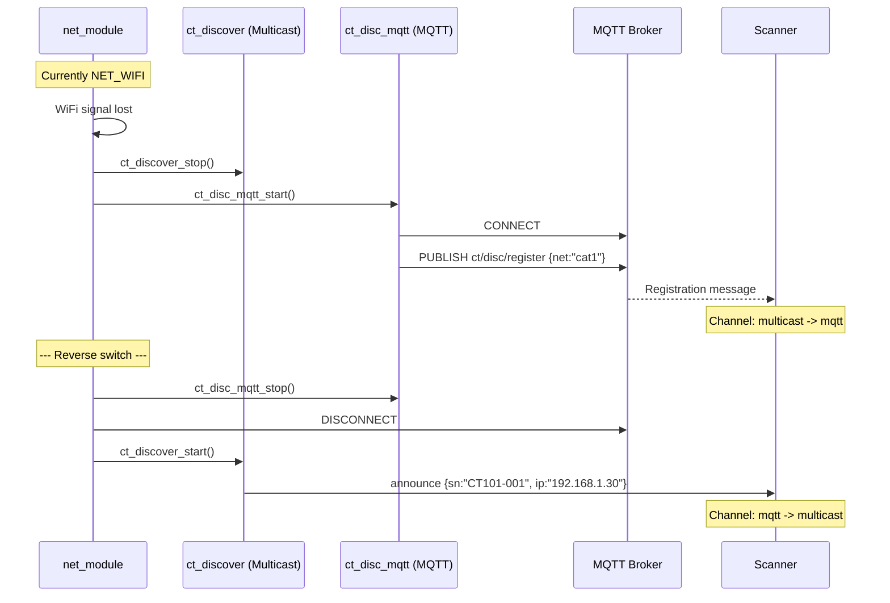
```mermaid
sequenceDiagram
    participant NM as net_module
    participant CTD as ct_discover (Multicast)
    participant CDM as ct_disc_mqtt (MQTT)
    participant MQ as MQTT Broker
    participant S as Scanner

    Note over NM: Currently NET_WIFI

    NM->>NM: WiFi signal lost
    NM->>CTD: ct_discover_stop()
    NM->>CDM: ct_disc_mqtt_start()
    CDM->>MQ: CONNECT
    CDM->>MQ: PUBLISH ct/disc/register {net:"cat1"}
    MQ-->>S: Registration message
    Note over S: Channel: multicast -> mqtt

    Note over NM: --- Reverse switch ---

    NM->>CDM: ct_disc_mqtt_stop()
    NM->>MQ: DISCONNECT
    NM->>CTD: ct_discover_start()
    CTD->>S: announce {sn:"CT101-001", ip:"192.168.1.30"}
    Note over S: Channel: mqtt -> multicast
```

### 4.11 Scenario 11: Management Endpoint Queries Devices

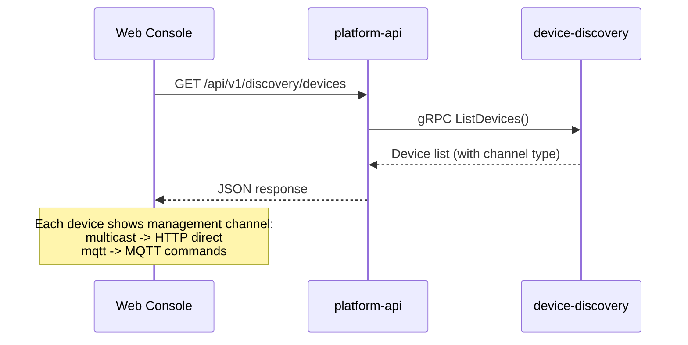
```mermaid
sequenceDiagram
    participant W as Web Console
    participant API as platform-api
    participant DS as device-discovery

    W->>API: GET /api/v1/discovery/devices
    API->>DS: gRPC ListDevices()
    DS-->>API: Device list (with channel type)
    API-->>W: JSON response

    Note over W: Each device shows management channel:<br/>multicast -> HTTP direct<br/>mqtt -> MQTT commands
```

### 4.12 Scenario 12: Manually Trigger Scan

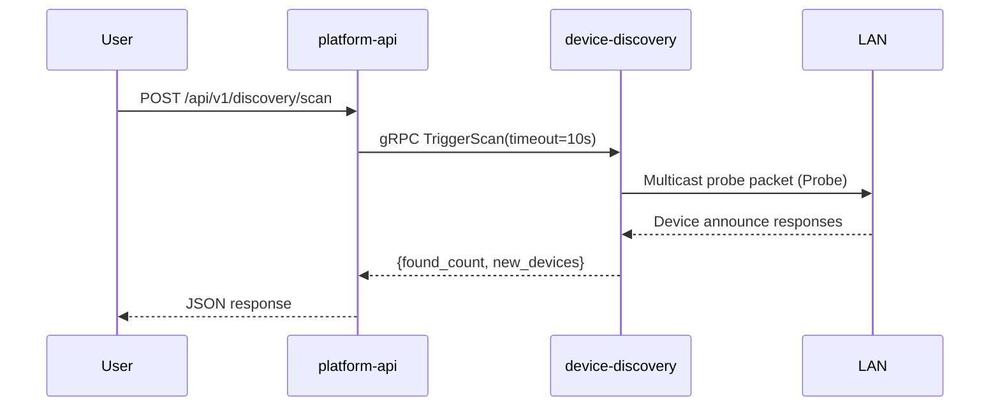
```mermaid
sequenceDiagram
    participant U as User
    participant API as platform-api
    participant DS as device-discovery
    participant N as LAN

    U->>API: POST /api/v1/discovery/scan
    API->>DS: gRPC TriggerScan(timeout=10s)
    DS->>N: Multicast probe packet (Probe)
    N-->>DS: Device announce responses
    DS-->>API: {found_count, new_devices}
    API-->>U: JSON response
```

### 4.13 Scenario 13: Scanner Restart Recovery

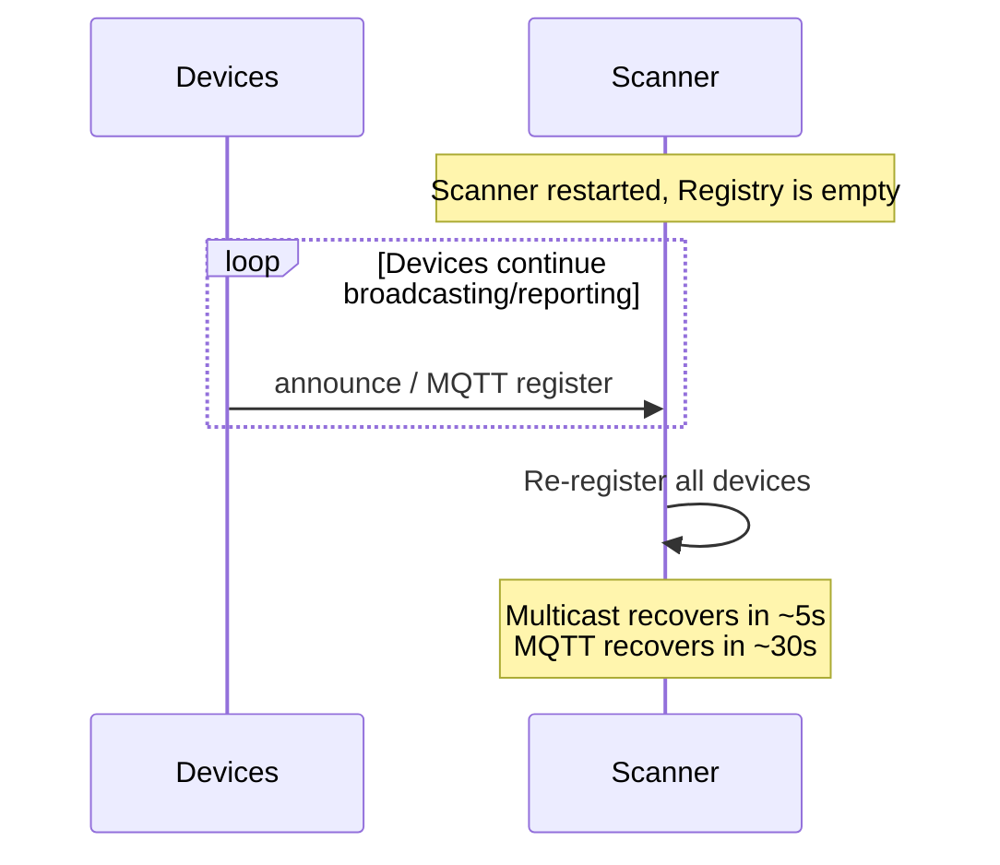
```mermaid
sequenceDiagram
    participant D as Devices
    participant S as Scanner

    Note over S: Scanner restarted, Registry is empty

    loop Devices continue broadcasting/reporting
        D->>S: announce / MQTT register
    end

    S->>S: Re-register all devices
    Note over S: Multicast recovers in ~5s<br/>MQTT recovers in ~30s
```

### 4.14 Scenario 14: NE301 Integration Sequence

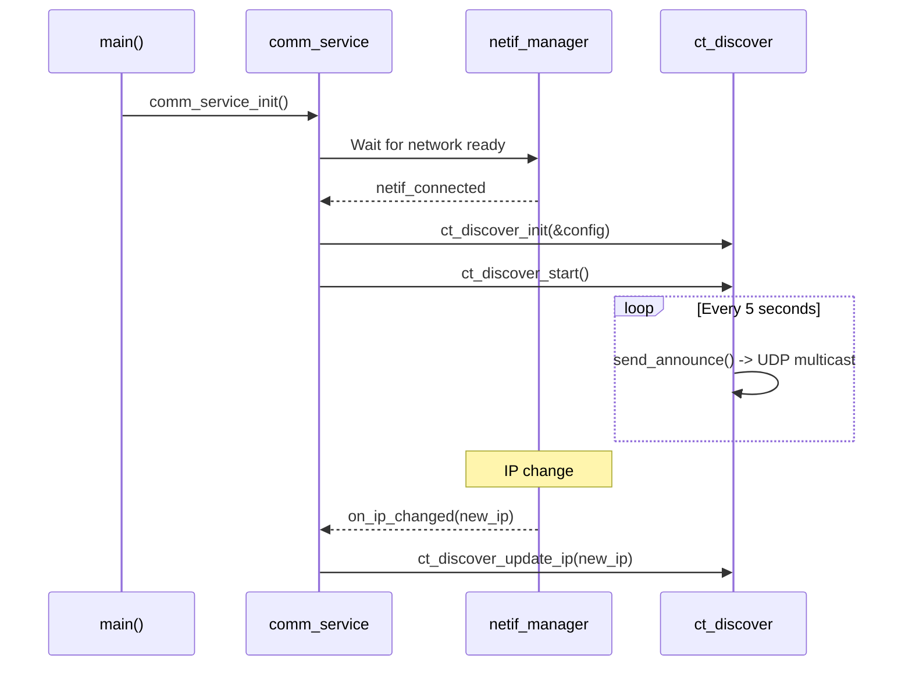
```mermaid
sequenceDiagram
    participant MAIN as main()
    participant COMM as comm_service
    participant NETIF as netif_manager
    participant CTD as ct_discover

    MAIN->>COMM: comm_service_init()
    COMM->>NETIF: Wait for network ready
    NETIF-->>COMM: netif_connected

    COMM->>CTD: ct_discover_init(&config)
    COMM->>CTD: ct_discover_start()

    loop Every 5 seconds
        CTD->>CTD: send_announce() -> UDP multicast
    end

    Note over NETIF: IP change
    NETIF-->>COMM: on_ip_changed(new_ip)
    COMM->>CTD: ct_discover_update_ip(new_ip)
```

---

## 5. Protocol Specification

### 5.1 Announce / Register Payload

**Multicast Transport Parameters**:

| Parameter | Value |
|-----------|-------|
| Transport | UDP multicast |
| Multicast address | `239.255.255.250` |
| Destination port | `19850` |
| Broadcast interval | `5000ms` |
| Max packet size | `512 bytes` |

**MQTT Transport Parameters**:

| Parameter | Value |
|-----------|-------|
| Registration Topic | `ct/disc/register` |
| Command Topic | `ct/cmd/{sn}` |
| Response Topic | `ct/resp/{sn}` |
| Registration QoS | `0` (reduce traffic) |
| Command QoS | `1` (guaranteed delivery) |
| Response QoS | `1` (guaranteed delivery) |
| Registration interval | `30000ms` |

#### JSON -- Multicast Announce

```json
{
    "type": "ct-announce",
    "product": "NE101",
    "sn": "CT101-2026-00001",
    "mac": "AA:BB:CC:DD:EE:FF",
    "ip": "192.168.1.50",
    "fw": "v1.0.0",
    "port": 80,
    "hw": "ESP32-S3",
    "caps": ["camera", "mqtt", "http"]
}
```

#### JSON -- MQTT Register

```json
{
    "type": "ct-register",
    "product": "NE101",
    "sn": "CT101-2026-00001",
    "mac": "AA:BB:CC:DD:EE:FF",
    "ip": "10.0.1.50",
    "fw": "v1.0.0",
    "port": 80,
    "hw": "ESP32-S3",
    "caps": ["camera", "mqtt", "http", "cellular"],
    "net": "cat1"
}
```

#### Field Descriptions

| Field | Type | Required | Description | Example |
|-------|------|----------|-------------|---------|
| `type` | string | Yes | `ct-announce` (multicast) or `ct-register` (MQTT) | `"ct-announce"` |
| `product` | string | Yes | Product model | `"NE503"`, `"NE301"`, `"NE101"` |
| `sn` | string | Yes | Device serial number, globally unique primary key | `"CT301-2026-00001"` |
| `mac` | string | Yes | MAC address | `"AA:BB:CC:DD:EE:FF"` |
| `ip` | string | Yes | Current IP address | `"192.168.1.100"` |
| `fw` | string | Yes | Firmware version | `"v1.2.0"` |
| `port` | int | Yes | HTTP API listening port | `80`, `8080` |
| `hw` | string | Yes | Hardware platform | `"STM32N6570"`, `"Hailo-15"`, `"ESP32-S3"` |
| `caps` | string[] | Yes | Device capability list | `["camera", "mqtt", "http"]` |
| `net` | string | Conditional | Network type, required for MQTT registration | `"cat1"`, `"wifi"`, `"eth"`, `"halow"` |

### 5.2 MQTT Management Command Format

**Command delivery Topic: `ct/cmd/{sn}`**

```json
{
    "id": "cmd-20260520-001",
    "action": "reboot",
    "params": {},
    "timestamp": 1716163200
}
```

**Command response Topic: `ct/resp/{sn}`**

```json
{
    "id": "cmd-20260520-001",
    "result": "ok",
    "data": {},
    "timestamp": 1716163201
}
```

**Standard Management Commands**:

| action | Description | params | Typical Devices |
|--------|-------------|--------|-----------------|
| `reboot` | Reboot device | `{}` | All |
| `get_info` | Get device details | `{}` | All |
| `set_config` | Push configuration | `{key: value, ...}` | All |
| `ota_upgrade` | OTA upgrade | `{"url": "...", "version": "..."}` | NE101, NE503 |
| `capture` | Trigger photo capture | `{}` | NE101 |
| `set_network` | Modify network configuration | `{"mode": "static", "ip": "..."}` | NE503 |
| `list_apps` | List applications | `{}` | NE503 |
| `start_stream` | Start video stream | `{"type": "rtsp"}` | NE301, NE503 |

### 5.3 Standard Capability Identifiers (caps)

| Identifier | Meaning | Typical Devices |
|------------|---------|-----------------|
| `ai` | Local AI inference | NE301, NE503 |
| `rtsp` | RTSP video streaming | NE301, NE503 |
| `mqtt` | MQTT connection | NE301, NE101 |
| `http` | HTTP API / Web | NE101, NE503 |
| `camera` | Camera capture | NE101 |
| `ptz` | PTZ control | NE503 |
| `lens` | Lens zoom/focus | NE503 |
| `gpio` | GPIO control | NE503 |
| `cellular` | Cellular network | NE101 |
| `halow` | HaLow (802.11ah) | NE101 |
| `lowpower` | Low power/sleep | NE101 |
| `ble` | Bluetooth | NE301 |
| `onvif` | ONVIF protocol | Future products |

### 5.4 Default Configuration per Product

| Product | caps | port | hw |
|---------|------|------|----|
| NE503 | `["ai","rtsp","ptz","lens","gpio"]` | 8080 | `Hailo-15` |
| NE301 | `["ai","rtsp","mqtt"]` | 80 | `STM32N6570` |
| NE101 (WiFi) | `["camera","mqtt","http"]` | 80 | `ESP32-S3` |
| NE101 (CAT1) | `["camera","mqtt","http","cellular"]` | 80 | `ESP32-S3` |
| NE101 (HaLow) | `["camera","mqtt","http","halow"]` | 80 | `ESP32-S3` |

### 5.5 Heartbeat and Timeout

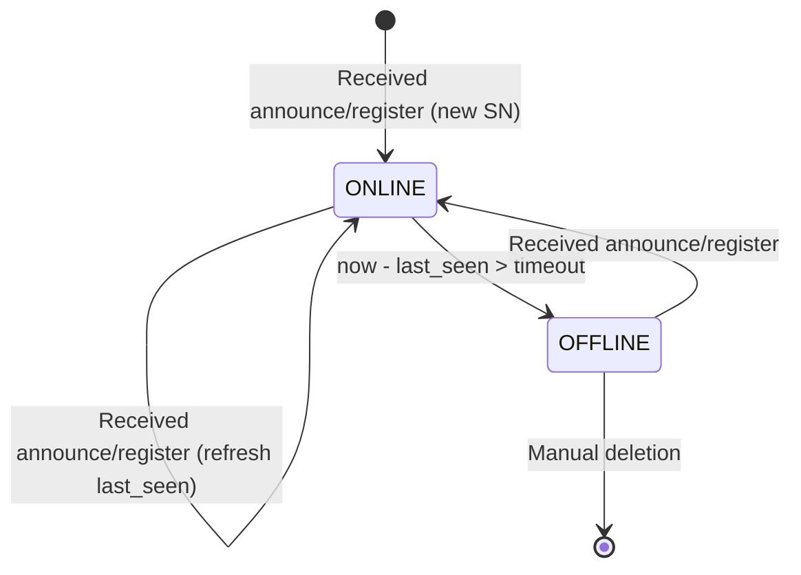
```mermaid
stateDiagram-v2
    [*] --> ONLINE : Received announce/register (new SN)
    ONLINE --> ONLINE : Received announce/register (refresh last_seen)
    ONLINE --> OFFLINE : now - last_seen > timeout
    OFFLINE --> ONLINE : Received announce/register
    OFFLINE --> [*] : Manual deletion
```

| Parameter | Multicast Network | MQTT (Cellular) |
|-----------|-------------------|-----------------|
| Broadcast/report interval | 5s | 30s |
| Timeout threshold | 30s | 120s |
| Timeout check interval | 10s | 30s |

---

## 6. Device-Side MQTT Architecture

### 6.1 Dual MQTT Client Design

Business MQTT and CT-Disc MQTT **must be separated**:

| Dimension | Business MQTT | CT-Disc MQTT |
|-----------|---------------|--------------|
| Broker | User-configured business platform | CamThink management platform |
| Purpose | Upload images, sensor data | Device registration heartbeat + receive management commands |
| Lifecycle | User can start/stop | Always running when network is online |
| Authentication | User credentials | Device certificate / platform token |
| QoS | Image QoS 1-2 | Heartbeat QoS 0, commands QoS 1 |

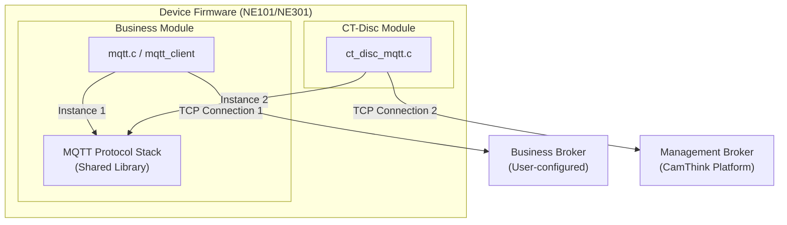
```mermaid
graph TB
    subgraph "Device Firmware (NE101/NE301)"
        MQTTLIB["MQTT Protocol Stack<br/>(Shared Library)"]

        subgraph "Business Module"
            BIZ["mqtt.c / mqtt_client"]
            BIZ -->|"Instance 1"| MQTTLIB
        end

        subgraph "CT-Disc Module"
            DISC["ct_disc_mqtt.c"]
            DISC -->|"Instance 2"| MQTTLIB
        end
    end

    BIZ -->|"TCP Connection 1"| BRK1["Business Broker<br/>(User-configured)"]
    DISC -->|"TCP Connection 2"| BRK2["Management Broker<br/>(CamThink Platform)"]
```

The two client instances share the same MQTT protocol stack and create independent connections. Additional overhead on ESP32-S3 is approximately ~4KB RAM.

### 6.2 MQTT Topic Specification

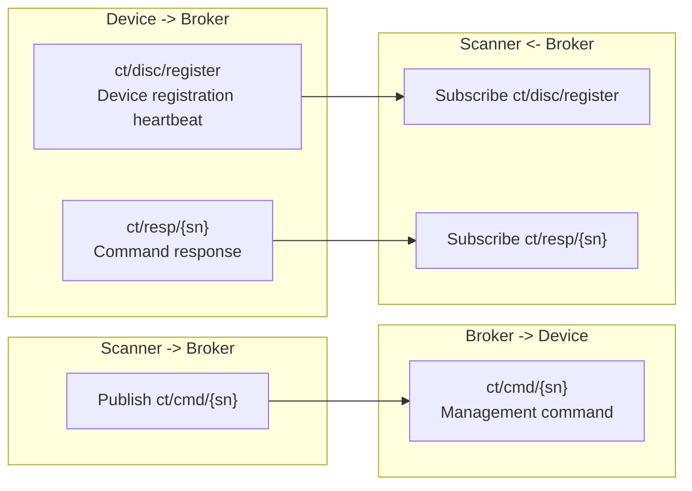
```mermaid
graph LR
    subgraph "Device -> Broker"
        R["ct/disc/register<br/>Device registration heartbeat"]
        RESP["ct/resp/{sn}<br/>Command response"]
    end

    subgraph "Broker -> Device"
        CMD["ct/cmd/{sn}<br/>Management command"]
    end

    subgraph "Scanner -> Broker"
        PUB1["Publish ct/cmd/{sn}"]
    end

    subgraph "Scanner <- Broker"
        SUB1["Subscribe ct/disc/register"]
        SUB2["Subscribe ct/resp/{sn}"]
    end

    R --> SUB1
    PUB1 --> CMD
    RESP --> SUB2
```

| Topic | Direction | QoS | Description |
|-------|-----------|-----|-------------|
| `ct/disc/register` | Device -> Scanner | 0 | Device registration heartbeat |
| `ct/cmd/{sn}` | Scanner -> Device | 1 | Management command, `{sn}` is target device serial number |
| `ct/resp/{sn}` | Device -> Scanner | 1 | Command response, `{sn}` is device serial number |

### 6.3 Relationship Between MQTT and Multicast

These are different transport channels of the same CT-Disc protocol:

```
CT-Disc Protocol (Unified)
|-- Unified JSON payload format
|-- Unified Scanner Registry
|-- Unified event mechanism (ONLINE / OFFLINE / UPDATED)
|
|-- Transport Method 1: UDP multicast ct-announce (same subnet)
|-- Transport Method 2: MQTT ct-register (cross-subnet / cellular)
+-- Transport Method 3: mDNS (optional enhancement)
```

The Scanner does not differentiate sources; all entries are unified by SN into the Registry.

---

## 7. Network Constraints and Compatibility

### 7.1 Network Environment Support Matrix

```mermaid
graph TB
    subgraph "Same Subnet (Multicast + HTTP)"
        S1[Scanner]
        D1[NE301 Ethernet]
        D2[NE503 Ethernet/WiFi]
        D3[NE101 WiFi]
        D4[NE101 HaLow]
    end

    subgraph "Cross-Subnet / Cellular (MQTT)"
        D5[NE101 CAT1]
        D6[Cross-subnet Devices]
    end

    S1 ---|"ct-announce + HTTP"| D1
    S1 ---|"ct-announce + HTTP"| D2
    S1 ---|"ct-announce + HTTP"| D3
    S1 ---|"ct-announce + HTTP"| D4

    D5 -->|"MQTT registration + commands"| MQ[("MQTT Broker")]
    D6 -->|"MQTT registration + commands"| MQ
    MQ -->|"Message forwarding"| S1

    style MQ fill:#ffa502,color:#fff
```

| Network Environment | Discovery | Management | Description |
|---------------------|-----------|------------|-------------|
| Same switch/L2 | Multicast | HTTP direct | Default scenario |
| Same subnet/VLAN | Multicast | HTTP direct | Enterprise network |
| WiFi (same AP) | Multicast | HTTP direct | Depends on AP settings |
| HaLow | Multicast | HTTP direct | NE101 specific |
| CAT1 cellular | MQTT | MQTT commands | NE101 CAT1 |
| Cross-router/subnet | MQTT | MQTT commands | Requires MQTT Broker |
| Docker default network | Requires host mode | HTTP direct | Containerized deployment |

---

## 8. gRPC Interface Specification

Service name: `aipc.discovery.DiscoveryService`
Proto file: `platform/device-discovery/proto/discovery.proto`

### 8.1 ListDevices

```
rpc ListDevices(ListDevicesRequest) returns (ListDevicesResponse)
```

| Field | Type | Description |
|-------|------|-------------|
| **Request** | | |
| `product` | string | Filter by product model; empty string means no filter |
| `status` | DeviceStatus | Filter by device status |
| **Response** | | |
| `devices` | DiscoveredDevice[] | Device list |

### 8.2 GetDevice

```
rpc GetDevice(GetDeviceRequest) returns (DiscoveredDevice)
```

| Field | Type | Description |
|-------|------|-------------|
| **Request** | | |
| `serial_number` | string | Device serial number |

### 8.3 TriggerScan

```
rpc TriggerScan(TriggerScanRequest) returns (TriggerScanResponse)
```

| Field | Type | Description |
|-------|------|-------------|
| **Request** | | |
| `timeout_seconds` | int32 | Scan timeout |
| **Response** | | |
| `found_count` | int32 | Number of discovered devices |
| `new_devices` | DiscoveredDevice[] | List of new devices |

### 8.4 WatchDevices

```
rpc WatchDevices(WatchDevicesRequest) returns (stream DeviceEvent)
```

| Field | Type | Description |
|-------|------|-------------|
| **Event** | | |
| `type` | EventType | `ONLINE` / `OFFLINE` / `UPDATED` |
| `device` | DiscoveredDevice | Device information |

### 8.5 SendCommand

```
rpc SendCommand(SendCommandRequest) returns (SendCommandResponse)
```

| Field | Type | Description |
|-------|------|-------------|
| **Request** | | |
| `serial_number` | string | Target device SN |
| `action` | string | Command action |
| `params` | string | Command parameters (JSON) |
| `timeout_seconds` | int32 | Wait for response timeout |
| **Response** | | |
| `result` | string | Execution result |
| `data` | string | Response data (JSON) |

### 8.6 DiscoveredDevice Data Model

| Field | Type | Description |
|-------|------|-------------|
| `product` | string | Product model |
| `serial_number` | string | Serial number (primary key) |
| `mac_address` | string | MAC address |
| `ip_address` | string | IP address |
| `api_port` | int32 | HTTP API port |
| `firmware_version` | string | Firmware version |
| `hardware_platform` | string | Hardware platform |
| `capabilities` | string[] | Capability list |
| `status` | DeviceStatus | Current status |
| `channel` | string | Management channel: `multicast` or `mqtt` |
| `first_seen` | int64 | First discovery time (Unix) |
| `last_seen` | int64 | Last announce received time (Unix) |

---

## 9. REST API Specification

### 9.1 API List

| Method | Path | Description |
|--------|------|-------------|
| `GET` | `/api/v1/discovery/devices` | Get device list |
| `GET` | `/api/v1/discovery/devices/:sn` | Get single device |
| `POST` | `/api/v1/discovery/scan` | Trigger scan |
| `POST` | `/api/v1/discovery/devices/:sn/command` | Send management command |
| `GET` | `/api/v1/discovery/events` | WebSocket event stream |

### 9.2 GET /api/v1/discovery/devices

**Query Parameters:**

| Parameter | Type | Default | Description |
|-----------|------|---------|-------------|
| `product` | string | `""` | Filter by product model |
| `status` | string | `"online"` | Filter by status |

**Response Example:**

```json
{
    "code": 0,
    "data": [
        {
            "product": "NE301",
            "serial_number": "CT301-2026-00001",
            "ip_address": "192.168.1.100",
            "api_port": 80,
            "firmware_version": "v1.2.0",
            "hardware_platform": "STM32N6570",
            "capabilities": ["ai", "rtsp", "mqtt"],
            "status": "DEVICE_ONLINE",
            "channel": "multicast",
            "first_seen": 1715481600,
            "last_seen": 1715481650
        },
        {
            "product": "NE101",
            "serial_number": "CT101-2026-00002",
            "ip_address": "10.0.1.50",
            "api_port": 80,
            "firmware_version": "v1.0.0",
            "hardware_platform": "ESP32-S3",
            "capabilities": ["camera", "mqtt", "http", "cellular"],
            "status": "DEVICE_ONLINE",
            "channel": "mqtt",
            "first_seen": 1715481200,
            "last_seen": 1715481650
        }
    ]
}
```

### 9.3 GET /api/v1/discovery/devices/:sn

**Response Example:**

```json
{
    "code": 0,
    "data": {
        "product": "NE101",
        "serial_number": "CT101-2026-00002",
        "ip_address": "10.0.1.50",
        "api_port": 80,
        "firmware_version": "v1.0.0",
        "hardware_platform": "ESP32-S3",
        "capabilities": ["camera", "mqtt", "http", "cellular"],
        "status": "DEVICE_ONLINE",
        "channel": "mqtt",
        "first_seen": 1715481200,
        "last_seen": 1715481650
    }
}
```

### 9.4 POST /api/v1/discovery/devices/:sn/command

Send a management command to a specified device. The Scanner automatically selects the transport channel based on the `channel` field.

**Request:**

```json
{
    "action": "reboot",
    "params": {},
    "timeout_seconds": 10
}
```

**Channel Selection Logic:**

```
device.channel == "multicast"
  -> HTTP POST http://{ip}:{port}/api/v1/{action}

device.channel == "mqtt"
  -> MQTT PUBLISH ct/cmd/{sn} {action, params}
  -> Wait for ct/resp/{sn} response (within timeout_seconds)
```

**Response Example (Success):**

```json
{
    "code": 0,
    "data": {
        "result": "ok",
        "data": {}
    }
}
```

### 9.5 POST /api/v1/discovery/scan

**Response Example:**

```json
{
    "code": 0,
    "data": {
        "found_count": 3,
        "new_devices": [...]
    }
}
```

### 9.6 WebSocket /api/v1/discovery/events

```json
{"type": "EVENT_ONLINE", "device": {"product": "NE101", "serial_number": "CT101-001", "channel": "multicast"}}
{"type": "EVENT_OFFLINE", "device": {"product": "NE301", "serial_number": "CT301-001"}}
{"type": "EVENT_UPDATED", "device": {"serial_number": "CT101-002", "channel": "mqtt", "ip_address": "10.0.2.80"}}
```

---

## 10. Device-Side Integration Guide

### 10.1 NE301 (C / lwIP)

NE301 is Ethernet only, with multicast channel only.

```c
#include "ct_discover.h"

void on_network_ready(netif_info_t *netif) {
    ct_discover_config_t config = {
        .product = "NE301",
        .port    = 80,
        .hw      = "STM32N6570",
    };

    device_info_config_t dev_info;
    json_config_get_device_info_config(&dev_info);

    strncpy(config.sn,  dev_info.serial_number, sizeof(config.sn) - 1);
    strncpy(config.fw,  dev_info.software_version, sizeof(config.fw) - 1);
    strncpy(config.mac, dev_info.mac_address, sizeof(config.mac) - 1);
    snprintf(config.ip, sizeof(config.ip), "%d.%d.%d.%d",
        netif->ip_addr[0], netif->ip_addr[1],
        netif->ip_addr[2], netif->ip_addr[3]);
    strncpy(config.caps, "\"ai\",\"rtsp\",\"mqtt\"", sizeof(config.caps) - 1);

    ct_discover_init(&config);
    ct_discover_start();
}
```

### 10.2 NE503 (Linux / Go)

NE503 acts as both Scanner and Device. The `device-discovery` service includes a built-in announcer that periodically broadcasts `ct-announce` packets, enabling other NE503 devices and the ct-disc desktop tools to discover it.

```yaml
# /opt/aipc/etc/discovery.yaml
service:
  name: device-discovery
  listen: unix:///run/aipc/device-discovery.sock
  log_level: info

discovery:
  multicast_addr: 239.255.255.250
  multicast_port: 19850
  timeout: 30
  interface: ""

announce:
  enabled: true
  product: "NE503"
  port: 8080
  interval: 5
  caps:
    - ai
    - camera
    - http
    - mqtt
```

The SN is auto-detected from `/opt/aipc/VERSION` (line `serial=XXX`) or falls back to hostname. Firmware version is read from `/opt/aipc/VERSION` (line `version=XXX`). IP and MAC are auto-detected from the network interface.

```bash
# systemd service
/opt/aipc/bin/device-discovery --config /opt/aipc/etc/discovery.yaml
```

**Network Configuration via ct-disc-gui:**

The desktop GUI can read and modify NE503 network settings through the platform-api REST endpoint:

```
GET  http://{device-ip}:8080/api/v1/network/config   # Read current config
POST http://{device-ip}:8080/api/v1/network/config   # Apply new config
```

Request body for static IP:
```json
{
    "interface": "eth0",
    "mode": "static",
    "ip_address": "192.168.1.100",
    "subnet_mask": "255.255.255.0",
    "gateway": "192.168.1.1",
    "dns1": "8.8.8.8",
    "dns2": "8.8.4.4"
}
```

### 10.3 NE101 (ESP-IDF / FreeRTOS)

NE101 dynamically selects the channel based on network type:

```c
#include "ct_discover.h"
#include "ct_disc_mqtt.h"
#include "net_module.h"
#include "config.h"

void on_network_ready(void) {
    net_type_t net_type = net_module_get_type();

    if (net_type == NET_CAT1) {
        ct_disc_mqtt_config_t mqtt_cfg = {
            .broker_url = CT_DISC_MQTT_BROKER,
            .product = "NE101",
            .port = 80,
            .hw = "ESP32-S3",
        };
        strncpy(mqtt_cfg.sn, config_get_serial(), sizeof(mqtt_cfg.sn) - 1);
        strncpy(mqtt_cfg.fw, config_get_fw_version(), sizeof(mqtt_cfg.fw) - 1);
        strncpy(mqtt_cfg.mac, config_get_mac_address(), sizeof(mqtt_cfg.mac) - 1);
        strncpy(mqtt_cfg.ip, config_get_ip_address(), sizeof(mqtt_cfg.ip) - 1);
        strncpy(mqtt_cfg.caps, "\"camera\",\"mqtt\",\"http\",\"cellular\"",
                sizeof(mqtt_cfg.caps) - 1);
        strncpy(mqtt_cfg.net, "cat1", sizeof(mqtt_cfg.net) - 1);
        ct_disc_mqtt_start(&mqtt_cfg);
        return;
    }

    ct_discover_config_t config = {
        .product = "NE101",
        .port = 80,
        .hw = "ESP32-S3",
    };
    strncpy(config.sn, config_get_serial(), sizeof(config.sn) - 1);
    strncpy(config.fw, config_get_fw_version(), sizeof(config.fw) - 1);
    strncpy(config.mac, config_get_mac_address(), sizeof(config.mac) - 1);
    strncpy(config.ip, config_get_ip_address(), sizeof(config.ip) - 1);

    if (net_type == NET_WIFI)
        strncpy(config.caps, "\"camera\",\"mqtt\",\"http\"", sizeof(config.caps) - 1);
    else if (net_type == NET_HALOW)
        strncpy(config.caps, "\"camera\",\"mqtt\",\"http\",\"halow\"", sizeof(config.caps) - 1);

    ct_discover_init(&config);
    ct_discover_start();
}

void on_network_changed(net_type_t old_type, net_type_t new_type) {
    if (new_type == NET_CAT1) {
        ct_discover_stop();
        on_network_ready();
    } else if (old_type == NET_CAT1) {
        ct_disc_mqtt_stop();
        on_network_ready();
    }
}
```

**NE101 Module Structure**:

```
main/
├── mqtt.c / mqtt.h                   # Business MQTT (existing)
├── ct_discover.c / ct_discover.h     # CT-Disc multicast module
├── ct_disc_mqtt.c / ct_disc_mqtt.h   # CT-Disc MQTT module
└── net_module.c / net_module.h       # Network module (existing)
```

---

## 11. Security Considerations

| Risk | Description | Mitigation |
|------|-------------|------------|
| Forged announce | Malicious device sends fake broadcasts | v1.4 introduces device authentication pairing |
| Information disclosure | Announce contains device information | Limited to LAN only |
| Multicast storm | Mass device broadcasting | Fixed 5s interval, < 512B |
| DoS | Forged packets flooding Scanner | Registry cap, rate limiting |
| MQTT forgery | Forged CAT1 device registration | MQTT TLS + device certificates |
| Command injection | Malicious management commands | ACL permission control, command whitelist |
| Man-in-the-middle | MQTT traffic eavesdropping | TLS encrypted transport |

---

## 12. Version Evolution

```mermaid
graph LR
    V1["v1.0 Basic Discovery<br/>Multicast + Heartbeat"] --> V2["v1.1 Management Interface<br/>REST + WebSocket"]
    V2 --> V3["v1.2 Enhanced Discovery<br/>mDNS + Active Scan"]
    V3 --> V4["v1.3 MQTT Channel<br/>Cellular Discovery + Commands"]
    V4 --> V5["v1.4 Device Authentication<br/>Pairing + Token"]
    V5 --> V6["v2.0 Centralized Management<br/>OTA + Alerts"]

    style V1 fill:#4ecdc4,color:#fff
    style V2 fill:#45b7d1,color:#fff
    style V3 fill:#96ceb4,color:#fff
    style V4 fill:#ffa502,color:#fff
    style V5 fill:#ffeaa7,color:#333
    style V6 fill:#fd79a8,color:#fff
```

| Version | Core Capability | Status |
|---------|----------------|--------|
| v1.0 | Multicast discovery + heartbeat timeout + gRPC | Implemented |
| v1.1 | REST API + WebSocket + Web frontend | Partially implemented |
| v1.2 | mDNS + active scan + NE101 multicast | Planned |
| v1.3 | MQTT registration + management commands + channel switching | Planned |
| v1.4 | Device pairing authentication + Token + ACL | Planned |
| v2.0 | OTA + configuration push + alert aggregation | Planned |

---

## 13. Desktop Management Tools

### ct-disc CLI

A Go command-line tool for discovering and managing CamThink devices from a desktop/laptop. Source: `tools/ct-disc/`.

```bash
ct-disc list                # List discovered devices
ct-disc list --watch        # Continuous watch mode
ct-disc scan                # Active scan (send probe, collect responses)
ct-disc scan --iface eth0   # Scan on specific interface
ct-disc send --sn CT503-001 reboot --broker tcp://192.168.1.1:1883
```

The CLI reuses the same `discover` package (`tools/ct-disc/pkg/discover/`) as the GUI, providing identical multicast listener and announcer logic.

### ct-disc-gui (Wails Desktop App)

A cross-platform desktop GUI for field operations staff. Built with Wails v2 (Go backend + React/TypeScript frontend). Source: `tools/ct-disc/gui/ct-disc-gui/`.

**Key features:**
- Real-time device discovery with online/offline status
- Network interface selection
- Device detail panel (SN, product, IP, port, firmware, capabilities, MAC)
- Open device management web UI in browser (`http://{ip}:{port}`)
- MQTT command dialog (reboot, get_info, set_config, etc.)
- Network configuration dialog (DHCP/static IP, gateway, DNS) via platform-api
- Listener diagnostics (packet receive count, decode errors, event count)

**Build:**
```bash
cd tools/ct-disc/gui/ct-disc-gui
wails build -clean -ldflags "-s -w"
```

Outputs single binary: `build/bin/ct-disc-gui` (Linux/macOS) or `build/bin/ct-disc-gui.exe` (Windows).

---