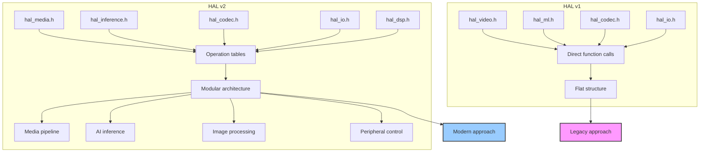
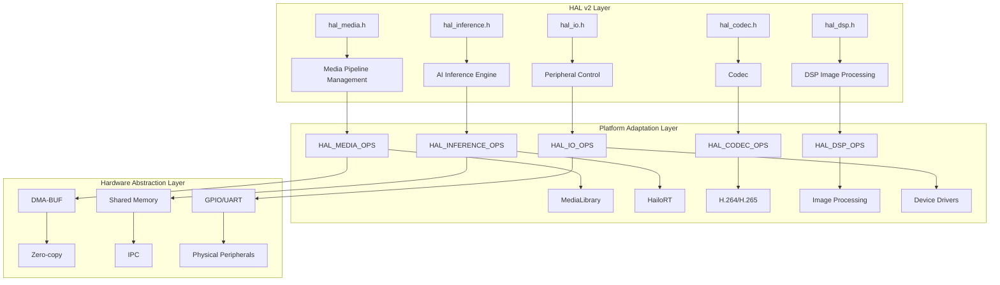
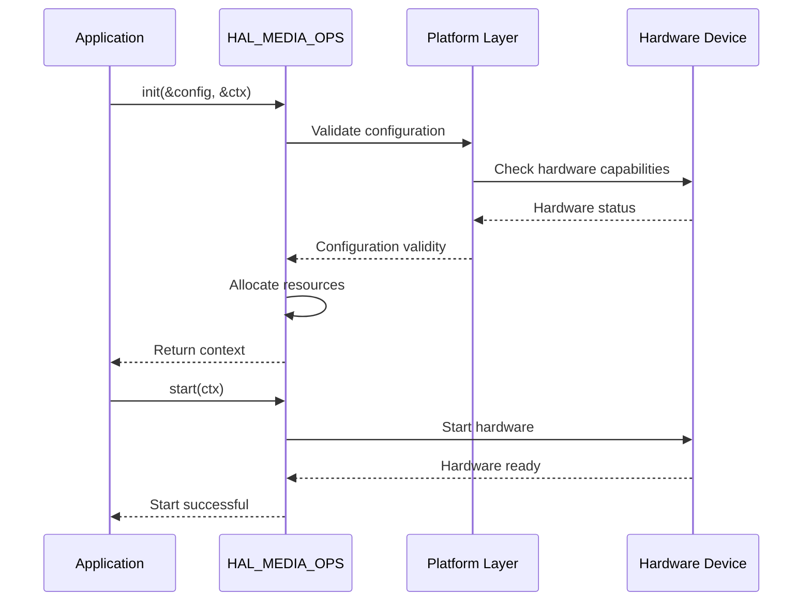
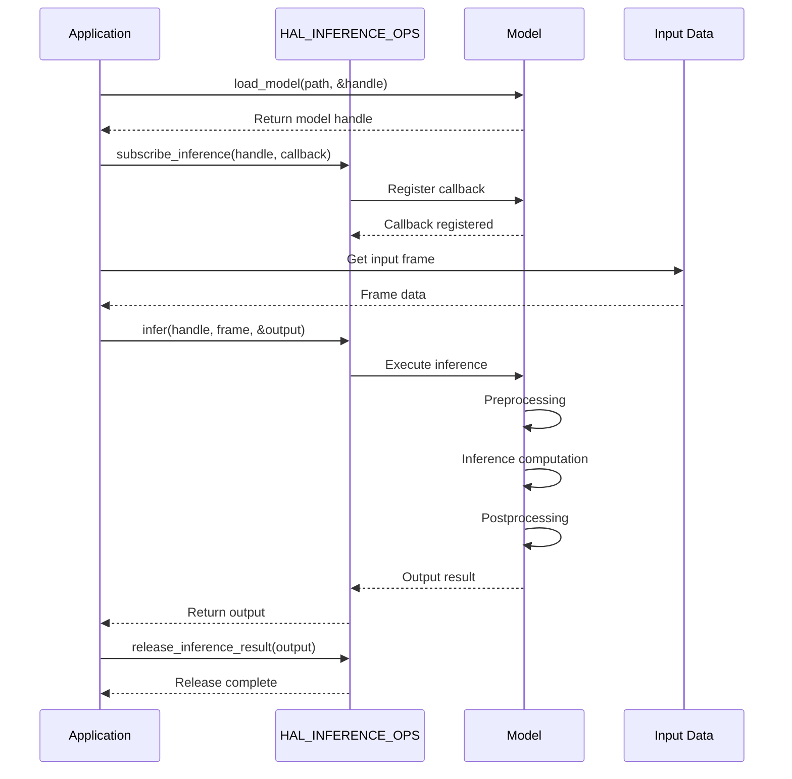
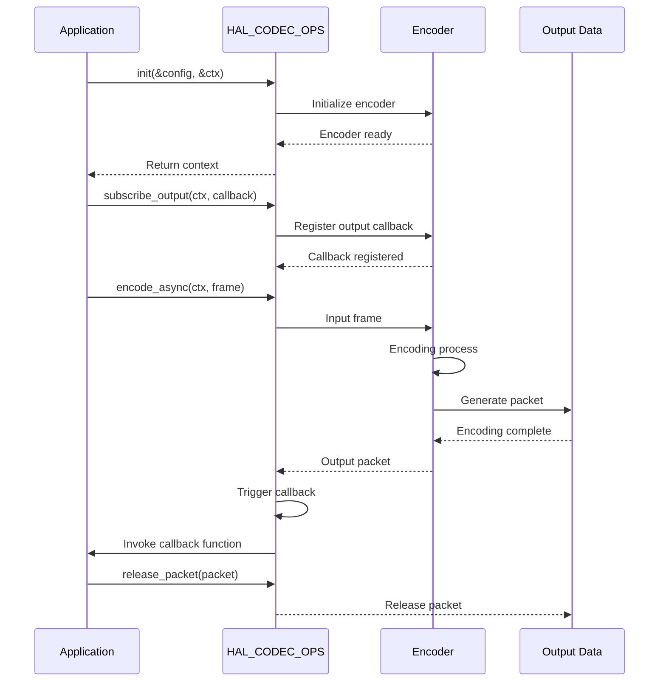

# HAL v2 API Reference

## Table of Contents

- [Architecture Overview](#architecture-overview)
- [Common Type Definitions](#common-type-definitions)
- [Interface Modules](#interface-modules)
- [Error Code Table](#error-code-table)
- [Usage Examples](#usage-examples)
- [Call Flows](#call-flows)
- [Stub Mode Notes](#stub-mode-notes)

## Architecture Overview

### HAL v1 vs HAL v2 Interface Comparison



### HAL v2 Modular Architecture



## Common Type Definitions

### HalStatus - Device Status

```c
typedef enum {
    HAL_STATUS_UNINITIALIZED = 0,   /* Not initialized */
    HAL_STATUS_INITIALIZED,         /* Initialized but not running */
    HAL_STATUS_RUNNING,             /* Running */
    HAL_STATUS_STOPPED,             /* Stopped */
    HAL_STATUS_ERROR,               /* Error state */
    HAL_STATUS_MAX,                 /* Sentinel value */
} HalStatus;
```

### HalErrorCode - Error Codes

```c
typedef enum {
    HAL_OK = 0,                     /* Success */
    HAL_ERROR = -0x0AFF,            /* General error */
    HAL_ERR_INVALID_ARG,           /* Invalid argument */
    HAL_ERR_INVALID_STATE,         /* Invalid state */
    HAL_ERR_INVALID_FMT,           /* Unsupported format */
    HAL_ERR_INVALID_SIZE,          /* Invalid size */
    HAL_ERR_TIMEOUT,               /* Operation timeout */
    HAL_ERR_NO_MEM,                /* Memory allocation failed */
    HAL_ERR_NOT_FINISHED,          /* Operation not completed */
    HAL_ERR_NOT_SUPPORTED,         /* Unsupported feature */
    HAL_ERR_NOT_IMPLEMENTED,       /* Not implemented */
    HAL_ERR_NOT_INITIALIZED,       /* Not initialized */
    HAL_ERR_NOT_READY,             /* Resource not ready */
    HAL_ERR_MUTEX,                 /* Mutex error */
    HAL_ERR_CHECK,                 /* Internal check failed */
    HAL_ERR_RESULT,                /* Upstream returned abnormal result */
    HAL_ERR_NOT_FOUND,             /* Resource not found */
    HAL_ERR_INSUFFICIENT_BUFFER,   /* Insufficient buffer */
    HAL_ERR_UNKNOW,                /* Unknown error */
} HalErrorCode;
```

### HalFrameBuffer - Frame Buffer

```c
typedef struct {
    /* Metadata */
    uint32_t        width;              /* Image width */
    uint32_t        height;             /* Image height */
    HalPixelFormat  format;             /* Pixel format */
    HalMemoryType   mem_type;            /* Memory type */
    uint32_t        sequence;            /* Frame sequence number */
    uint64_t        timestamp_ns;       /* Timestamp (nanoseconds) */
    
    /* Plane data */
    uint32_t        num_planes;         /* Number of planes [1..3] */
    int             dma_fds[HAL_MAX_PLANES];  /* DMA-BUF file descriptors */
    void           *planes[HAL_MAX_PLANES];   /* Userspace addresses */
    uint32_t        strides[HAL_MAX_PLANES]; /* Row strides */
    uint32_t        sizes[HAL_MAX_PLANES];     /* Plane sizes */
    
    void           *metadata;           /* Platform-specific metadata */
    void           *priv;               /* Platform private data */
} HalFrameBuffer;
```

### HalModelHandle - Model Handle

```c
typedef void* HalModelHandle;  /* Model inference session handle */
```

### HalModelInfo - Model Information

```c
typedef struct {
    char name[64];                      /* Model name */
    char version[32];                  /* Model version */
    uint32_t input_count;              /* Number of inputs */
    uint32_t output_count;             /* Number of outputs */
    
    struct {
        uint32_t width;                /* Input width */
        uint32_t height;               /* Input height */
        HalPixelFormat format;         /* Input format */
        uint32_t size;                 /* Input size (bytes) */
        HalDataType dtype;             /* Data type */
    } input;
    
    struct {
        uint32_t width;                /* Output width */
        uint32_t height;               /* Output height */
        uint32_t channels;              /* Output channels */
        uint32_t size;                 /* Output size (bytes) */
        HalDataType dtype;             /* Data type */
    } output;
} HalModelInfo;
```

## Interface Modules

### HalMediaOps - Media Pipeline Operations

```c
typedef struct {
    /* Lifecycle */
    int (*init)(const HalMediaConfig *config, void **media_ctx_return);
    int (*deinit)(void *media_ctx);
    int (*start)(void *media_ctx);
    int (*stop)(void *media_ctx);
    int (*get_status)(void *media_ctx);
    
    /* Configuration management */
    int (*get_current_profile)(void *media_ctx, char **profile_name);
    int (*get_profile_list)(void *media_ctx, char **profile_list, uint32_t *profile_list_count);
    int (*switch_profile)(void *media_ctx, const char *profile_name);
    
    /* Context retrieval */
    int (*get_video_list)(void *media_ctx, void **video_list, uint32_t *video_list_count);
    int (*get_codec_list)(void *media_ctx, void **codec_list, uint32_t *codec_list_count);
    
    /* Dynamic configuration */
    int (*dynamic_change_image_config)(void *media_ctx, const HalMediaImageConfig *config);
    int (*override_stream_params)(void *media_ctx, const HalStreamOverrideBatch *batch);
    
    /* Stream management */
    int (*add_streams_batch)(void *media_ctx, const HalMediaAddCodecConfig *codec_cfg,
                            const HalMediaAddVideoConfig *video_cfg);
    int (*remove_streams_batch)(void *media_ctx, const char *stream_id);
    
    /* Auto-feed */
    int (*set_encoder_auto_feed)(void *media_ctx, bool enable);
    int (*get_encoder_auto_feed)(void *media_ctx, bool *enable_out);
    
    /* Version information */
    const char *(*get_version)(void);
} HalMediaOps;
```

**Key features:**
- Unified media pipeline lifecycle management
- Profile switching
- Dynamic image parameter adjustment
- Frontend-to-encoder auto-feed
- Privacy mask support
- Digital zoom and image stabilization

### HalInferenceOps - AI Inference Operations

```c
typedef struct {
    /* Model management */
    int (*load_model)(const char *model_path, HalModelHandle *model_out);
    int (*unload_model)(HalModelHandle model);
    int (*get_model_info)(HalModelHandle model, HalModelInfo *info);
    
    /* Inference execution */
    int (*infer)(HalModelHandle model, const HalFrameBuffer *input, HalFrameBuffer **output);
    int (*infer_async)(HalModelHandle model, const HalFrameBuffer *input);
    
    /* Inference result handling */
    int (*get_inference_result)(HalModelHandle model, HalFrameBuffer **output);
    int (*subscribe_inference)(HalModelHandle model, inference_callback_t callback);
    
    /* Preprocessing/postprocessing */
    int (*tensor_from_frame)(HalModelHandle model, const HalFrameBuffer *frame, void **tensor_out);
    int (*postprocess)(HalModelHandle model, void *raw_output, void *processed_output);
    
    /* Version information */
    const char *(*get_version)(void);
} HalInferenceOps;
```

**Key features:**
- Model loading and unloading
- Synchronous/asynchronous inference
- Inference result subscription
- Tensor conversion
- Post-processing support
- GenAI streaming inference (LLM/VLM)

### HalCodecOps - Codec Operations

```c
typedef struct {
    /* Lifecycle */
    int (*init)(const HalCodecConfig *config, void **codec_ctx_return);
    int (*deinit)(void *codec_ctx);
    int (*get_status)(void *codec_ctx);
    
    /* Encoding */
    int (*encode)(void *codec_ctx, const HalFrameBuffer *input, HalPacketBuffer **packet_out);
    int (*encode_async)(void *codec_ctx, const HalFrameBuffer *input);
    
    /* Decoding */
    int (*decode)(void *codec_ctx, const HalPacketBuffer *packet, HalFrameBuffer **frame_out);
    int (*decode_async)(void *codec_ctx, const HalPacketBuffer *packet);
    
    /* Bitrate control */
    int (*set_bitrate)(void *codec_ctx, uint32_t bitrate);
    int (*get_bitrate)(void *codec_ctx, uint32_t *bitrate_out);
    
    /* Subscribe callbacks */
    int (*subscribe_output)(void *codec_ctx, codec_callback_t callback);
    
    /* Version information */
    const char *(*get_version)(void);
} HalCodecOps;
```

**Key features:**
- H.264/H.265 encoding
- Dynamic bitrate adjustment
- Asynchronous encoding/decoding
- Output stream subscription
- Encoder state management

### HalIoOps - Peripheral Operations

```c
typedef struct {
    /* GPIO operations */
    int (*init_gpio)(uint8_t pin, bool output_mode);
    int (*set_gpio)(uint8_t pin, bool value);
    int (*get_gpio)(uint8_t pin, bool *value_out);
    
    /* UART operations */
    int (*init_uart)(uint32_t baud_rate, uint8_t data_bits, uint8_t parity, uint8_t stop_bits);
    int (*uart_write)(const uint8_t *data, size_t size, size_t *written_out);
    int (*uart_read)(uint8_t *buffer, size_t buffer_size, size_t *read_out);
    
    /* Device management */
    int (*init_device)(const char *device_type, void **device_ctx);
    int (*control_device)(void *device_ctx, const char *command, void *params);
    
    /* Version information */
    const char *(*get_version)(void);
} HalIoOps;
```

**Key features:**
- GPIO control
- UART communication
- Device initialization
- Command execution
- Device status query

### HalDspOps - DSP Image Processing Operations

```c
typedef struct {
    /* Image processing */
    int (*convert_format)(const HalFrameBuffer *input, HalPixelFormat output_fmt, HalFrameBuffer **output);
    int (*resize)(const HalFrameBuffer *input, uint32_t width, uint32_t height, HalFrameBuffer **output);
    int (*crop)(const HalFrameBuffer *input, uint32_t x, uint32_t y, uint32_t width, uint32_t height, HalFrameBuffer **output);
    
    /* Image enhancement */
    int (*apply_filter)(const HalFrameBuffer *input, const char *filter_type, void *params, HalFrameBuffer **output);
    int (*sharpen)(const HalFrameBuffer *input, float strength, HalFrameBuffer **output);
    int (*denoise)(const HalFrameBuffer *input, float strength, HalFrameBuffer **output);
    
    /* Privacy mask */
    int (*apply_privacy_mask)(const HalFrameBuffer *input, const HalPrivacyMaskConfig *mask, HalFrameBuffer **output);
    
    /* Version information */
    const char *(*get_version)(void);
} HalDspOps;
```

**Key features:**
- Format conversion
- Image scaling
- Image cropping
- Image filtering
- Privacy mask application
- Image enhancement

## Error Code Table

| Error Code | Value | Description | Solution |
|------------|-------|-------------|----------|
| HAL_OK | 0 | Success | - |
| HAL_ERROR | -0x0AFF | General error | Check logs for specific error |
| HAL_ERR_INVALID_ARG | -1 | Invalid argument | Verify all input parameters |
| HAL_ERR_INVALID_STATE | -2 | Invalid state | Check device/context state |
| HAL_ERR_INVALID_FMT | -3 | Unsupported format | Use a supported pixel format |
| HAL_ERR_INVALID_SIZE | -4 | Invalid size | Check buffer dimensions |
| HAL_ERR_TIMEOUT | -5 | Operation timeout | Increase timeout or check performance |
| HAL_ERR_NO_MEM | -6 | Memory allocation failed | Increase system memory or reduce buffers |
| HAL_ERR_NOT_IMPLEMENTED | -8 | Feature not implemented | Update firmware or use alternative |
| HAL_ERR_NOT_INITIALIZED | -9 | Not initialized | Initialize device/context first |

## Usage Examples

### Media Pipeline Initialization Example

```c
#include <hal_media.h>
#include <hal_video.h>
#include <hal_codec.h>

int main() {
    HalMediaConfig media_config = {
        .config_path = "/etc/imaging/cfg/medialib_configs/profile.json",
        .backup_folder_path = "/opt/aipc/backups",
        .image_config = {
            .rotation_angle = HAL_ROTATION_ANGLE_0,
            .flip_direction = HAL_FLIP_DIRECTION_NONE,
            .dewarp = false,
            .dis = false,
            .privacy_mask = false
        },
        .priv = NULL
    };
    
    void *media_ctx = NULL;
    int ret = HAL_MEDIA_OPS.init(&media_config, &media_ctx);
    if (ret != HAL_OK) {
        printf("Failed to init media: %s\n", hal_error_to_string(ret));
        return -1;
    }
    
    // Start media pipeline
    ret = HAL_MEDIA_OPS.start(media_ctx);
    if (ret != HAL_OK) {
        printf("Failed to start media: %s\n", hal_error_to_string(ret));
        HAL_MEDIA_OPS.deinit(media_ctx);
        return -1;
    }
    
    printf("Media pipeline started successfully\n");
    
    // Get video context
    void *video_ctx = NULL;
    void *video_list[8];
    uint32_t video_count = 0;
    ret = HAL_MEDIA_OPS.get_video_list(media_ctx, video_list, &video_count);
    if (ret == HAL_OK && video_count > 0) {
        video_ctx = video_list[0];
        printf("Got video context with type HAL_VIDEO_TYPE_FROM_MEDIA\n");
    }
    
    // ... Use video stream ...
    
    // Cleanup
    HAL_MEDIA_OPS.stop(media_ctx);
    HAL_MEDIA_OPS.deinit(media_ctx);
    
    return 0;
}
```

### AI Inference Example

```c
#include <hal_inference.h>
#include <hal_buffer.h>

int run_ai_pipeline() {
    HalModelHandle model = NULL;
    HalModelInfo model_info;
    
    // Load model
    int ret = HAL_INFERENCE_OPS.load_model(
        "/opt/aipc/models/person_detection.hef",
        &model
    );
    if (ret != HAL_OK) {
        printf("Failed to load model: %s\n", hal_error_to_string(ret));
        return -1;
    }
    
    // Get model information
    ret = HAL_INFERENCE_OPS.get_model_info(model, &model_info);
    if (ret != HAL_OK) {
        printf("Failed to get model info\n");
        HAL_INFERENCE_OPS.unload_model(model);
        return -1;
    }
    
    printf("Model loaded: %s, input: %dx%d\n", 
           model_info.name, model_info.input.width, model_info.input.height);
    
    // Subscribe to inference results
    ret = HAL_INFERENCE_OPS.subscribe_inference(model, inference_callback);
    if (ret != HAL_OK) {
        printf("Failed to subscribe to inference\n");
        HAL_INFERENCE_OPS.unload_model(model);
        return -1;
    }
    
    // Inference loop
    for (int i = 0; i < 100; i++) {
        HalFrameBuffer *input_frame = NULL;
        
        // Get input frame (from media pipeline or other source)
        // ... get_next_frame(&input_frame) ...
        
        if (input_frame) {
            // Execute inference
            ret = HAL_INFERENCE_OPS.infer(model, input_frame, NULL);
            if (ret != HAL_OK) {
                printf("Inference failed: %s\n", hal_error_to_string(ret));
            }
            
            // Release frame
            HAL_MEDIA_OPS.release_frame(input_frame);
        }
        
        usleep(33000); // 30 FPS
    }
    
    // Cleanup
    HAL_INFERENCE_OPS.unsubscribe_inference(model);
    HAL_INFERENCE_OPS.unload_model(model);
    
    return 0;
}

void inference_callback(HalFrameBuffer *output) {
    // Process inference result
    printf("Inference result received\n");
    
    // Release output
    HAL_INFERENCE_OPS.release_inference_result(output);
}
```

### Encoder Example

```c
#include <hal_codec.h>

int run_encoder() {
    HalCodecConfig codec_config = {
        .packet_type = HAL_PACKET_TYPE_H264,
        .bitrate = 2000000,      // 2 Mbps
        .fps = 30,
        .width = 1920,
        .height = 1080,
        .gop_size = 30,
        .path = NULL,
        .media_ptr = NULL
    };
    
    void *codec_ctx = NULL;
    int ret = HAL_CODEC_OPS.init(&codec_config, &codec_ctx);
    if (ret != HAL_OK) {
        printf("Failed to init codec: %s\n", hal_error_to_string(ret));
        return -1;
    }
    
    // Subscribe to encoder output
    ret = HAL_CODEC_OPS.subscribe_output(codec_ctx, encoder_callback);
    if (ret != HAL_OK) {
        printf("Failed to subscribe to encoder\n");
        HAL_CODEC_OPS.deinit(codec_ctx);
        return -1;
    }
    
    // Encoding loop
    for (int i = 0; i < 100; i++) {
        HalFrameBuffer *input_frame = NULL;
        
        // Get input frame
        // ... get_next_frame(&input_frame) ...
        
        if (input_frame) {
            // Asynchronous encoding
            ret = HAL_CODEC_OPS.encode_async(codec_ctx, input_frame);
            if (ret != HAL_OK) {
                printf("Encode failed: %s\n", hal_error_to_string(ret));
            }
            
            // Release frame
            HAL_MEDIA_OPS.release_frame(input_frame);
        }
        
        usleep(33000); // 30 FPS
    }
    
    // Stop encoder
    HAL_CODEC_OPS.deinit(codec_ctx);
    
    return 0;
}

void encoder_callback(HalPacketBuffer *packet) {
    // Process encoded packet
    printf("Encoded packet: %d bytes\n", packet->size);
    
    // Send over network or save to file
    // ... send_packet(packet) ...
    
    // Release packet
    HAL_CODEC_OPS.release_packet(packet);
}
```

### Peripheral Control Example

```c
#include <hal_io.h>

int control_devices() {
    // Initialize GPIO
    int ret = HAL_IO_OPS.init_gpio(23, true); // GPIO 23 output mode
    if (ret != HAL_OK) {
        printf("Failed to init GPIO: %s\n", hal_error_to_string(ret));
        return -1;
    }
    
    // Control light
    HAL_IO_OPS.set_gpio(23, true);  // Light on
    sleep(5);
    HAL_IO_OPS.set_gpio(23, false); // Light off
    
    // Initialize UART
    ret = HAL_IO_OPS.init_uart(115200, 8, 0, 1); // 115200 8N1
    if (ret != HAL_OK) {
        printf("Failed to init UART: %s\n", hal_error_to_string(ret));
        return -1;
    }
    
    // UART communication
    uint8_t tx_data[] = "Hello UART";
    size_t written = 0;
    ret = HAL_IO_OPS.uart_write(tx_data, sizeof(tx_data) - 1, &written);
    if (ret == HAL_OK) {
        printf("Sent %d bytes via UART\n", written);
    }
    
    // Read UART data
    uint8_t rx_buffer[256];
    size_t bytes_read = 0;
    ret = HAL_IO_OPS.uart_read(rx_buffer, sizeof(rx_buffer), &bytes_read);
    if (ret == HAL_OK && bytes_read > 0) {
        printf("Received %d bytes via UART\n", bytes_read);
        rx_buffer[bytes_read] = '\0';
        printf("Data: %s\n", rx_buffer);
    }
    
    return 0;
}
```

## Call Flows

### Media Pipeline Initialization Flow



### AI Inference Flow



### Encoding Flow



## Stub Mode Notes

### Stub Mode Overview

HAL v2 uses a Stub mode that allows development and testing without hardware:

1. **Interface consistency**: Stub implementation uses the same API as the real hardware implementation
2. **Simulated data**: Returns predefined mock data or simple responses
3. **Performance optimization**: Avoids the overhead of hardware access
4. **Debug friendly**: Easy to add debug information

### Stub Features

```c
// HAL implementation selection
#ifdef HAL_STUB_IMPL
    // Stub implementation - returns simulated data
    const char* hal_get_version(void) {
        return "HAL Stub v2.0.0";
    }
    
    int HAL_MEDIA_OPS.init(const HalMediaConfig *config, void **ctx) {
        *ctx = (void*)0x12345678; // Return simulated context
        return HAL_OK;
    }
#else
    // Real hardware implementation
    // ... Actual hardware access code ...
#endif
```

### Stub Use Cases

1. **Unit testing**: Test application logic without hardware
2. **CI/CD pipelines**: Automated testing without hardware dependencies
3. **Prototype development**: Rapidly validate feature design
4. **Debugging aid**: Isolate software issues

### Stub Limitations

1. **Feature limitations**: Some advanced features may not be simulated
2. **Performance differences**: Stub and real hardware performance differ
3. **Behavioral differences**: Error handling may differ from real hardware
4. **Resource management**: Memory allocation strategies may differ from actual behavior

### Switching from Stub to Hardware

```bash
# Build HAL stub version
make hal-v2 PLATFORM=stub

# Build Hailo-15 real version (requires SDK)
source /opt/poky/4.0.23/environment-setup-aarch64-poky-linux
make hal-v2 PLATFORM=hailo15
```

Through this design, HAL v2 provides a unified interface while supporting flexible switching between development testing and actual deployment.
