# Troubleshooting Manual

## Overview

This manual provides troubleshooting procedures and solutions for common issues on the AIPC platform. The platform uses a microservice architecture where services communicate via Unix sockets and follow a specific startup order.

## General Troubleshooting Procedure

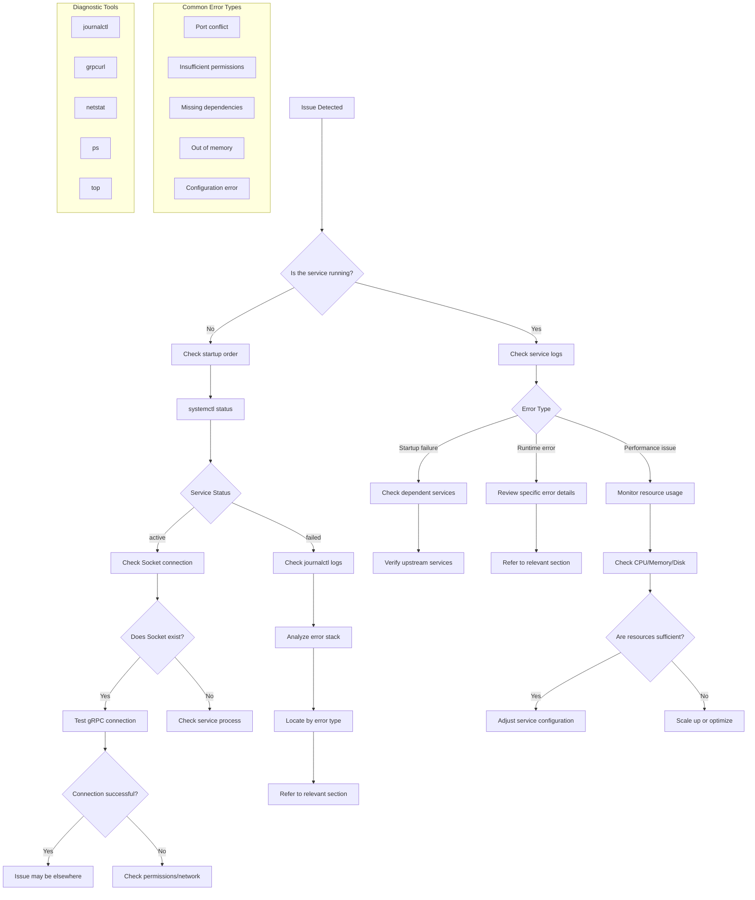
```mermaid
flowchart TD
    A[Issue Detected] --> B{Is the service running?}
    B -->|Yes| C[Check service logs]
    B -->|No| D[Check startup order]
    
    D --> E[systemctl status]
    E --> F{Service Status}
    F -->|failed| G[Check journalctl logs]
    F -->|active| H[Check Socket connection]
    
    C --> I{Error Type}
    I -->|Startup failure| J[Check dependent services]
    I -->|Runtime error| K[Review specific error details]
    I -->|Performance issue| L[Monitor resource usage]
    
    J --> M[Verify upstream services]
    K --> N[Refer to relevant section]
    L --> O[Check CPU/Memory/Disk]
    
    H --> P{Does Socket exist?}
    P -->|Yes| Q[Test gRPC connection]
    P -->|No| R[Check service process]
    
    Q --> S{Connection successful?}
    S -->|Yes| T[Issue may be elsewhere]
    S -->|No| U[Check permissions/network]
    
    G --> V[Analyze error stack]
    V --> W[Locate by error type]
    W --> X[Refer to relevant section]
    
    O --> Y{Are resources sufficient?}
    Y -->|Yes| Z[Adjust service configuration]
    Y -->|No| AA[Scale up or optimize]
    
    subgraph "Common Error Types"
        AB[Port conflict]
        AC[Insufficient permissions]
        AD[Missing dependencies]
        AE[Out of memory]
        AF[Configuration error]
    end
    
    subgraph "Diagnostic Tools"
        AG[journalctl]
        AH[grpcurl]
        AI[netstat]
        AJ[ps]
        AK[top]
    end
```

## Service Startup Failure Troubleshooting

### 1. Check systemd Status

```bash
# View all AIPC service statuses
systemctl status 'aipc-*'

# View specific service status
systemctl status aipc-ai-runtime.service

# View services that failed to start
systemctl --failed | grep aipc

# View service dependencies
systemctl list-dependencies aipc-platform-api.service
```

### 2. Check if Unix Socket Exists

```bash
# Check /run/aipc directory
ls -la /run/aipc/

# Check if specific Socket exists
ls -la /run/aipc/ai-runtime.sock
ls -la /run/aipc/app-manager.sock
ls -la /run/aipc/device-control.sock

# Test Socket connection
nc -U /run/aipc/ai-runtime.sock
```

### 3. Check Logs with journalctl

```bash
# View service logs in real-time
journalctl -u aipc-ai-runtime -f

# View logs from the last 1 hour
journalctl -u aipc-camera-daemon --since "1 hour ago"

# View logs with error keywords
journalctl -u aipc-app-manager | grep -i "error\|failed\|fatal"

# View detailed startup failure errors
journalctl -u aipc-app-manager -b --no-pager

# Filter by specific error level
journalctl -u aipc-event-bus -p err
journalctl -u aipc-device-control -p warning
```

### 4. Common Service Startup Issues

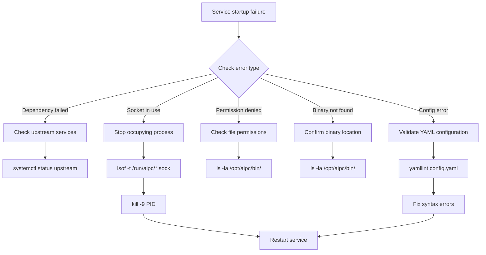
```mermaid
flowchart TD
    A[Service startup failure] --> B{Check error type}
    B -->|Dependency failed| C[Check upstream services]
    B -->|Socket in use| D[Stop occupying process]
    B -->|Permission denied| E[Check file permissions]
    B -->|Binary not found| F[Confirm binary location]
    B -->|Config error| G[Validate YAML configuration]
    
    C --> H[systemctl status upstream]
    D --> I[lsof -t /run/aipc/*.sock]
    E --> J[ls -la /opt/aipc/bin/]
    F --> K[ls -la /opt/aipc/bin/]
    G --> L[yamllint config.yaml]
    
    I --> M[kill -9 PID]
    L --> N[Fix syntax errors]
    M --> O[Restart service]
    N --> O
```

### 5. Socket Connection Test

```bash
# Test gRPC service using grpcurl
grpcurl -plaintext -d '{}' unix:///run/aipc/ai-runtime.sock list

# Test if service responds
grpcurl -plaintext -d '{"model_id": "test"}' unix:///run/aipc/ai-runtime.sock aipc.platform.inference.v1.InferenceService/ListModels

# Check Socket permissions
ls -ld /run/aipc/
ls -la /run/aipc/*.sock
```

## AI Inference Troubleshooting

### 1. Model Loading Failure

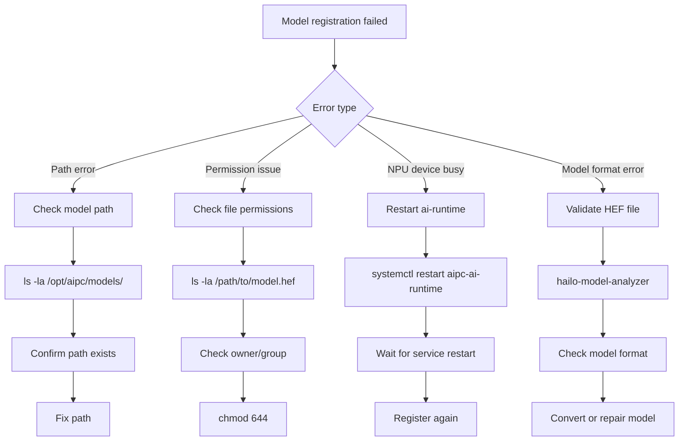
```mermaid
flowchart TD
    A[Model registration failed] --> B{Error type}
    B -->|Path error| C[Check model path]
    B -->|Permission issue| D[Check file permissions]
    B -->|NPU device busy| E[Restart ai-runtime]
    B -->|Model format error| F[Validate HEF file]
    
    C --> G[ls -la /opt/aipc/models/]
    D --> H[ls -la /path/to/model.hef]
    E --> I[systemctl restart aipc-ai-runtime]
    F --> J[hailo-model-analyzer]
    
    G --> K[Confirm path exists]
    H --> L[Check owner/group]
    I --> M[Wait for service restart]
    J --> N[Check model format]
    
    K --> O[Fix path]
    L --> P[chmod 644]
    M --> Q[Register again]
    N --> R[Convert or repair model]
```

**Diagnostic commands:**
```bash
# View model registration logs
journalctl -u aipc-ai-runtime | grep -i "model"

# Check NPU device status
hailo-smi

# Validate model files
ls -la /opt/aipc/models/
file /opt/aipc/models/yolov8n.hef
```

### 2. Inference Timeout

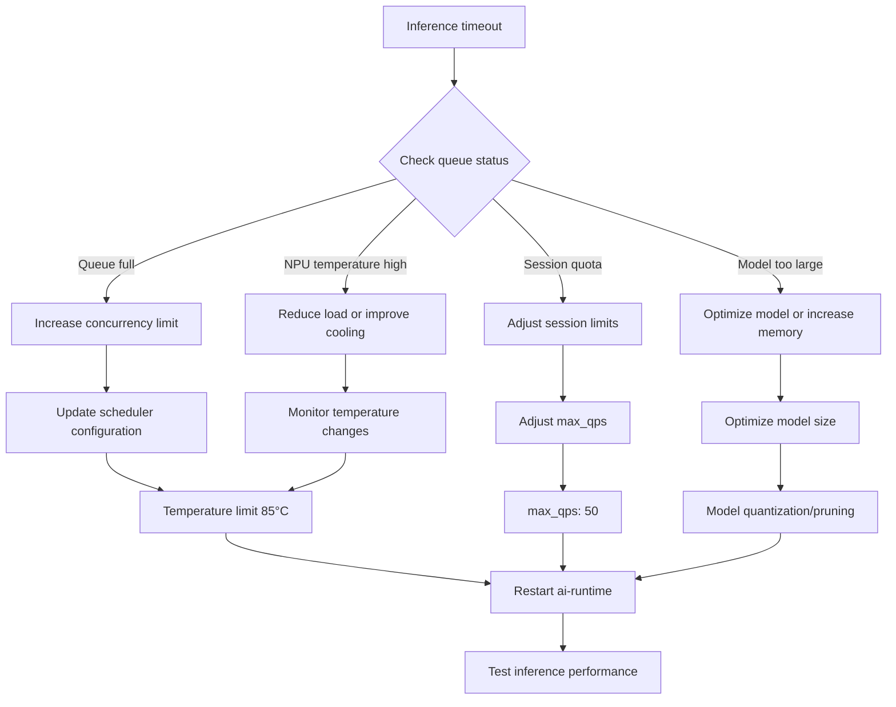
```mermaid
flowchart TD
    A[Inference timeout] --> B{Check queue status}
    B -->|Queue full| C[Increase concurrency limit]
    B -->|Session quota| D[Adjust session limits]
    B -->|Model too large| E[Optimize model or increase memory]
    B -->|NPU temperature high| F[Reduce load or improve cooling]
    
    C --> G[Update scheduler configuration]
    D --> H[Adjust max_qps]
    E --> I[Optimize model size]
    F --> J[Monitor temperature changes]
    
    G --> K[global_qps_limit: 200]
    H --> L[max_qps: 50]
    I --> M[Model quantization/pruning]
    J --> K[Temperature limit 85°C]
    
    K --> N[Restart ai-runtime]
    L --> N
    M --> N
    N --> O[Test inference performance]
```

**Diagnostic commands:**
```bash
# View inference statistics
grpcurl -plaintext -d '{}' unix:///run/aipc/ai-runtime.sock aipc.platform.inference.v1.InferenceService/GetStats

# Check queue length
grpcurl -plaintext -d '{}' unix:///run/aipc/ai-runtime.sock aipc.platform.inference.v1.InferenceService/ListModels

# Monitor system resources
top -p $(pidof ai-runtime)
```

### 3. NPU Overtemperature

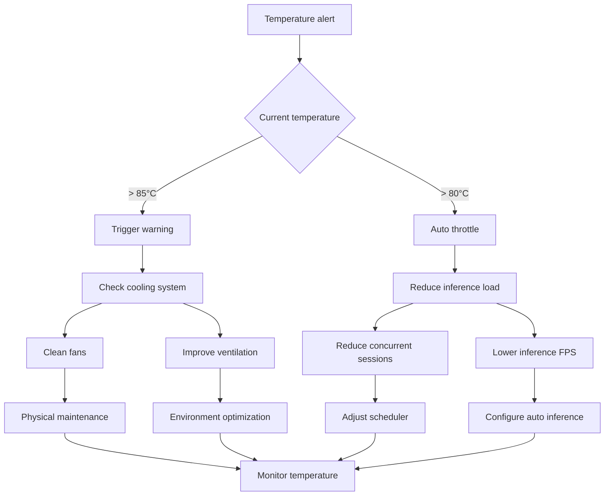
```mermaid
flowchart TD
    A[Temperature alert] --> B{Current temperature}
    B -->|> 85°C| C[Trigger warning]
    B -->|> 80°C| D[Auto throttle]
    
    C --> E[Check cooling system]
    D --> F[Reduce inference load]
    
    E --> G[Clean fans]
    E --> H[Improve ventilation]
    F --> I[Reduce concurrent sessions]
    F --> J[Lower inference FPS]
    
    G --> K[Physical maintenance]
    H --> L[Environment optimization]
    I --> M[Adjust scheduler]
    J --> N[Configure auto inference]
    
    K --> O[Monitor temperature]
    L --> O
    M --> O
    N --> O
```

**Monitoring commands:**
```bash
# Check NPU temperature
hailo-smi | grep Temperature

# View ai-runtime temperature logs
journalctl -u aipc-ai-runtime | grep -i "temperature"

# View performance statistics
grpcurl -plaintext -d '{}' unix:///run/aipc/ai-runtime.sock aipc.platform.inference.v1.InferenceService/GetStats
```

### 4. Session Quota Exceeded

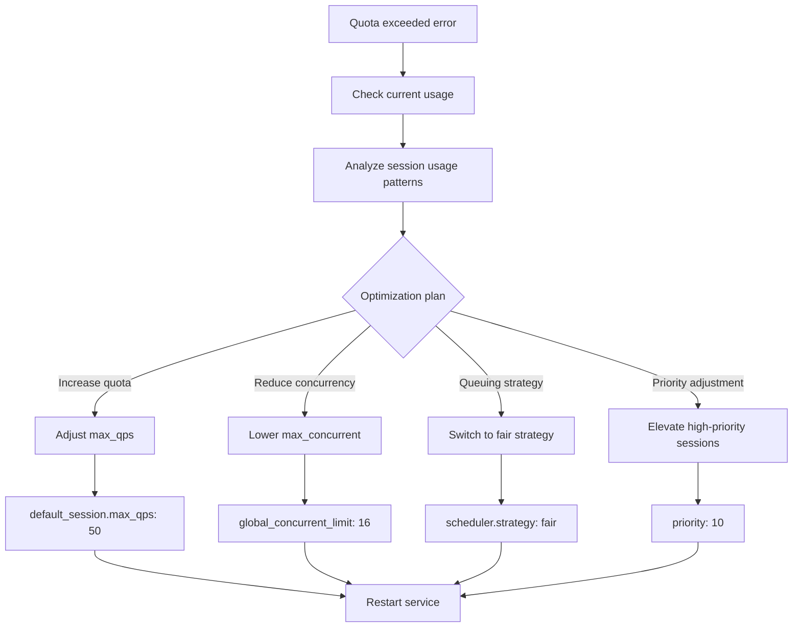
```mermaid
flowchart TD
    A[Quota exceeded error] --> B[Check current usage]
    B --> C[Analyze session usage patterns]
    C --> D{Optimization plan}
    
    D -->|Increase quota| E[Adjust max_qps]
    D -->|Reduce concurrency| F[Lower max_concurrent]
    D -->|Queuing strategy| G[Switch to fair strategy]
    D -->|Priority adjustment| H[Elevate high-priority sessions]
    
    E --> I[default_session.max_qps: 50]
    F --> J[global_concurrent_limit: 16]
    G --> K[scheduler.strategy: fair]
    H --> L[priority: 10]
    
    I --> M[Restart service]
    J --> M
    K --> M
    L --> M
```

**Diagnostic commands:**
```bash
# View all sessions
grpcurl -plaintext -d '{}' unix:///run/aipc/ai-runtime.sock aipc.platform.inference.v1.InferenceService/ListModels

# View quota statistics
grpcurl -plaintext -d '{}' unix:///run/aipc/ai-runtime.sock aipc.platform.inference.v1.InferenceService/GetStats

# Check session creation logs
journalctl -u aipc-ai-runtime | grep -i "session"
```

## Video Streaming Troubleshooting

### 1. RTSP Connection Failure

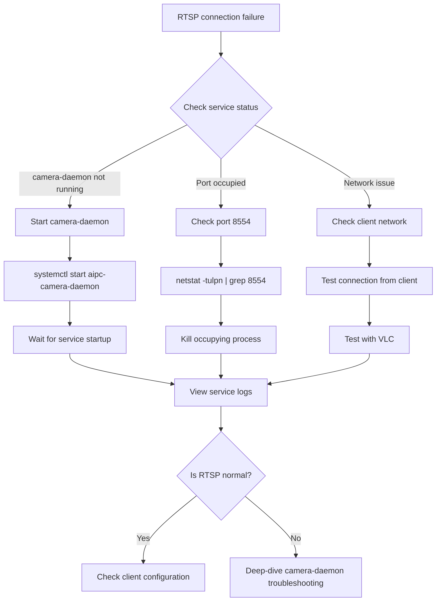
```mermaid
flowchart TD
    A[RTSP connection failure] --> B{Check service status}
    B -->|camera-daemon not running| C[Start camera-daemon]
    B -->|Port occupied| D[Check port 8554]
    B -->|Network issue| E[Check client network]
    
    C --> F[systemctl start aipc-camera-daemon]
    D --> G["netstat -tulpn | grep 8554"]
    E --> H[Test connection from client]
    
    F --> I[Wait for service startup]
    G --> J[Kill occupying process]
    H --> K[Test with VLC]
    
    I --> L[View service logs]
    J --> L
    K --> L
    
    L --> M{Is RTSP normal?}
    M -->|Yes| N[Check client configuration]
    M -->|No| O[Deep-dive camera-daemon troubleshooting]
```

**Diagnostic commands:**
```bash
# Check RTSP server status
systemctl status aipc-camera-daemon

# View RTSP logs
journalctl -u aipc-camera-daemon -f

# Test RTSP connection
ffmpeg -rtsp_transport tcp -i rtsp://localhost:8554/stream -t 10 -f null -

# View port usage
netstat -tulpn | grep 8554
```

### 2. WebSocket Disconnection

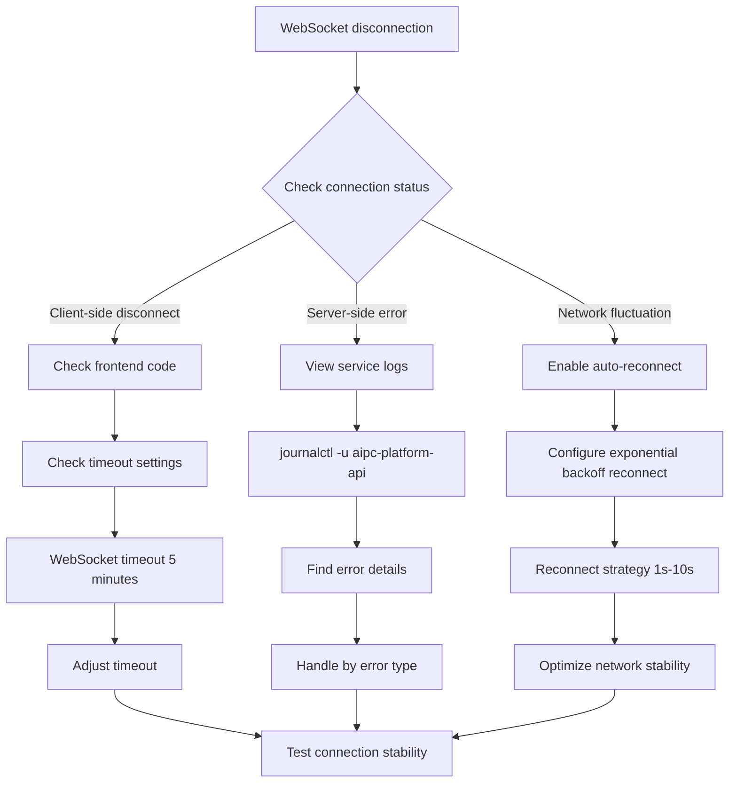
```mermaid
flowchart TD
    A[WebSocket disconnection] --> B{Check connection status}
    B -->|Client-side disconnect| C[Check frontend code]
    B -->|Server-side error| D[View service logs]
    B -->|Network fluctuation| E[Enable auto-reconnect]
    
    C --> F[Check timeout settings]
    D --> G[journalctl -u aipc-platform-api]
    E --> H[Configure exponential backoff reconnect]
    
    F --> I[WebSocket timeout 5 minutes]
    G --> J[Find error details]
    H --> K[Reconnect strategy 1s-10s]
    
    I --> L[Adjust timeout]
    J --> M[Handle by error type]
    K --> N[Optimize network stability]
    
    L --> O[Test connection stability]
    M --> O
    N --> O
```

**Diagnostic commands:**
```bash
# View WebSocket connection logs
journalctl -u aipc-platform-api | grep -i "websocket\|h264"

# Test WebSocket connection
wscat -c ws://localhost:8080/api/v1/h264/cam1

# Check frontend connection status
# In browser developer tools, check the Network tab
```

### 3. Video Artifacts/Black Screen

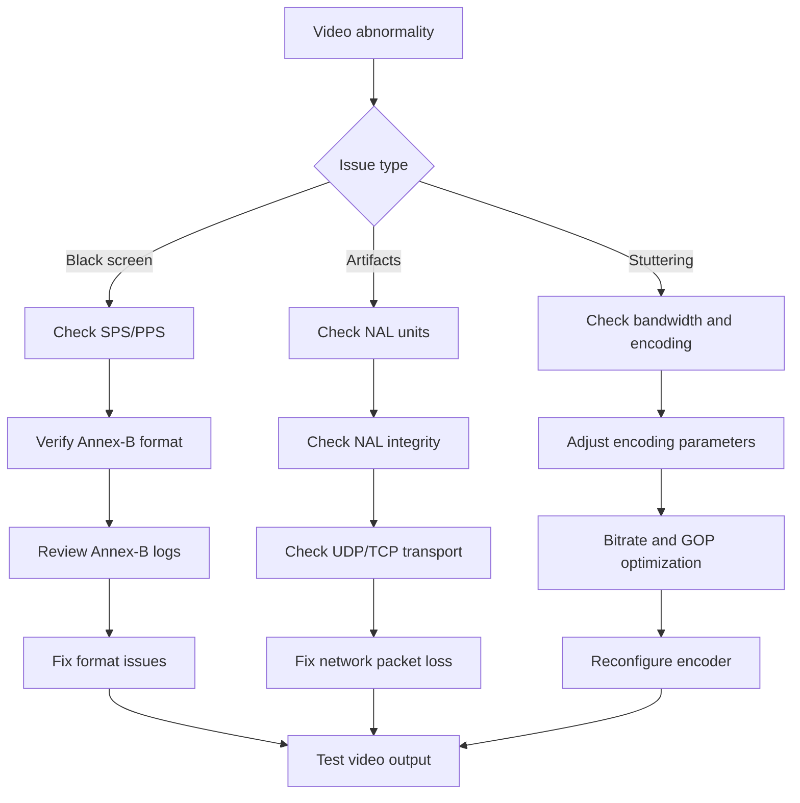
```mermaid
flowchart TD
    A[Video abnormality] --> B{Issue type}
    B -->|Black screen| C[Check SPS/PPS]
    B -->|Artifacts| D[Check NAL units]
    B -->|Stuttering| E[Check bandwidth and encoding]
    
    C --> F[Verify Annex-B format]
    D --> G[Check NAL integrity]
    E --> H[Adjust encoding parameters]
    
    F --> I[Review Annex-B logs]
    G --> J[Check UDP/TCP transport]
    H --> K[Bitrate and GOP optimization]
    
    I --> L[Fix format issues]
    J --> M[Fix network packet loss]
    K --> N[Reconfigure encoder]
    
    L --> O[Test video output]
    M --> O
    N --> O
```

**Diagnostic commands:**
```bash
# Check video stream status
curl http://localhost:8080/api/v1/media/status

# View H.264 stream logs
journalctl -u aipc-platform-api | grep -i "h264\|nal"

# Analyze video packets
tcpdump -i lo -s 0 -w rtsp.pcap port 8554
```

## Container Application Troubleshooting

### 1. Application Installation Failure

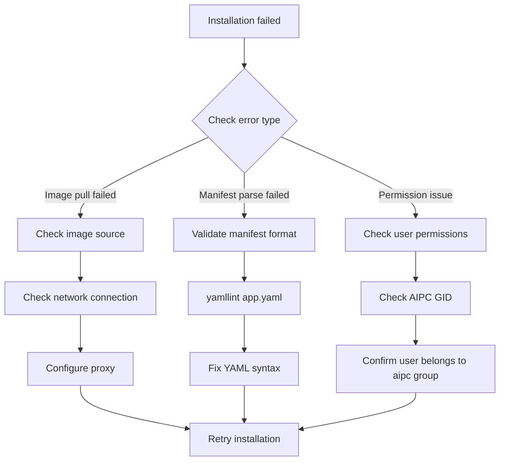
```mermaid
flowchart TD
    A[Installation failed] --> B{Check error type}
    B -->|Image pull failed| C[Check image source]
    B -->|Manifest parse failed| D[Validate manifest format]
    B -->|Permission issue| E[Check user permissions]
    
    C --> F[Check network connection]
    D --> G[yamllint app.yaml]
    E --> H[Check AIPC GID]
    
    F --> I[Configure proxy]
    G --> J[Fix YAML syntax]
    H --> K[Confirm user belongs to aipc group]
    
    I --> L[Retry installation]
    J --> L
    K --> L
```

**Diagnostic commands:**
```bash
# View installation logs
journalctl -u aipc-app-manager -f

# Check manifest format
aipc-cli app-manager inspect-app /path/to/app.yaml

# Validate image
docker pull registry.example.com/app:latest
```

### 2. Container Startup Failure

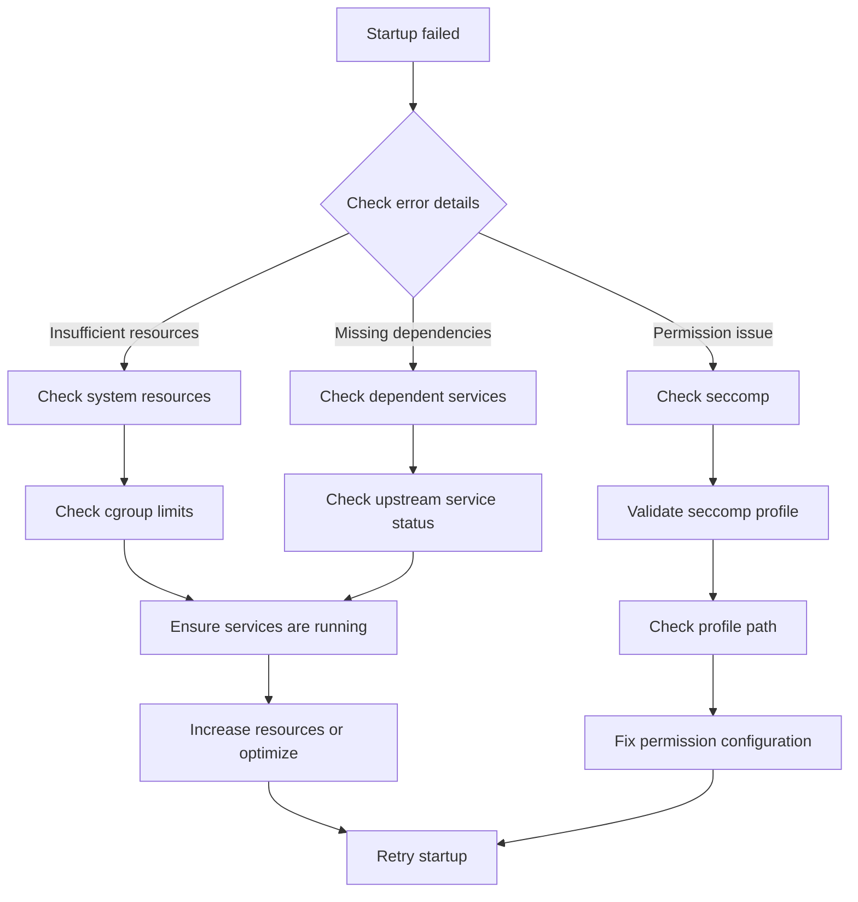
```mermaid
flowchart TD
    A[Startup failed] --> B{Check error details}
    B -->|Insufficient resources| C[Check system resources]
    B -->|Permission issue| D[Check seccomp]
    B -->|Missing dependencies| E[Check dependent services]
    
    C --> F[Check cgroup limits]
    D --> G[Validate seccomp profile]
    E --> H[Check upstream service status]
    
    F --> I[Adjust resource quotas]
    G --> J[Check profile path]
    H --> I[Ensure services are running]
    
    I --> K[Increase resources or optimize]
    J --> L[Fix permission configuration]
    K --> M[Retry startup]
    L --> M
```

**Diagnostic commands:**
```bash
# View container logs
journalctl -u aipc-app-manager | grep -i "container"

# Check system resources
free -h
df -h
cgrouptop

# Check containerd status
systemctl status containerd
```

### 3. Health Check Failure

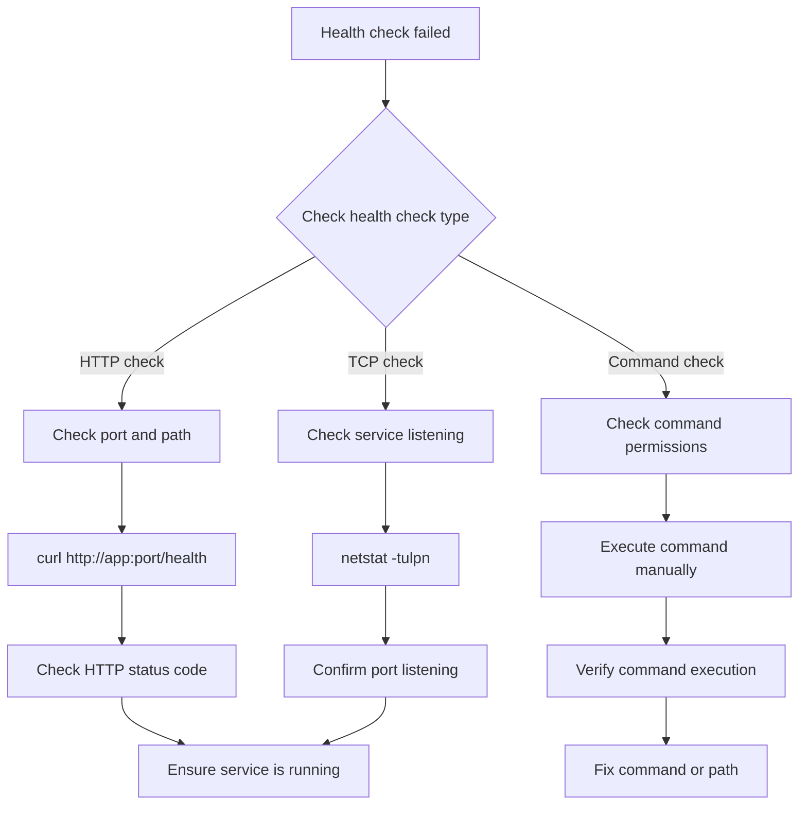
```mermaid
flowchart TD
    A[Health check failed] --> B{Check health check type}
    B -->|HTTP check| C[Check port and path]
    B -->|Command check| D[Check command permissions]
    B -->|TCP check| E[Check service listening]
    
    C --> F[curl http://app:port/health]
    D --> G[Execute command manually]
    E --> H[netstat -tulpn]
    
    F --> I[Check HTTP status code]
    G --> J[Verify command execution]
    H --> K[Confirm port listening]
    
    I --> L[Fix application health endpoint]
    J --> M[Fix command or path]
    K --> L[Ensure service is running]
```

**Diagnostic commands:**
```bash
# View health check logs
journalctl -u aipc-app-manager | grep -i "healthcheck"

# Execute health check command manually
docker exec -it container-id /path/to/healthcheck.sh

# Check container status
aipc-cli app-manager get-app <app-id>
```

## Device Control Troubleshooting

### 1. PTZ Control Not Responding

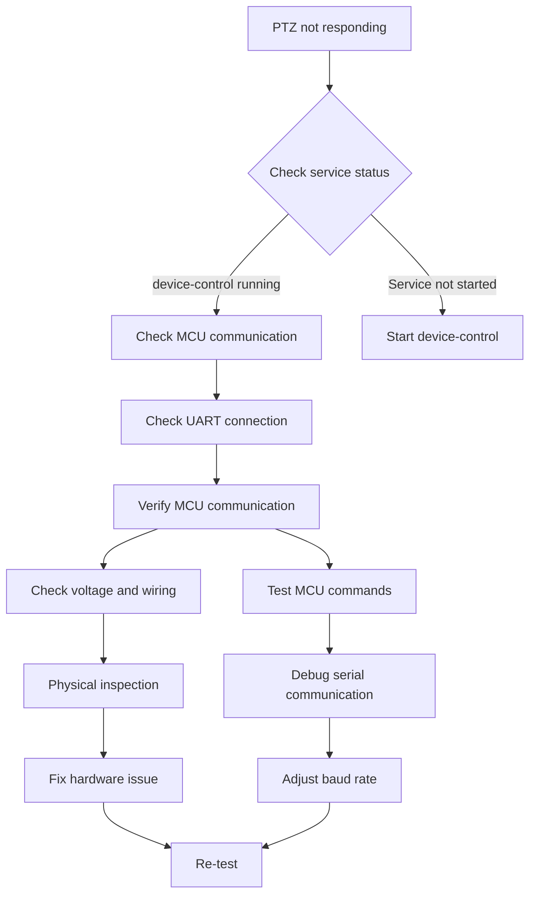
```mermaid
flowchart TD
    A[PTZ not responding] --> B{Check service status}
    B -->|device-control running| C[Check MCU communication]
    B -->|Service not started| D[Start device-control]
    
    C --> E[Check UART connection]
    E --> F[Verify MCU communication]
    
    F --> G[Check voltage and wiring]
    F --> H[Test MCU commands]
    
    G --> I[Physical inspection]
    H --> J[Debug serial communication]
    
    I --> K[Fix hardware issue]
    J --> L[Adjust baud rate]
    
    K --> M[Re-test]
    L --> M
```

**Diagnostic commands:**
```bash
# Check device-control status
systemctl status aipc-device-control

# View PTZ logs
journalctl -u aipc-device-control -f

# Test UART communication
ls -la /dev/ttyS*
stty -F /dev/ttyS0 921600

# Test PTZ control command
grpcurl -plaintext -d '{"direction": "PAN_LEFT", "speed": 50}' unix:///run/aipc/device-control.sock aipc.platform.device.v1.DeviceControl/Pan
```

### 2. Lens Control Abnormality

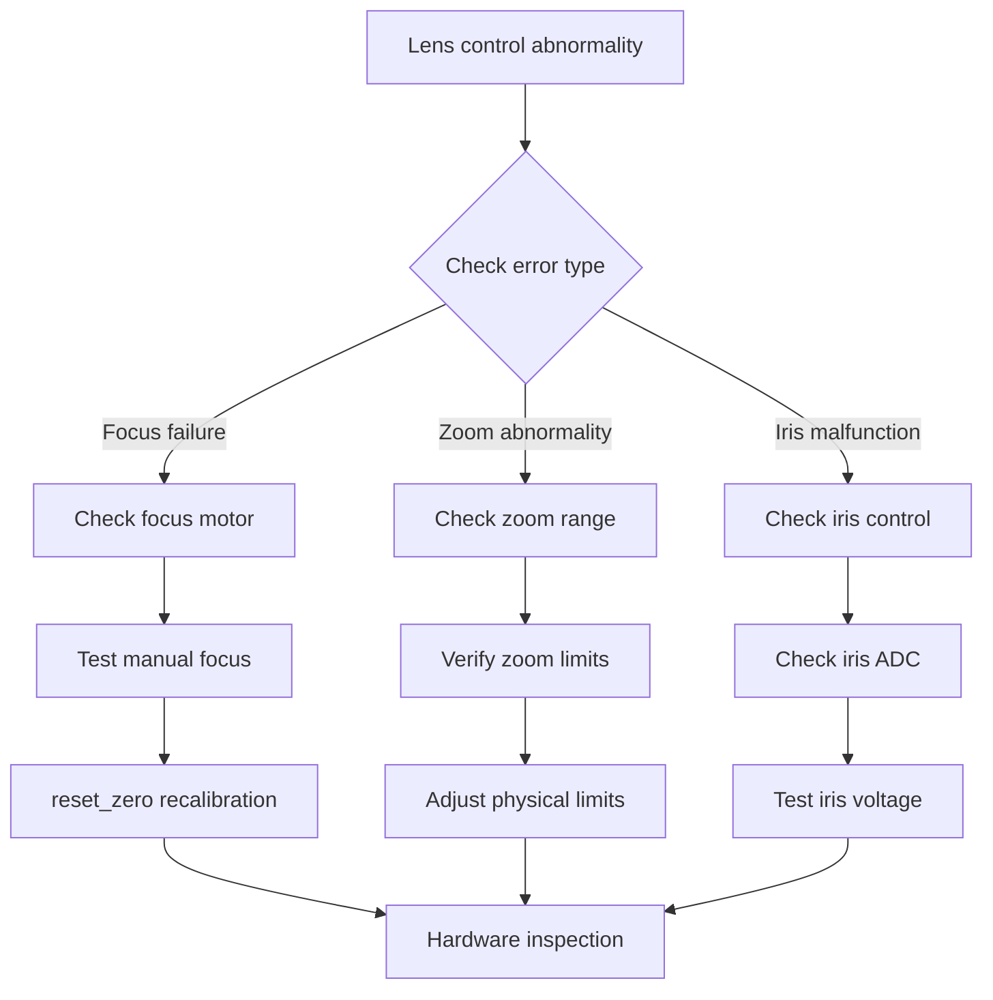
```mermaid
flowchart TD
    A[Lens control abnormality] --> B{Check error type}
    B -->|Focus failure| C[Check focus motor]
    B -->|Zoom abnormality| D[Check zoom range]
    B -->|Iris malfunction| E[Check iris control]
    
    C --> F[Test manual focus]
    D --> G[Verify zoom limits]
    E --> H[Check iris ADC]
    
    F --> I[reset_zero recalibration]
    G --> J[Adjust physical limits]
    H --> K[Test iris voltage]
    
    I --> L[Re-test focus]
    J --> L[Physical adjustment]
    K --> L[Hardware inspection]
```

**Diagnostic commands:**
```bash
# View lens control logs
journalctl -u aipc-device-control | grep -i "lens\|focus\|zoom"

# Check lens status
grpcurl -plaintext -d '{}' unix:///run/aipc/device-control.sock aipc.platform.device.v1.DeviceControl/GetLensStatus

# Test lens reset
grpcurl -plaintext -d '{}' unix:///run/aipc/device-control.sock aipc.platform.device.v1.DeviceControl/LensResetZero
```

## Event Bus Troubleshooting

### 1. Event Publishing Failure

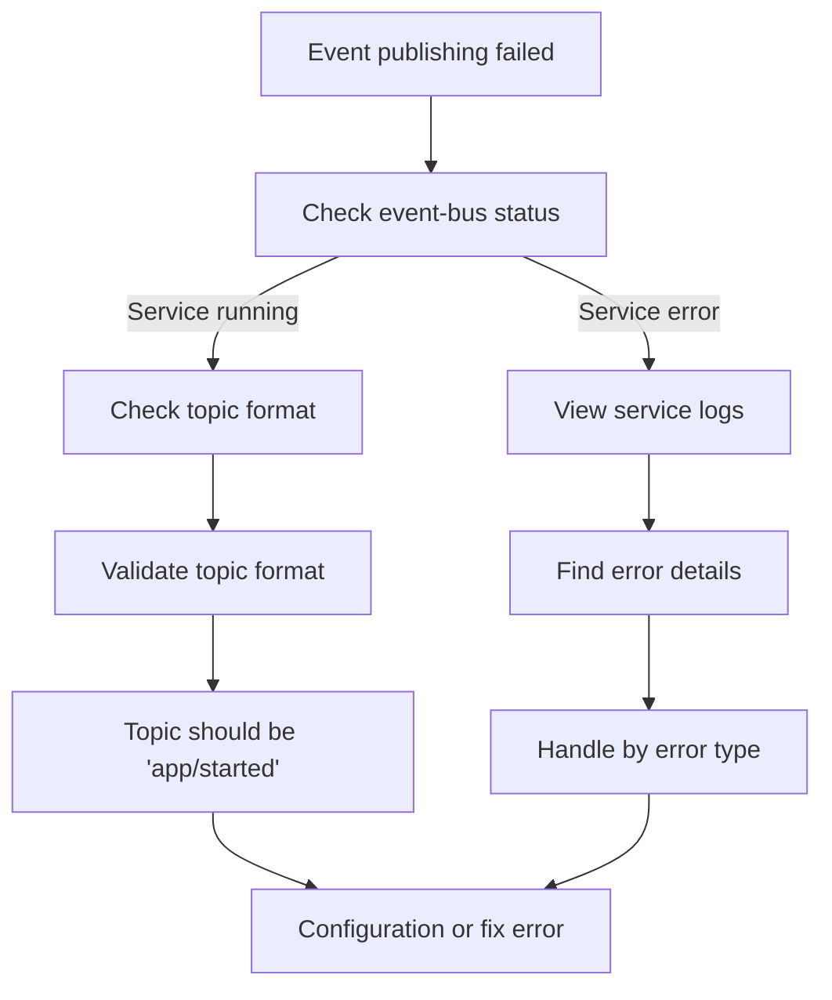
```mermaid
flowchart TD
    A[Event publishing failed] --> B[Check event-bus status]
    B -->|Service running| C[Check topic format]
    B -->|Service error| D[View service logs]
    
    C --> E[Validate topic format]
    D --> F[Find error details]
    
    E --> G["Topic should be 'app/started'"]
    F --> H[Handle by error type]
    
    G --> I[Fix topic format]
    H --> I[Configuration or fix error]
```

**Diagnostic commands:**
```bash
# Check event-bus status
systemctl status aipc-event-bus

# View event logs
journalctl -u aipc-event-bus -f

# Test event publishing
aipc-cli event-bus publish test/topic '{"message": "test"}'
```

### 2. Subscription Failure

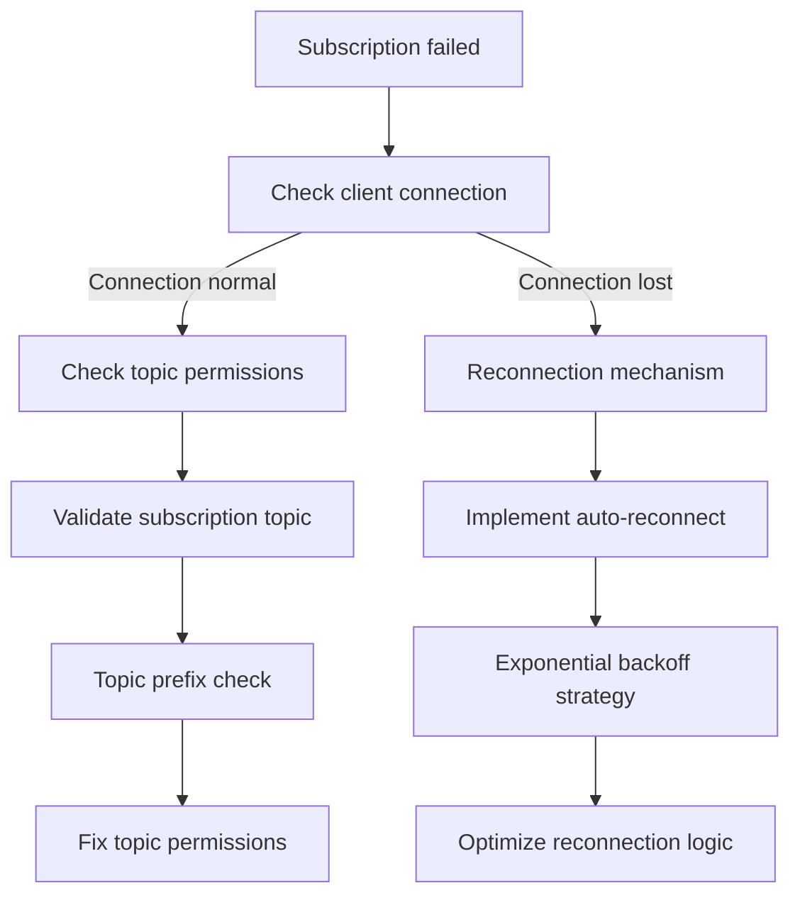
```mermaid
flowchart TD
    A[Subscription failed] --> B[Check client connection]
    B -->|Connection normal| C[Check topic permissions]
    B -->|Connection lost| D[Reconnection mechanism]
    
    C --> E[Validate subscription topic]
    D --> F[Implement auto-reconnect]
    
    E --> G["Topic prefix check"]
    F --> H[Exponential backoff strategy]
    
    G --> I[Fix topic permissions]
    H --> J[Optimize reconnection logic]
```

## Common Diagnostic Commands Quick Reference

| Scenario | Command | Description |
|----------|---------|-------------|
| View service status | `systemctl status aipc-*.service` | View all AIPC service statuses |
| View service logs | `journalctl -u aipc-service-name -f` | View service logs in real-time |
| Test gRPC connection | `grpcurl -plaintext -d '{}' unix:///run/aipc/service.sock list` | Test gRPC service availability |
| Check Sockets | `ls -la /run/aipc/` | View Unix Socket files |
| Check port usage | `netstat -tulpn \| grep 8554` | Check RTSP port usage |
| Check system resources | `top -p $(pidof service)` | Monitor service resource usage |
| View container status | `aipc-cli app-manager list-apps` | List all container applications |
| Test network connection | `curl http://localhost:8080/api/v1/media/status` | Test API endpoint |
| View model status | `grpcurl -plaintext -d '{}' unix:///run/aipc/ai-runtime.sock aipc.platform.inference.v1.InferenceService/ListModels` | List registered models |
| Check NPU status | `hailo-smi` | View Hailo device status |
| Test PTZ control | `grpcurl -plaintext -d '{"direction": "PAN_LEFT", "speed": 50}' unix:///run/aipc/device-control.sock aipc.platform.device.v1.DeviceControl/Pan` | Test PTZ control |
| View event logs | `aipc-cli event-bus logs` | View event bus logs |
| View disk usage | `df -h /opt/aipc` | Check disk space usage |
| View memory usage | `free -h` | Check system memory usage |

## Log Level Adjustment

### 1. Temporarily Adjust Log Level

```bash
# Temporarily set to debug level
sudo journalctl -u aipc-ai-runtime -f --log-level debug

# View logs at error level and above
sudo journalctl -u aipc-camera-daemon -p err
```

### 2. Modify Configuration File

```yaml
# Adjust log_level in service configuration
service:
  name: ai-runtime
  listen: unix:///run/aipc/ai-runtime.sock
  log_level: debug  # debug, info, warn, error
  
# Or use environment variable
export LOG_LEVEL=debug
```

### 3. Common Log Levels

- **debug**: Detailed debugging information
- **info**: Key operational status
- **warn**: Non-fatal warnings
- **error**: Critical errors

### 4. Log Analysis Tips

```bash
# View error rate
journalctl -u aipc-service --since "1 hour ago" | grep -c "error"

# View most frequent errors
journalctl -u aipc-service | grep "error" | sort | uniq -c | sort -nr

# Filter specific errors
journalctl -u aipc-service | grep -E "(timeout|connection refused|permission denied)"
```

## Performance Monitoring

### 1. System Resource Monitoring

```bash
# Monitor CPU usage
top -p $(pgrep -f ai-runtime)

# Monitor memory usage
free -h && ps aux | grep ai-runtime

# Monitor disk I/O
iostat -x 1 5

# Monitor network
iftop -i eth0
```

### 2. Service Performance Metrics

```bash
# AI Runtime statistics
grpcurl -plaintext -d '{}' unix:///run/aipc/ai-runtime.sock aipc.platform.inference.v1.InferenceService/GetStats

# Container statistics
aipc-cli app-manager get-app-stats <app-id>

# Device status
grpcurl -plaintext -d '{}' unix:///run/aipc/device-control.sock aipc.platform.device.v1.DeviceControl/GetDeviceStatus
```

### 3. Real-time Monitoring Script

```bash
#!/bin/bash
# Monitoring script example

while true; do
    echo "=== $(date) ==="
    echo "CPU Usage:"
    top -bn1 | grep "Cpu(s)" | sed "s/.*, *\([0-9.]*\)%* id.*/\1/" | awk '{print 100 - $1}'
    echo "Memory Usage:"
    free | grep Mem | awk '{printf "%.2f%%\n", $3/$2 * 100.0}'
    echo "Disk Usage:"
    df /opt/aipc | tail -1 | awk '{print $5}'
    echo "NPU Temperature:"
    hailo-smi | grep Temperature | awk '{print $2}'
    sleep 5
done
```

## Troubleshooting Summary

1. **Check service status first**: Use `systemctl status` to confirm services are running
2. **Review error logs**: Use `journalctl` to view detailed error information
3. **Verify network connections**: Check that Sockets and ports are normal
4. **Check resource usage**: Ensure system resources are sufficient
5. **Troubleshoot module by module**: Verify progressively from low-level hardware to upper-level applications
6. **Maintain detailed logs**: Preserve sufficient log information before and after failures

Following the procedures above, you can quickly locate and resolve most issues on the AIPC platform.