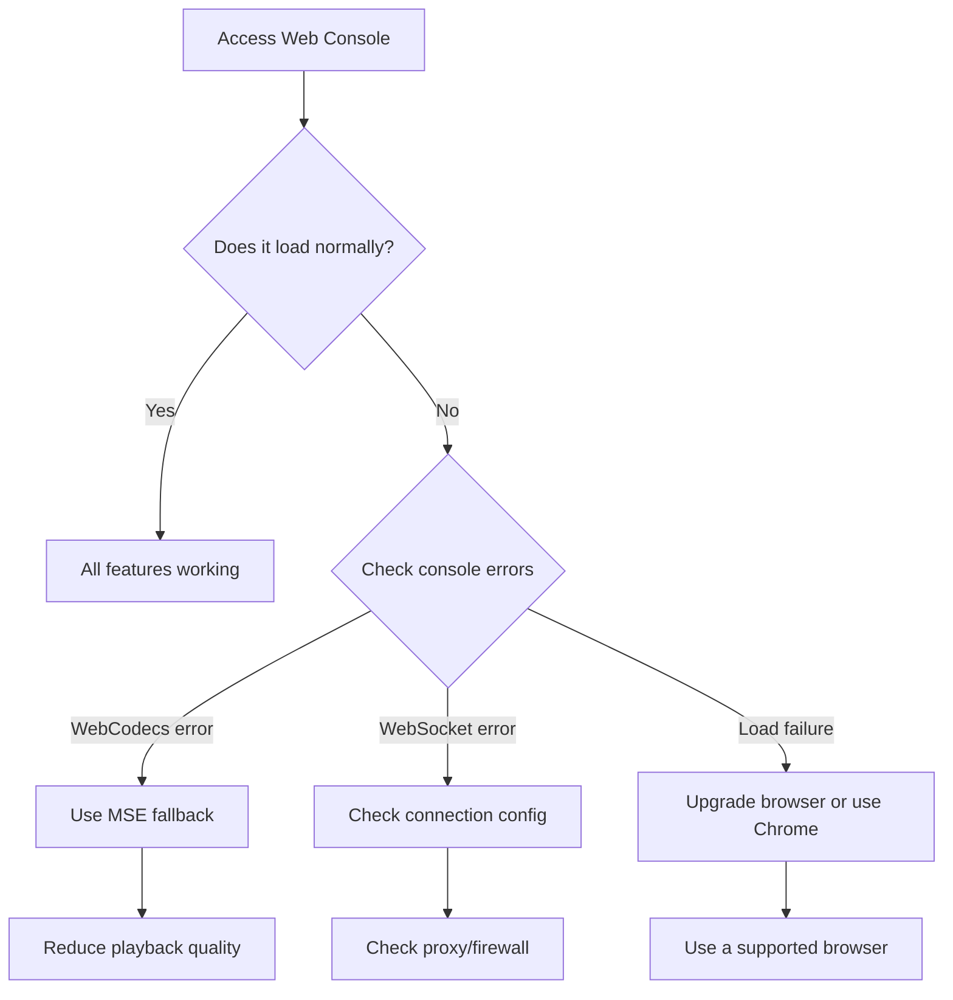
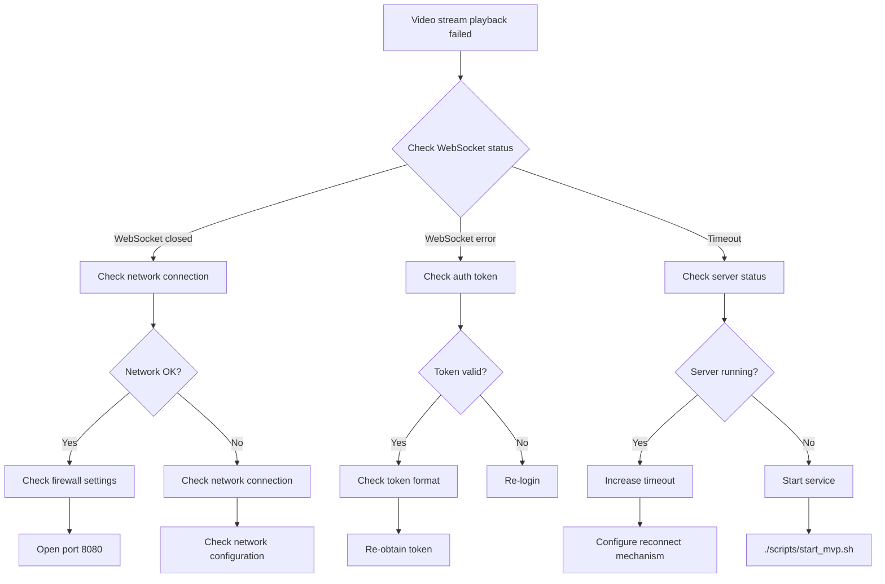
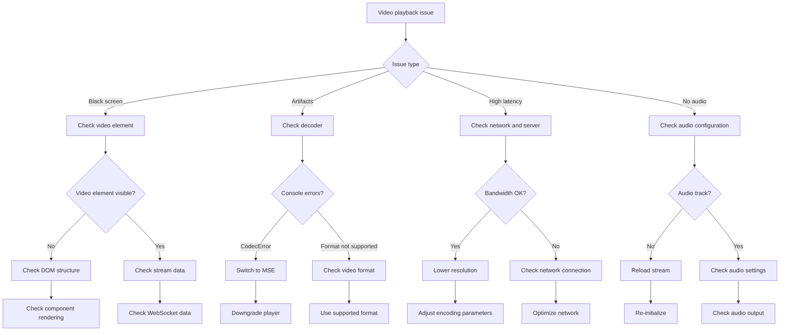
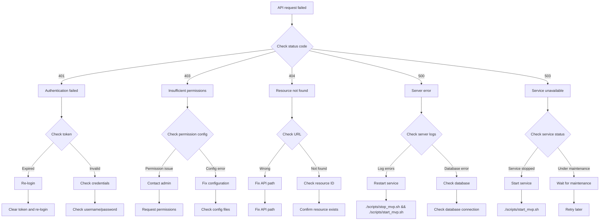
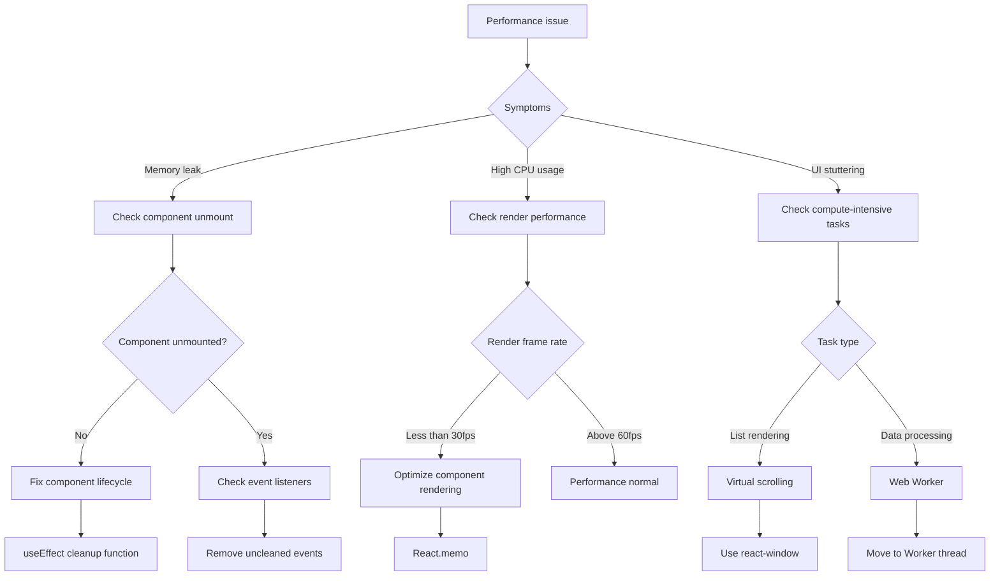
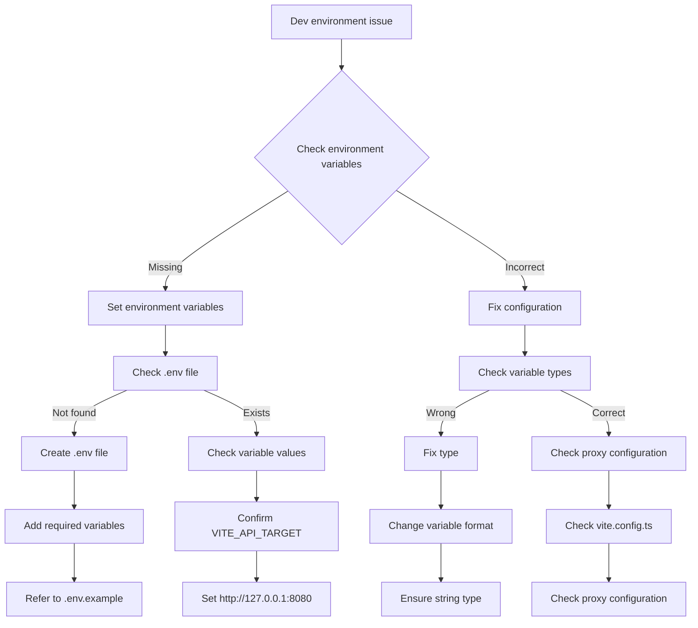

# Web Console Troubleshooting Guide

**Last Updated:** December 27, 2024

## Overview

This document provides diagnosis and solutions for common issues with the NE503 AI IPC Web Console. When encountering issues, follow this troubleshooting process:

1. Confirm the issue symptoms
2. Check related logs
3. Refer to the relevant section
4. Execute the suggested solution

## Browser Compatibility Issues

### Check Browser Support



### Browser Compatibility Matrix

| Browser | Version | Support Level | Issues | Solution |
|---------|---------|---------------|--------|----------|
| Chrome | 88+ | Full support | - | - |
| Firefox | 78+ | Basic support | WebCodecs not supported | Use MSE |
| Safari | 14+ | Partial support | WebCodecs not supported | Downgrade to MSE |
| Edge | 88+ | Full support | - | - |
| Mobile browsers | - | Limited support | Performance issues | Use desktop |

### WebCodecs Support Detection

```typescript
// Run the following code in the console to check WebCodecs support
if ('WebCodecs' in window) {
    console.log('WebCodecs supported - using hardware decoding');
} else {
    console.log('WebCodecs not supported - falling back to MSE');
    // Automatically switch to MSE player
    window.location.reload();
}
```

## WebSocket Connection Troubleshooting

### Connection Failure Flowchart



### Common WebSocket Errors and Solutions

| Error Code | Error Message | Possible Cause | Solution |
|------------|---------------|----------------|----------|
| 1006 | WebSocket closed | Connection actively closed | Check if server is running normally |
| 1005 | No status code | Connection abnormally interrupted | Check network stability |
| 401/403 | Unauthorized | Token invalid or expired | Re-login to obtain new token |
| 500 | Server error | Internal server error | Check server logs |

### WebSocket Connection Test

```javascript
// Run in browser console
const ws = new WebSocket('ws://localhost:8080/api/v1/h264/main');

ws.onopen = function() {
    console.log('WebSocket connected');
    // Send authentication message
    const token = localStorage.getItem('token');
    if (token) {
        ws.send(JSON.stringify({
            type: 'auth',
            token: token
        }));
    }
};

ws.onmessage = function(event) {
    console.log('Received:', event.data);
};

ws.onclose = function(event) {
    console.log('WebSocket closed:', event.code, event.reason);
};

ws.onerror = function(error) {
    console.error('WebSocket error:', error);
};
```

## Video Playback Troubleshooting

### Playback Issue Diagnosis Flowchart



### Common Video Playback Issues

#### 1. Black Screen

**Symptoms**: Video player displays black, no content

**Possible causes**:
- WebSocket connection not established
- SPS/PPS not correctly received
- Video element not properly mounted

**Solutions**:

```bash
# Check WebSocket connection status
# In browser console, check the Network panel
# See if there are WebSocket requests

# Check video element
document.querySelector('video')?.controls = true;
document.querySelector('video')?.play();

# Reload video stream
const player = window.videoRendererInstance;
if (player) {
    player.restart();
}
```

#### 2. Artifacts/Mosaic

**Symptoms**: Video shows mosaics, color blocks, or visual anomalies

**Possible causes**:
- Network packet loss
- Decoder does not support current format
- Frame synchronization issues

**Solutions**:

```typescript
// Enable fallback mode
if (window.navigator.userAgent.indexOf('Safari') > -1) {
    // Safari uses MSE player
    const player = new H264Player();
    player.initPlayer(videoElement);
    player.start(videoUrl);
}

// Reduce playback quality
const videoElement = document.querySelector('video');
if (videoElement) {
    videoElement.playbackRate = 1.0;
    // Or adjust resolution
}
```

#### 3. High Latency

**Symptoms**: Video playback noticeably lags behind real-time

**Possible causes**:
- High network latency
- Slow server processing
- Improper buffer settings

**Solutions**:

```javascript
// Adjust player parameters
const player = window.videoRendererInstance;
if (player) {
    player.setLatencyTarget(200); // 200ms
    player.setBufferLength(0.5); // 0.5 seconds
}

// Check network quality
navigator.connection.addEventListener('change', () => {
    console.log('Connection type:', navigator.connection.effectiveType);
    console.log('Downlink:', navigator.connection.downlink);
});
```

## API Request Failure Troubleshooting

### API Error Response Flowchart



### Common API Errors and Solutions

#### 1. 401 Unauthorized

```javascript
// Error response example
{
    "success": false,
    "error": "Invalid token",
    "code": 401
}

// Solution
// 1. Clear local token
localStorage.removeItem('token');
localStorage.removeItem('user');

// 2. Re-login
window.location.href = '/login';

// 3. Check system time
// Ensure system time is accurate to avoid token expiration
```

#### 2. 403 Forbidden

```javascript
// Error response example
{
    "success": false,
    "error": "Permission denied",
    "code": 403
}

// Solution
// 1. Check user permissions
// 2. Confirm if the operation requires special permissions
// 3. Contact admin to obtain permissions
```

#### 3. 500 Server Error

```javascript
// Error response example
{
    "success": false,
    "error": "Internal server error",
    "code": 500
}

// Solution
// 1. Check server logs
tail -f /opt/aipc/logs/platform-api.log

// 2. Restart services
./scripts/stop_mvp.sh
./scripts/start_mvp.sh

// 3. Check system resources
top
df -h
```

## Frontend Performance Troubleshooting

### Performance Issue Diagnosis Flowchart



### Memory Leak Troubleshooting

```javascript
// Run memory test in browser console
// 1. Force garbage collection
if (window.gc) {
    window.gc();
}

// 2. Monitor memory usage
const memoryUsed = performance.memory?.usedJSHeapSize;
console.log('Memory used:', memoryUsed / 1024 / 1024, 'MB');

// 3. Check component unmount
// Check for uncleaned subscriptions
const subscriptions = [];
const originalAdd = subscriptions.push;
subscriptions.push = function(...args) {
    console.log('Adding subscription:', args);
    return originalAdd.apply(this, args);
};
```

### CPU Usage Optimization

```javascript
// Check render performance
const observer = new PerformanceObserver((list) => {
    for (const entry of list.getEntries()) {
        if (entry.name.includes('Paint')) {
            console.log('Paint time:', entry.duration);
        }
    }
});
observer.observe({ entryTypes: ['paint'] });

// Use React DevTools Profiler
// Analyze component render times
// Identify re-render causes
```

## Development Environment Troubleshooting

### Build Failure Issues

#### 1. Dependency Installation Failure

```bash
# Clean cache and reinstall
rm -rf node_modules
rm -rf .pnpm-store
pnpm install --force

# Check Node.js version
node --version  # Requires 18+ or 20+
npm --version   # Corresponding version
```

#### 2. TypeScript Errors

```bash
# Force type checking
pnpm exec tsc --noEmit --strict

# Check type definitions
pnpm exec tsc --noEmit --skipLibCheck

# Clean cache
rm -rf .vite
```

#### 3. Hot Reload Not Working

```bash
# Check Vite configuration
cat vite.config.ts

# Clean cache
rm -rf .vite
rm -rf node_modules/.vite

# Check port usage
netstat -tulpn | grep :5174
```

### Development Environment Configuration Check



## Common Error Codes and Solutions

### Error Code Table

| Error Code | Error Name | Description | Solution |
|------------|------------|-------------|----------|
| 10001 | E_AUTH_FAILED | Authentication failed | Check username/password |
| 10002 | E_TOKEN_EXPIRED | Token expired | Re-login |
| 20001 | E_DEVICE_NOT_FOUND | Device not found | Check device connection |
| 20002 | E_STREAM_TIMEOUT | Stream timeout | Check network connection |
| 30001 | E_APP_NOT_INSTALLED | Application not installed | Install the application |
| 30002 | E_APP_RUNNING | Application is running | Stop the application first |
| 40001 | E_MODEL_NOT_FOUND | Model not found | Scan model directory |
| 40002 | E_MODEL_LOAD_FAILED | Model loading failed | Check model format |
| 50001 | E_SYSTEM_ERROR | System error | Check system logs |
| 50002 | E_RESOURCE_BUSY | Resource busy | Wait for resource release |

### Error Handling Example

```javascript
// Generic error handling function
async function handleApiError(error) {
    console.error('API Error:', error);
    
    switch (error.code) {
        case 10001:
        case 10002:
            // Authentication error
            alert('Authentication failed, please re-login');
            localStorage.clear();
            window.location.href = '/login';
            break;
            
        case 20001:
            // Device error
            alert('Device not connected, please check network');
            break;
            
        case 30001:
            // Application error
            alert('Please install the application first');
            break;
            
        case 40001:
            // Model error
            alert('Model not found, please scan models');
            break;
            
        case 50001:
        case 50002:
            // System error
            alert('System busy, please retry later');
            break;
            
        default:
            alert(`Error: ${error.message}`);
    }
}

// Usage example
try {
    const response = await api.get('/api/v1/devices');
    return response.data;
} catch (error) {
    handleApiError(error);
}
```

### How to View Logs

```bash
# View Web Console logs
# 1. Open browser developer tools (F12)
# 2. Switch to Console tab
# 3. View error messages

# View server logs
# View platform API service logs
tail -f /opt/aipc/logs/platform-api.log

# View application manager logs
tail -f /opt/aipc/logs/app-manager.log

# View device control logs
tail -f /opt/aipc/logs/device-control.log

# View camera daemon logs
tail -f /opt/aipc/logs/camera-daemon.log
```

## Troubleshooting Checklist

### Basic Checks

- [ ] Network connection is normal (ping device IP)
- [ ] Browser version is supported (Chrome recommended)
- [ ] Login session is valid
- [ ] Token has not expired
- [ ] Server services are running normally

### Advanced Checks

- [ ] Firewall allows port 8080
- [ ] System resource usage is normal
- [ ] Disk space is sufficient
- [ ] Hardware devices are connected normally
- [ ] Configuration files are correct

### Performance Optimization Checks

- [ ] Components have no memory leaks
- [ ] Render performance is good
- [ ] API request caching is effective
- [ ] Video stream parameters are optimized
- [ ] Network bandwidth is sufficient

### Contact Support

If the issue cannot be resolved, please provide the following information:

1. Issue description
2. Browser version and operating system
3. Console error screenshots
4. Related log files
5. Steps to reproduce

Contact email: support@camthink.ai