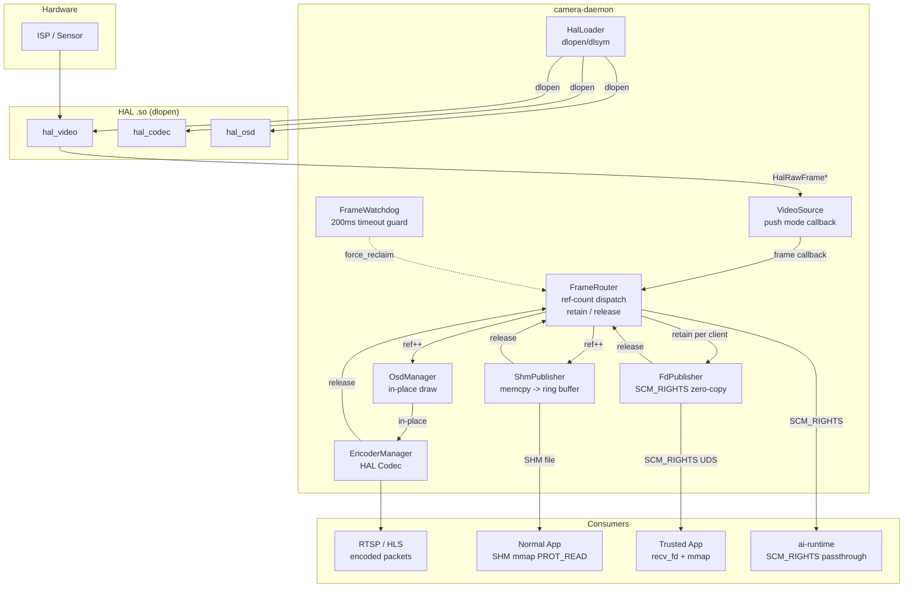
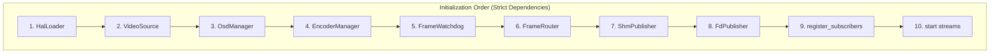
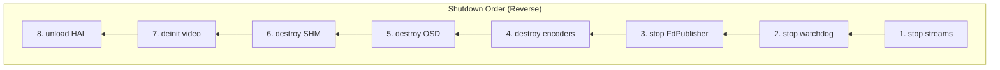
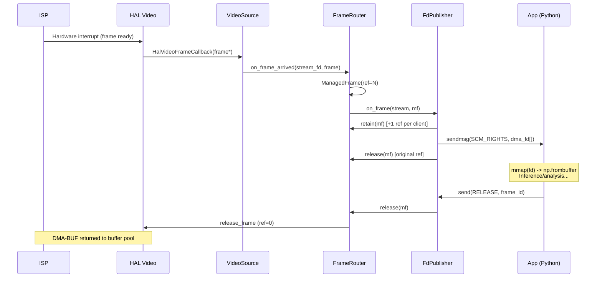
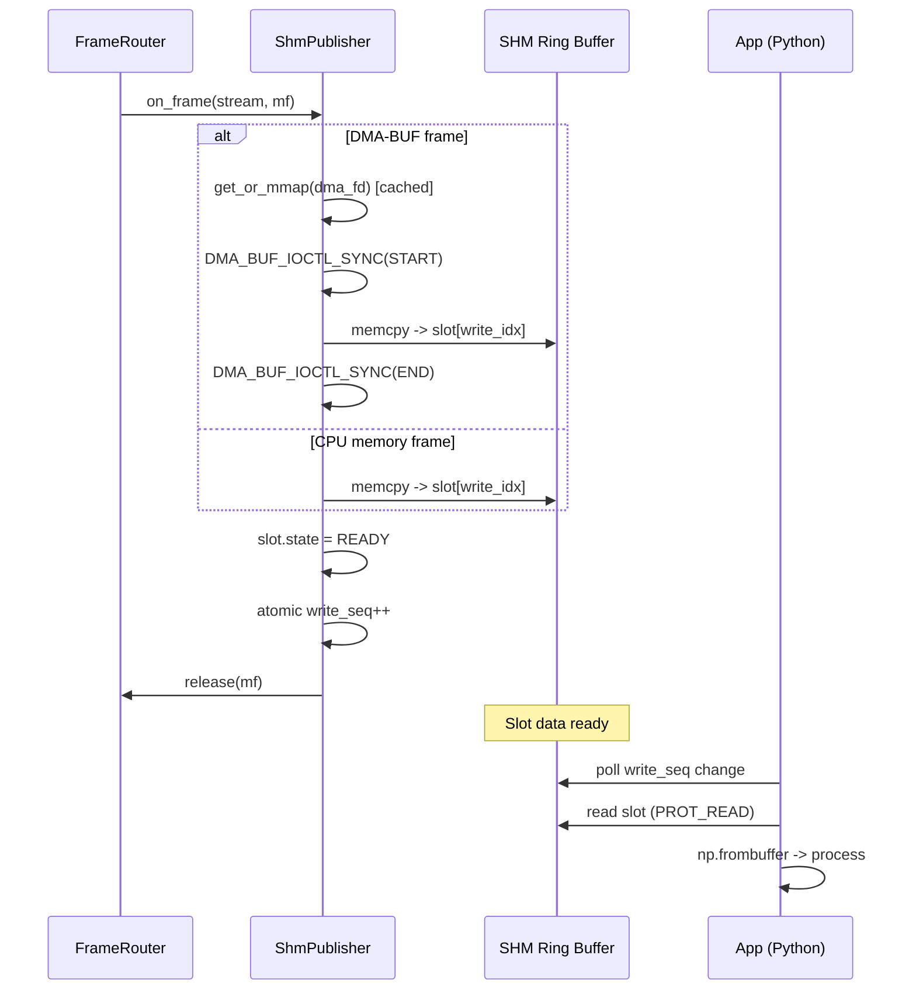
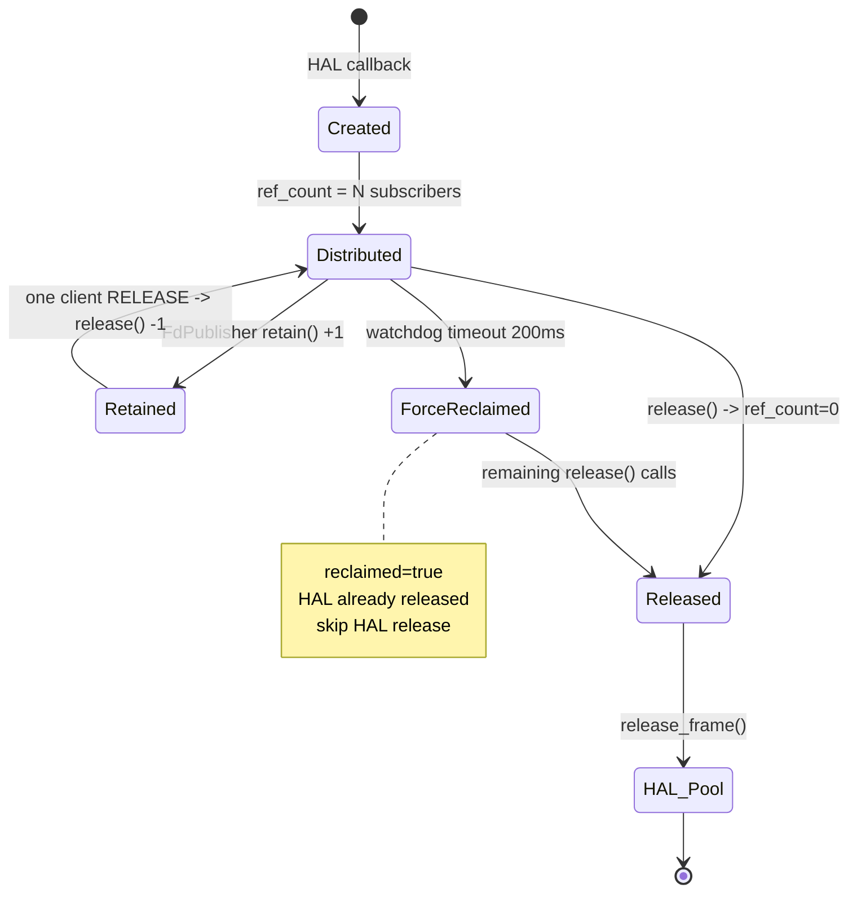
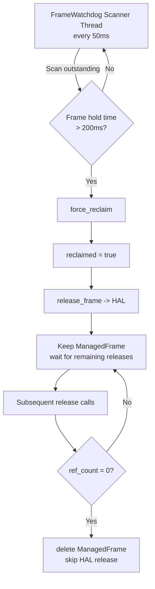
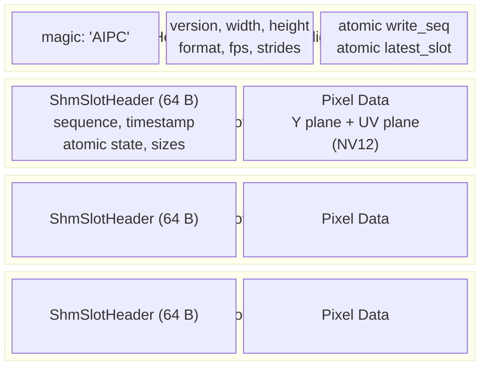
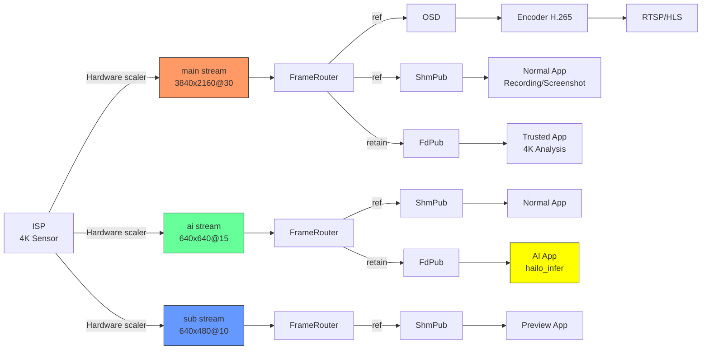
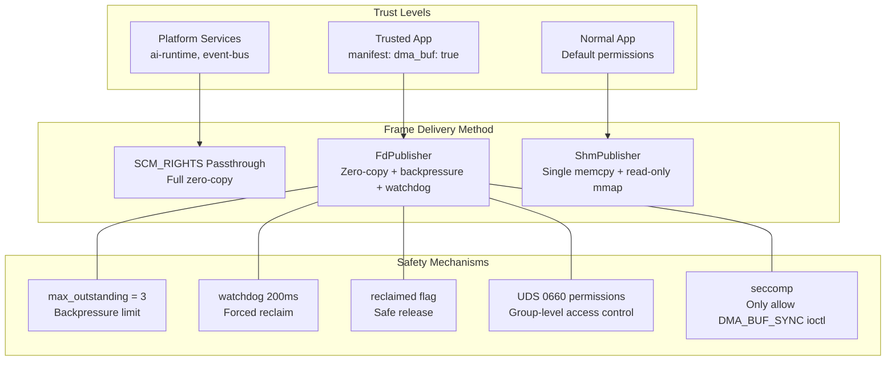

# Camera Daemon Design Document

## 1. Overview

Camera Daemon is the core C++ service of the AIPC platform, responsible for video capture, frame dispatch, encoding, and multi-channel frame publishing. It directly operates the HAL hardware abstraction layer, serving as the bridge between hardware and upper-layer platform services/App containers.

**Design Goals:**
- Zero-copy frame dispatch (DMA-BUF FD passthrough + reference counting)
- Dual-channel App frame delivery (FD passthrough / SHM ring buffer coexistence)
- Strict buffer lifecycle management (reference counting + retain/release + watchdog)
- Platform-independent (HAL dynamic loading, no hardware coupling)
- Tiered container security isolation

## 2. Overall Architecture



## 3. Module Relationships and Initialization Order





## 4. Dual-Channel Frame Delivery

App containers can obtain video frames in two ways. The daemon automatically selects based on App permissions:

### 4.1 FD Passthrough (Zero-Copy) -- FdPublisher

**Applicable to:** Trusted Apps (manifest declares `dma_buf: true`)



**Wire Protocol (`fd_protocol.h`):**

| Direction | Message | Description |
|-----------|---------|-------------|
| Client -> Server | `SUBSCRIBE(stream_name)` | Subscribe to stream |
| Server -> Client | `FRAME` + SCM_RIGHTS | Frame metadata + DMA-BUF fd |
| Client -> Server | `RELEASE(frame_id)` | Return frame |
| Client -> Server | `UNSUBSCRIBE` | Unsubscribe |

**Security Constraints:**
- App container seccomp must allow `DMA_BUF_IOCTL_SYNC` (only this one ioctl)
- `max_outstanding_per_client = 3`, frames dropped if exceeded (backpressure protection)
- Watchdog 200ms timeout forced reclaim (App crash/hang protection)

### 4.2 SHM Ring Buffer (Single memcpy) -- ShmPublisher

**Applicable to:** All Apps (no special container permissions required)



**Performance:** Single memcpy. 640x640 NV12 ~0.1ms, 4K ~2ms.

**DMA-BUF mmap Cache:** HAL buffer pool fds are fixed during stream lifecycle. ShmPublisher caches mmap results to avoid per-frame mmap/munmap syscalls (critical optimization for 4K scenarios).

### 4.3 Comparison of the Two Approaches

| | FD Passthrough | SHM |
|---|---|---|
| Copy | 0 | 1 memcpy |
| 640x640 Latency | ~0.03ms | ~0.1ms |
| 4K Latency | ~0.03ms | ~2ms |
| Container Permissions | seccomp: ioctl, SCM_RIGHTS | No special permissions |
| App Crash Risk | HAL buffer leak (watchdog protection) | No impact |
| Python Interface | recv_fd + mmap + np.frombuffer | mmap + np.frombuffer |
| Recommended Use Case | AI inference, high-framerate processing | General analysis, image saving |

## 5. Frame Lifecycle Management

### 5.1 Reference Counting Flow



### 5.2 Watchdog Forced Reclaim



## 6. Module Descriptions

### 6.1 HalLoader (`hal_loader.h/cpp`)

Dynamically loads HAL shared libraries via `dlopen`/`dlsym`.

| HAL | Symbol | Required |
|-----|--------|----------|
| Video | `HAL_VIDEO_OPS` | Required |
| Codec | `HAL_CODEC_OPS` | Optional |
| OSD | `HAL_OSD_OPS` | Optional |

### 6.2 VideoSource (`video_source.h/cpp`)

Wraps `hal_video.h` interface, push-mode frame callbacks, supports multi-stream (ISP hardware scaler).

**Key Point:** 4K main stream + 640x640 AI stream + sub-stream are all ISP hardware-scaled outputs, no software scaling.

### 6.3 FrameRouter (`frame_router.h/cpp`)

Reference-counted frame dispatch core.

```cpp
struct ManagedFrame {
    HalRawFrame     frame;           // Shallow copy (dma_fd and other metadata)
    std::atomic<int> ref_count{0};   // Initial = subscriber count
    std::atomic<bool> reclaimed{false}; // Watchdog forced reclaim flag
    uint64_t        frame_id;
};
```

The `retain()` method is used by FdPublisher to increment the reference count per client when dispatching to N clients, extending the frame's lifetime until all clients have RELEASE'd.

`force_reclaim()` safety mechanism: On watchdog timeout, marks `reclaimed = true` and immediately releases the frame to HAL, but does not delete the ManagedFrame (FD clients may still hold references). Subsequent `release()` calls check the `reclaimed` flag and skip HAL release, deleting the object when ref_count finally drops to 0.

### 6.4 FrameWatchdog (`frame_watchdog.h/cpp`)

| Parameter | Default | Description |
|-----------|---------|-------------|
| `scan_interval` | 50ms | Scan period |
| `frame_timeout` | 200ms | Timeout forced reclaim |
| `warn_threshold` | 150ms | Warning threshold |

### 6.5 FdPublisher (`fd_publisher.h/cpp`)

Zero-copy DMA-BUF FD publisher.

**Thread Model:**
- 1 accept thread (listening on UDS)
- N recv threads (one per client, handling SUBSCRIBE/RELEASE)
- Frame dispatch on FrameRouter callback thread (non-blocking sendmsg)

**Frame Dispatch Flow:**
```
on_frame(stream, mf):  // FrameRouter callback
  for each subscribed client:
    if outstanding >= max_outstanding -> drop
    retain(mf)            // +1 ref
    sendmsg(SCM_RIGHTS)   // send dma_fd
    track in outstanding
  release(mf)             // release this callback's ref
```

**Client Disconnect Handling:** Release all outstanding frame references for the disconnected client. If a frame has already been reclaimed by the watchdog, release checks the `reclaimed` flag and safely skips HAL release.

### 6.6 ShmPublisher (`shm_publisher.h/cpp`)

SHM ring buffer frame publisher with DMA-BUF mmap cache optimization.

**SHM Memory Layout:**



### 6.7 OsdManager (`osd_manager.h/cpp`)

Manages per-stream OSD instances (independent instances for different resolutions). `draw()` performs in-place pixel modification on `HalRawFrame`, used only for the encoding path and does not affect the AI inference stream.

### 6.8 EncoderManager (`encoder_manager.h/cpp`)

Manages HAL Codec hardware encoder instances. Uses push mode (`subscribe`) to obtain encoded packets. `encode_frame` accepts `HalRawFrame*`, and HAL internally accesses DMA-BUF directly for zero-copy encoding. Supports runtime parameter adjustment (bitrate, framerate, GOP, force keyframe).

## 7. Data Flow Overview



## 8. Typical App-Side Usage

### 8.1 AI Inference (FD Passthrough, Python)

```python
from hailo_ipc_sdk import FrameReceiver

receiver = FrameReceiver("/run/aipc/camera.sock", stream="ai")

with receiver.recv_frame() as frame:
    # frame.array: numpy view on mmap'd DMA-BUF, zero-copy
    # 640x640 NV12, ISP hardware-scaled output
    results = hailo_infer(frame.array)
    # Exiting the with block auto munmap + RELEASE
```

### 8.2 Image Saving (SHM, Python)

```python
from hailo_ipc_sdk import ShmReader

reader = ShmReader("/run/aipc/shm/main.raw")

frame = reader.read_latest()
with open("capture.nv12", "wb") as f:
    f.write(frame)  # Write raw frame directly, no transcoding
```

### 8.3 ROI Crop Analysis (FD Passthrough, Python)

```python
with receiver.recv_frame() as frame:
    h, w = frame.height, frame.width
    y_plane = frame.array[:h*w].reshape(h, w)
    roi = y_plane[100:300, 200:400]  # Zero-copy view crop
    analyze(roi)
```

## 9. Build

```bash
cd platform/camera-daemon
mkdir -p build && cd build
cmake ..
make -j$(nproc)
```

**Dependencies:** C++17, libdl, libpthread, librt. No GStreamer.

## 10. Configuration

```yaml
hal:
  video_library: /opt/aipc/lib/hal/hal-hailo15.so
  codec_library: ""
  osd_library: ""

video:
  device_path: /dev/video0
  streams:
    - { name: main, width: 3840, height: 2160, fps: 30, pool: 8 }
    - { name: ai,   width: 640,  height: 640,  fps: 15, pool: 6 }
    - { name: sub,  width: 640,  height: 480,  fps: 10, pool: 4 }

shm:
  directory: /run/aipc/shm
  buffer_count: 4

fd_publisher:
  sock_path: /run/aipc/camera.sock
  max_clients: 16
  max_outstanding_per_client: 3

watchdog:
  scan_interval_ms: 50
  frame_timeout_ms: 200
  warn_threshold_ms: 150
```

## 11. File Listing

```
platform/camera-daemon/
├── CMakeLists.txt
├── include/
│   ├── camera_daemon.h      # Top-level orchestrator + config structs
│   ├── hal_loader.h          # HAL dynamic loading
│   ├── video_source.h        # HAL Video wrapper
│   ├── frame_router.h        # Reference-counted frame dispatch (retain/release/reclaimed)
│   ├── frame_watchdog.h      # Timeout forced reclaim
│   ├── fd_protocol.h         # FD passthrough wire protocol (SCM_RIGHTS)
│   ├── fd_publisher.h        # FD passthrough publisher
│   ├── shm_protocol.h        # SHM ring buffer memory layout
│   ├── shm_publisher.h       # SHM publisher (with mmap cache)
│   ├── osd_manager.h         # OSD management
│   └── encoder_manager.h     # Hardware encoding management
├── src/
│   ├── main.cpp              # Entry, config, signal handling
│   ├── camera_daemon.cpp     # Orchestrator
│   ├── hal_loader.cpp
│   ├── video_source.cpp
│   ├── frame_router.cpp
│   ├── frame_watchdog.cpp
│   ├── fd_publisher.cpp
│   ├── shm_publisher.cpp
│   ├── osd_manager.cpp
│   └── encoder_manager.cpp
```

## 12. Security Model



| App Type | Frame Delivery Method | Container Permissions | Risk Control |
|----------|----------------------|----------------------|-------------|
| Trusted App (`dma_buf: true`) | FD passthrough | seccomp: +ioctl(DMA_BUF_SYNC) | Watchdog + backpressure |
| Normal App (default) | SHM | No special permissions | Read-only mmap |
| Platform Service (ai-runtime) | SCM_RIGHTS passthrough | Full trust | N/A |
