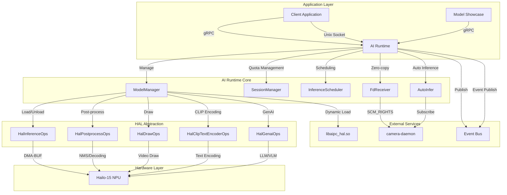
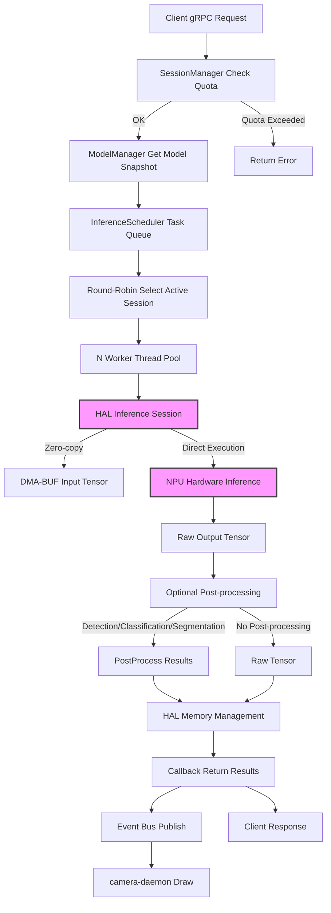
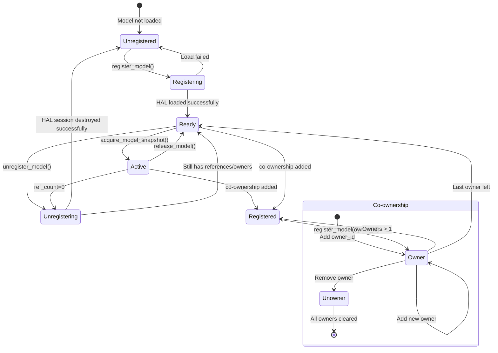
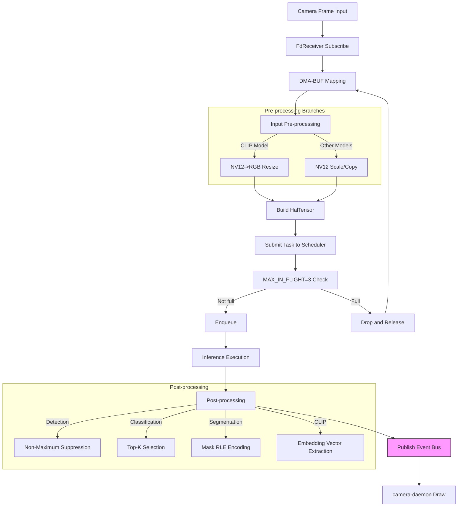
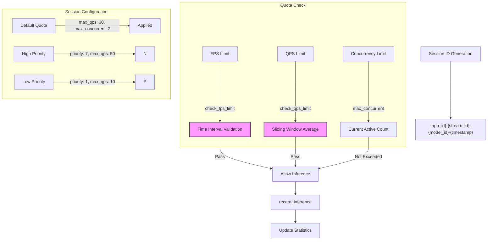
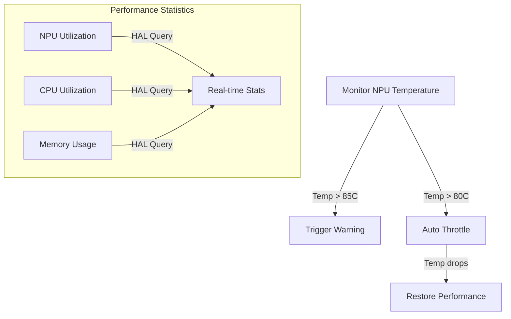
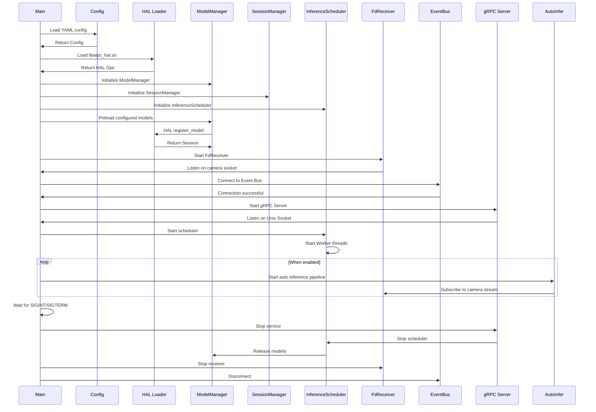
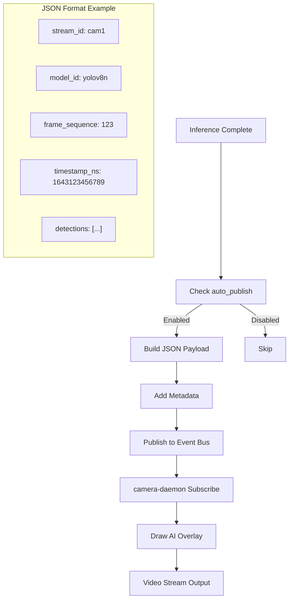
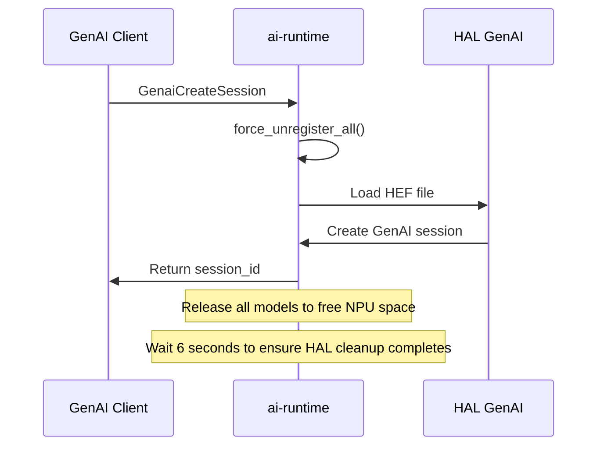
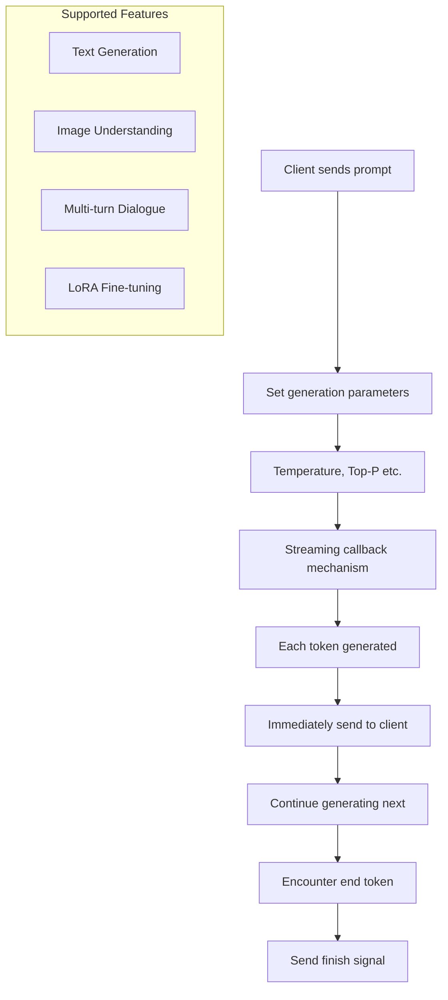

# AI Runtime Service

## Overview

`ai-runtime` is the unified inference service responsible for NPU compute scheduling, model lifecycle management, and inference execution. It supports traditional CV model inference and GenAI (LLM/VLM) streaming generation.

Tech stack: C++17 + gRPC, dynamically loads hardware acceleration libraries through HAL.

## Architecture Diagram



## Directory Structure

```
platform/ai-runtime/
├── include/                    # Header files
│   ├── config.h               # Configuration struct definitions
│   ├── grpc_service.h         # gRPC service implementation
│   ├── model_manager.h        # Model lifecycle management
│   ├── session_manager.h      # Session quota management
│   ├── inference_scheduler.h  # Inference task scheduling
│   ├── hal_ml_loader.h        # HAL ML library loader
│   ├── fd_receiver.h          # DMA-BUF zero-copy receiver
│   ├── event_bus_client.h     # Event bus client
│   ├── auto_infer.h           # Auto inference pipeline
│   ├── common.h               # Common definitions and types
│   ├── log.h                  # Logging interface
│   └── fd_protocol.h          # FD transfer protocol definitions
├── src/                       # Source files
│   ├── main.cpp               # Entry point
│   ├── grpc_service.cpp       # gRPC service (1103 lines)
│   ├── model_manager.cpp      # Model management (409 lines)
│   ├── session_manager.cpp    # Session management (84 lines)
│   ├── inference_scheduler.cpp# Scheduler (161 lines)
│   ├── hal_ml_loader.cpp      # HAL integration
│   ├── fd_receiver.cpp        # Zero-copy (351 lines)
│   ├── event_bus_client.cpp   # Event publishing
│   └── auto_infer.cpp         # Auto inference (517 lines)
├── proto/
│   └── inference.proto        # gRPC definitions
├── test/                      # Tests
└── build-*/                   # Build artifacts
```

## gRPC API

Service name: `InferenceService`, listening on `unix:///run/aipc/ai-runtime.sock`.

### Model Management

| RPC | Request | Response | Description |
|-----|---------|----------|-------------|
| `RegisterModel` | `ModelRegisterRequest` | `ModelRegisterResponse` | Register model to NPU |
| `UnregisterModel` | `ModelInfo` | `Status` | Unload model |
| `ListModels` | `Empty` | `ModelListResponse` | List registered models |
| `GetModelInfo` | `ModelInfo` | `ModelInfo` | Get model details |

### Inference

| RPC | Request | Response | Description |
|-----|---------|----------|-------------|
| `Infer` | `InferRequest` | `InferResponse` | Single inference |
| `StreamInfer` | `StreamInferRequest` | `stream StreamInferResponse` | Streaming inference (real-time video) |

### Session Management

| RPC | Request | Response | Description |
|-----|---------|----------|-------------|
| `CreateSession` | `SessionConfig` | `SessionCreateResponse` | Create quota session |
| `DestroySession` | `SessionConfig` | `Status` | Destroy session |

### Statistics and Configuration

| RPC | Request | Response | Description |
|-----|---------|----------|-------------|
| `GetStats` | `Empty` | `SystemStats` | Get system statistics |
| `UpdatePostprocessConfig` | `UpdatePostprocessConfigRequest` | `UpdatePostprocessConfigResponse` | Update post-processing config |
| `EncodeText` | `EncodeTextRequest` | `EncodeTextResponse` | CLIP text encoding |

### GenAI (LLM/VLM)

| RPC | Request | Response | Description |
|-----|---------|----------|-------------|
| `GenaiCreateSession` | `GenaiCreateSessionRequest` | `GenaiCreateSessionResponse` | Create GenAI session |
| `GenaiDestroySession` | `GenaiCreateSessionRequest` | `Status` | Destroy session |
| `GenaiGenerate` | `GenaiGenerateRequest` | `stream GenaiGenerateResponse` | Streaming generation |
| `GenaiAbort` | `GenaiAbortRequest` | `Status` | Abort generation |

### Key Message Structures

**Tensor Data**:
```protobuf
message Tensor {
  repeated int32 shape = 1;
  DataType dtype = 2;     // UINT8/INT8/FLOAT16/FLOAT32 etc.
  bytes data = 3;
  int32 dma_fd = 4;       // DMA-BUF zero-copy file descriptor
}
```

**Structured Post-processing Results**:
```protobuf
message PostResult {
  repeated Detection detections = 1;       // Object detection
  repeated Classification classifications = 2;  // Classification
  repeated LandmarkSet landmarks = 3;      // Keypoints
  repeated SegmentationMask masks = 4;     // Segmentation
  repeated OcrLine ocr_lines = 5;          // OCR
  repeated Embedding embeddings = 6;       // Embeddings
  repeated DepthMap depth_maps = 7;        // Depth estimation
}
```

**Model Registration Request**:
```protobuf
message ModelRegisterRequest {
  string model_path = 1;
  string model_id = 2;
  repeated TensorSpec inputs = 3;
  repeated TensorSpec outputs = 4;
  string model_type = 13;      // detection, landmarks, segmentation, classification
  string model_variant = 14;   // yolov8n, yolov8s etc.
  string owner_id = 12;
}
```

## Configuration

Configuration file: `configs/ai/ai-runtime.yaml`

```yaml
service:
  name: ai-runtime
  listen: unix:///run/aipc/ai-runtime.sock
  log_level: debug

hal:
  library_path: /opt/aipc/lib/hal/libaipc_hal.so
  device_path: /dev/hailo0

models:
  repository_path: /opt/aipc/models
  cache_path: /var/cache/aipc/models
  preload: []

scheduler:
  global_qps_limit: 100
  global_concurrent_limit: 8
  default_session:
    max_qps: 30
    max_concurrent: 2
    priority: 5
  strategy: fair          # priority | fifo | fair
  queue_size: 64
  timeout_ms: 5000

fd_receiver:
  socket_path: /run/aipc/camera.sock

performance:
  device_mode: high       # high | normal | low
  batch_enabled: false
  batch_size: 1
  batch_timeout_ms: 100
  max_model_cache: 3
  memory_limit_mb: 2048

monitoring:
  enabled: true
  stats_interval_sec: 10
  metrics_port: 9090
  temperature_limit_c: 85
  throttle_temperature_c: 80

event_bus:
  enabled: true
  endpoint: unix:///run/aipc/event-bus.sock
  auto_publish_results: true
  result_topic_prefix: "inference/"

auto_infer:
  enabled: false
  pipelines:
    - model_id: "yolov8n_det"
      stream_id: "cam1"
      fps: 10
    - model_id: "clip_text_encoder"
      stream_id: "cam2"
      fps: 5
```

## Core Component Implementation Details

### 1. Complete Inference Pipeline Flow



### 2. Model Lifecycle State Diagram



**ModelManager Key Features**:
- **Reference Counting**: `ref_count` tracks active usage
- **Co-ownership**: Multiple applications can share models, unloaded per owner
- **Atomic Snapshots**: `ModelSnapshot` ensures thread safety
- **RAII Protection**: `ModelGuard` automatically releases references

### 3. Scheduler Round-Robin Algorithm

```mermaid
flowchart TD
    A[Submit task to session_queues] --> B[Check total queue capacity]
    B -->|Not full| C[Add to corresponding Session queue]
    B -->|Full| D[Drop task]

    C --> E[Worker threads waiting]

    subgraph "Round-Robin Scheduling"
        F[Condition variable wakeup] --> G[rr_index points to current Session]
        G --> H[Check active_sessions list]
        H --> I[Dequeue front task from that Session]
        I --> J[Update rr_index]
        J --> K[Remove Session if queue empty]
        K --> L[If not empty, rr_index++]
    end

    L --> M[Model snapshot acquired]
    M --> N[Inference execution]
    N --> O[Result callback]

    subgraph "Session Queue Management"
        Q1[Session A Queue] -->|Task| C
        Q2[Session B Queue] -->|Task| C
        Q3[Session C Queue] -->|Task| C
        active_sessions --> LIST["[A, B, C]"]
    end

    style N fill:#f9f,stroke:#333,stroke-width:2px

    ```

**Scheduler Features**:
- **Fair Scheduling**: Round-Robin algorithm ensures fairness
- **Session Isolation**: Each session has an independent queue
- **Capacity Control**: Global queue limit prevents memory overflow
- **Dynamic Load Balancing**: Automatic active session detection

### 4. DMA-BUF Zero-Copy Flow

```mermaid
sequenceDiagram
    participant C as camera-daemon
    participant F as FdReceiver
    participant S as Subscriber1
    participant S2 as Subscriber2
    participant S3 as Subscriber3

    Note over C,S3: Phase 1: Subscription Establishment

    S->>F: subscribe(cam1, sub1, callback)
    F->>C: Connect /run/aipc/camera.sock
    F->>C: Send SUBSCRIBE
    C-->>F: OK + SCMs (DMA-BUF FDs)
    F->>F: Start recv_thread
    Note over F: Physical connection established

    S2->>F: subscribe(cam1, sub2, callback)
    F-->>S2: Reuse connection
    Note over F: Add to subscribers list

    S3->>F: subscribe(cam1, sub3, callback)
    F-->>S3: Reuse connection
    Note over F: subscribers = [sub1, sub2, sub3]

    Note over C,S3: Phase 2: Frame Reception and Dispatch

    loop Every frame
        C->>F: fd_pub_sendmsg(FRAME + 3 FDs)
        F->>F: recv_loop processing
        F->>F: ref_count = 3 (multiple subscribers)

        par Parallel dispatch
            F->>S: callback(frame1)
            F->>S2: callback(frame1)
            F->>S3: callback(frame1)
        end

        Note over S,S3: Each subscriber gets the same frame_fd_group
    end

    Note over C,S3: Phase 3: Release Mechanism

    S->>F: release_frame(cam1, fid=123)
    F->>F: ref_count-- = 2
    F->>F: Do not send RELEASE

    S2->>F: release_frame(cam1, fid=123)
    F->>F: ref_count-- = 1
    F->>F: Do not send RELEASE

    S3->>F: release_frame(cam1, fid=123)
    F->>F: ref_count-- = 0
    F->>C: fd_pub_sendmsg(RELEASE)

    Note over C,S3: Release back to camera-daemon buffer pool
```

**FdReceiver Key Features**:
- **Connection Reuse**: Multiple subscribers share physical connection
- **Reference Counting**: Prevents premature DMA-BUF release
- **Multicast**: All subscribers receive the same frame
- **RAII Management**: `FdGroup` automatically closes FDs

### 5. Auto Inference Pipeline



**AutoInfer Features**:
- **MAX_IN_FLIGHT=3**: Prevents camera buffer pool exhaustion
- **Adaptive Pre-processing**: Converts format based on model type
- **Diverse Post-processing**: Supports detection/classification/segmentation/CLIP
- **Flow Control**: FPS limiting and frame dropping

### 6. Session ID Format and Quota Management



### 7. Post-processing Type Mapping Table

| Post-processing Type | HAL Enum | Model Type | Default Parameters |
|---------------------|----------|------------|-------------------|
| Detection | `HAL_POST_TYPE_DETECTION` | detection, yolo | Confidence 0.25, NMS 0.45 |
| Keypoints | `HAL_POST_TYPE_KEYPOINT` | landmarks, keypoint | Confidence 0.25 |
| Segmentation | `HAL_POST_TYPE_SEGMENTATION` | segmentation | Confidence 0.25 |
| Classification | `HAL_POST_TYPE_CLASSIFICATION` | classification | Confidence 0.25, Top-K 5 |
| CLIP | `HAL_POST_TYPE_CLIP` | clip, embedding | Default config |
| OCR Detection | `HAL_POST_TYPE_OCR_DETECTION` | ocr_detection | Confidence 0.25, NMS 0.45 |
| OCR Recognition | `HAL_POST_TYPE_OCR_RECOGNITION` | ocr_recognition | Default config |
| Depth Map | `HAL_POST_TYPE_DEPTH` | depth, monocular_depth | Default config |

## HAL Integration

Dynamically loads `libaipc_hal.so` via `HalMlLoader`, using the following HAL interfaces:

| HAL Interface | Function | Key Methods |
|---------------|----------|-------------|
| `HalInferenceOps` | Core inference operations | `create`, `run`, `destroy` |
| `HalPostprocessOps` | Post-processing (NMS, decoding, etc.) | `create`, `run`, `apply_config_json` |
| `HalDrawOps` | Drawing/visualization | `overlay_detection` etc. |
| `HalClipTextEncoderOps` | CLIP text encoding | `create`, `encode`, `destroy` |
| `HalGenaiOps` | GenAI LLM/VLM operations | `create`, `generate_stream`, `abort_generation` |

## Performance Optimization Features

### 1. Zero-Copy Optimization
- **DMA-BUF Transfer**: Zero memory copy in camera-to-AI pipeline
- **File Descriptor Sharing**: Pass FDs via SCM_RIGHTS
- **Memory Mapping**: `MappedNV12Frame` automatically manages mappings

### 2. Streaming Inference Optimization
- **FPS Limiting**: Prevents over-inference, saves resources
- **QPS Tracking**: Sliding window average calculation
- **Concurrency Control**: Per-session independent concurrency limits

### 3. Thermal Protection


### 4. Multi-threading
- **Worker Thread Pool**: N threads for parallel processing
- **Round-Robin Scheduling**: Fair task distribution
- **Condition Variables**: Efficient waiting for new tasks

### 5. Memory Management
- **NPU Context Awareness**: Maximum model cache count control
- **HAL Memory Management**: Automatic output buffer release
- **Reference Counting**: Prevents memory leaks

## Startup Flow



## Event Bus Integration

### Topic Structure
- **Result Topic**: `inference/{model_id}/{stream_id}`
- **Event ID**: `inf-{frame_seq}-{timestamp_ns}`
- **Message Format**: JSON-formatted PostResult

### Publish Flow


## GenAI (LLM/VLM) Support

### Initialization Flow


### Streaming Generation


## Monitoring and Statistics

### System Statistics Metrics
- **NPU Utilization**: Hardware accelerator usage
- **CPU Utilization**: System CPU usage
- **DSP Utilization**: Digital signal processor load
- **Memory Usage**: Total RAM and used amount
- **Inference Latency**: Queue + inference time
- **FPS Statistics**: Actual inference rate per session

### Log Levels
- DEBUG: Detailed debug information
- INFO: Key operation status
- WARN: Non-fatal warnings
- ERROR: Critical errors

## Troubleshooting

### Common Issues
1. **Model Registration Failed**: Check model path, NPU device permissions
2. **Inference Timeout**: Check queue length, concurrency limits
3. **Zero-Copy Failed**: Check camera-daemon connection
4. **Insufficient Memory**: Adjust model cache count, concurrency limits
5. **Overheating**: Check cooling, reduce load

### Debug Tools
- `nmcli connection show aipc`: Network configuration
- `npu-smi`: Hailo device status
- `journalctl -u ai-runtime`: Service logs
- `perf stat`: Performance profiling

## API Usage Examples

### Python SDK Example
```python
# Register model
model = await runtime.register_model(
    model_id="yolov8n",
    model_path="/opt/aipc/models/yolov8n.hef",
    model_type="detection",
    owner_id="app1"
)

# Create session
session = await runtime.create_session(
    app_id="myapp",
    max_qps=30,
    priority=5
)

# Streaming inference
async for result in runtime.stream_infer(
    session_id=session,
    model_id="yolov8n",
    stream_id="cam1",
    fps_limit=15
):
    detections = result.post_result.detections
    print(f"Found {len(detections)} objects")
```

### Command Line Tool
```bash
# View system statistics
aipc-cli ai-runtime stats

# Register model
aipc-cli ai-runtime register-model yolov8n /path/to/model.hef

# List all models
aipc-cli ai-runtime list-models

# Test inference
aipc-cli ai-runtime test-inference model_id input_tensor.pb
```

## Version History

### v1.11.0 (Current)
- Added GenAI (LLM/VLM) support
- Optimized DMA-BUF zero-copy performance
- Added temperature monitoring and protection
- Improved scheduler fairness algorithm
- Supported CLIP text encoding

### Future Plans
- Batch inference support
- Model hot-update
- Distributed inference
- ONNX model format support
- More hardware accelerator support

---
