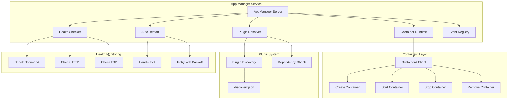
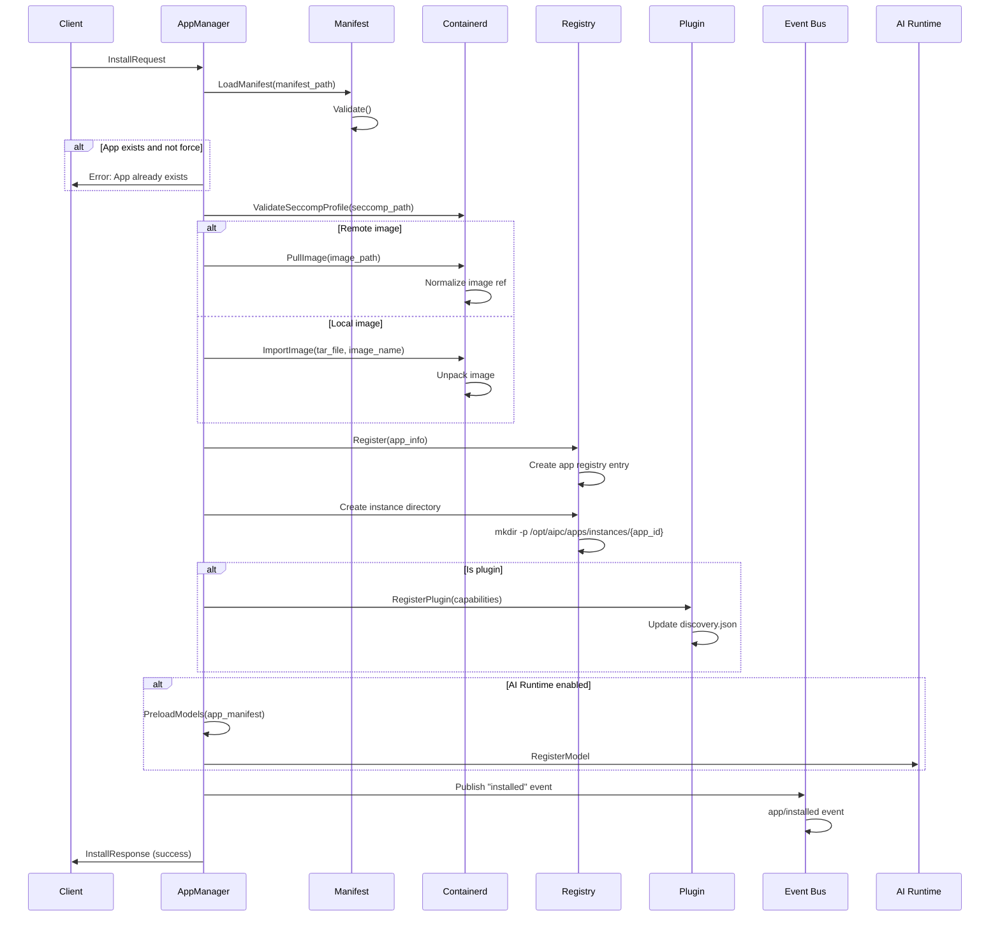
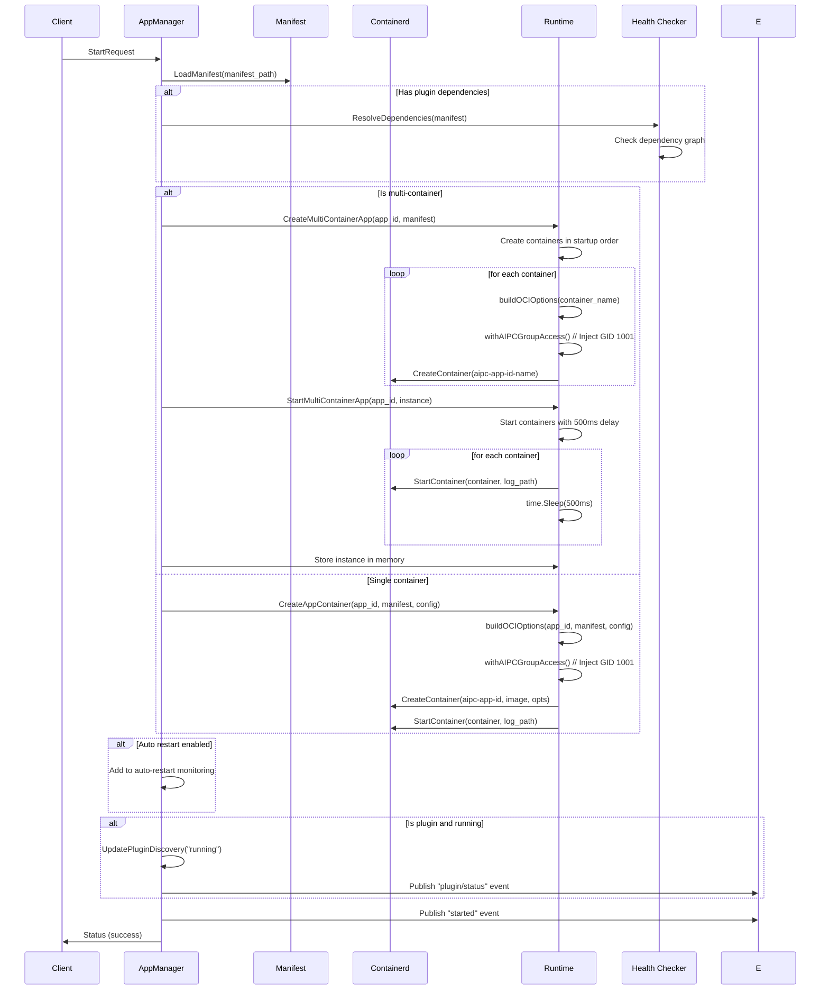
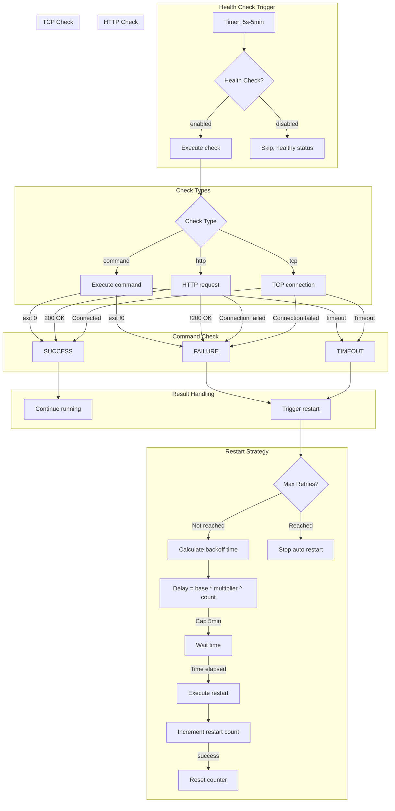
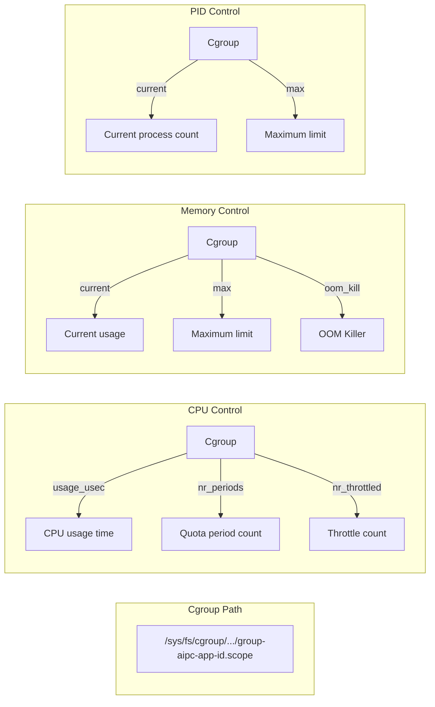
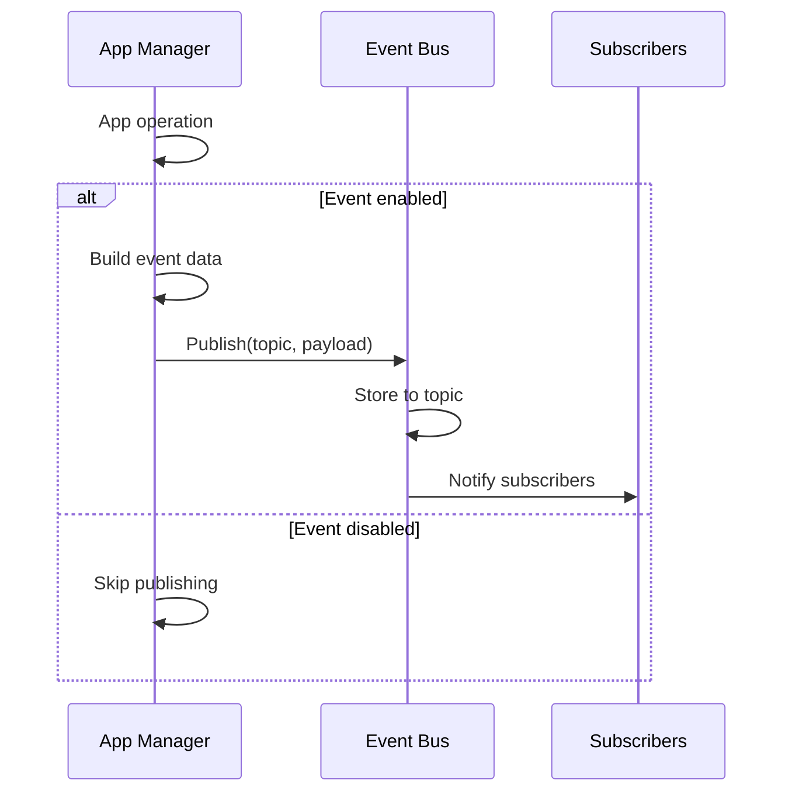

# App Manager Service

## Overview

`app-manager` is the core container lifecycle management service for the AIPC platform, built on containerd. It provides a unified API for managing application installation, start, stop, uninstallation, and monitoring. It supports single-container and multi-container (Main/Sub) architectures, with advanced features including a plugin system, health monitoring, and secure sandboxing.

### Core Features

- **Container Lifecycle Management**: Full CRUD operations
- **Multi-Container Architecture**: Main/Sub container mode, supporting complex applications
- **Plugin System**: Capability-based plugin discovery and dependency resolution
- **Health Monitoring**: Command/HTTP/TCP health checks + auto restart
- **Secure Sandbox**: Namespace, Capability, Seccomp isolation
- **Event Publishing**: Integrated with Event Bus
- **Model Preloading**: Integrated with AI Runtime

## Architecture Design

### Service Architecture

```
┌─────────────────────────────────────────────┐
│              App Manager Service             │
│  ┌─────────────┐   ┌───────────────┐     │
│  │ gRPC Server │   │ Event Bus    │     │
│  │             │   │ Client       │     │
│  └─────────────┘   └───────────────┘     │
│  ┌─────────────┐   ┌───────────────┐     │
│  │ AI Runtime │   │ Plugin        │     │
│  │ Client      │   │ Resolver     │     │
│  └─────────────┘   └───────────────┘     │
│                                             │
│  ┌─────────────────────────────────────────┐ │
│  │             Runtime Layer                │ │
│  │  ┌─────────────┐   ┌───────────────┐   │ │
│  │  │ Containerd  │   │ Multi-Container│   │ │
│  │  │ Client      │   │ Runtime       │   │ │
│  │  └─────────────┘   └───────────────┘   │ │
│  └─────────────────────────────────────────┘ │
└─────────────────────────────────────────────┘
```

### Component Relationships



## Directory Structure

```
platform/app-manager/
├── cmd/
│   └── main.go                # Service entry point
├── proto/
│   ├── app.proto              # gRPC API definitions
│   ├── app.pb.go
│   └── app_grpc.pb.go
├── server/
│   ├── server.go              # Main service implementation
│   ├── install_task.go        # Async install task
│   └── container.go           # Container operations
├── containerd/
│   ├── client.go              # Containerd client wrapper
│   ├── runtime.go             # Runtime operations (single/multi-container)
│   ├── seccomp_verify.go      # Seccomp verification
│   └── seccomp_test.go        # Seccomp tests
├── manifest/
│   ├── manifest.go            # Manifest parsing and validation
│   └── manifest_plugin_test.go
├── plugin/
│   ├── discovery.go           # Plugin discovery
│   ├── resolver.go            # Dependency resolution (Kahn's algorithm)
│   └── plugin_test.go
├── monitor/
│   ├── health.go              # Health checks
│   └── restart.go             # Auto restart
├── registry/
│   └── registry.go            # Application registry
├── security/
│   └── sandbox.go             # Security sandbox configuration
└── configs/
    └── app-manager.yaml       # Service configuration
```

## gRPC API

Service name: `AppManager`, listening on `unix:///run/aipc/app-manager.sock`.

### Application Lifecycle Management

| RPC | Request | Response | Description |
|-----|---------|----------|-------------|
| `InstallApp` | `InstallRequest` | `InstallResponse` | Install application |
| `AsyncInstallApp` | `AsyncInstallRequest` | `AsyncInstallResponse` | Async install |
| `GetInstallProgress` | `InstallProgressRequest` | `InstallProgressResponse` | Query install progress |
| `StartApp` | `StartRequest` | `Status` | Start application |
| `StopApp` | `StopRequest` | `Status` | Stop application |
| `UninstallApp` | `UninstallRequest` | `Status` | Uninstall application |
| `ListApps` | `Empty` | `AppList` | List applications |
| `GetApp` | `GetAppRequest` | `AppInfo` | Get application details |
| `GetAppStats` | `GetAppRequest` | `AppStats` | Get resource statistics |
| `GetAppLogs` | `GetLogsRequest` | `stream LogLine` | Stream read logs |
| `BatchOperation` | `BatchRequest` | `BatchResponse` | Batch operation |

### Container Management

| RPC | Request | Response | Description |
|-----|---------|----------|-------------|
| `ListContainers` | `ListContainersRequest` | `ContainerList` | List containers |
| `GetContainer` | `GetContainerRequest` | `ContainerDetail` | Container details |
| `GetContainerStats` | `GetContainerRequest` | `ContainerStats` | Container statistics |
| `GetContainerLogs` | `GetContainerLogsRequest` | `stream LogLine` | Container logs |
| `StartContainer` | `ContainerRequest` | `Status` | Start container |
| `StopContainer` | `ContainerRequest` | `Status` | Stop container |
| `RestartContainer` | `ContainerRequest` | `Status` | Restart container |
| `RemoveContainer` | `RemoveContainerRequest` | `Status` | Delete container |

### Image and Resource Management

| RPC | Request | Response | Description |
|-----|---------|----------|-------------|
| `ListImages` | `Empty` | `ImageList` | List images |
| `RemoveImage` | `RemoveImageRequest` | `Status` | Delete image |
| `GetDiskUsage` | `Empty` | `DiskUsageResponse` | Disk usage |
| `PruneResources` | `PruneRequest` | `PruneResponse` | Clean up resources |

### Advanced Operations

| RPC | Request | Response | Description |
|-----|---------|----------|-------------|
| `InspectApp` | `GetAppRequest` | `InspectResponse` | Inspect application config |
| `ExecContainer` | `stream ExecInput` | `stream ExecOutput` | Execute command in container |

### Key Message Structures

**AppInfo**:
```protobuf
message AppInfo {
  string id = 1;
  string name = 2;
  string version = 3;
  string state = 4;         // installed, running, stopped, failed
  string container_id = 5;
  int32 pid = 6;
  int64 installed_at = 7;
  int64 started_at = 8;
  int64 stopped_at = 9;
  int32 restart_count = 10;
  string manifest_path = 11;
  string instance_path = 12;
  bool is_plugin = 13;
  bool is_multi_container = 14;
  repeated CapabilityInfo capabilities = 15;
  repeated DependencyInfo dependencies = 16;
}
```

**ContainerConfig** (Security Configuration):
```protobuf
// Container ID format:
// Main container: aipc-{appID}
// Sub container: aipc-{appID}-{containerName}

message ContainerConfig {
  bool readonly_rootfs = 1;          // Read-only filesystem
  bool no_new_privileges = 2;        // Disable privilege escalation
  repeated string dropped_capabilities = 3;  // Removed capabilities
  repeated string added_capabilities = 4;    // Added capabilities
  string seccomp_profile = 5;       // Seccomp profile path
  int64 cpu_quota = 6;               // CPU quota (us)
  int64 cpu_period = 7;              // CPU period (us)
  int64 memory_limit = 8;            // Memory limit (bytes)
  int32 pids_limit = 9;              // PID limit
  repeated Mount mounts = 10;        // Mount points
  bool net_namespace = 11;          // Network namespace
  bool ipc_namespace = 12;          // IPC namespace
  bool is_main_container = 13;       // Whether it is the main container
  string role = 14;                 // "main" or "sub"
}
```

## Core Flow Details

### 1. InstallApp Flow

Installing an application is a complex multi-stage process that ensures the application is correctly installed and configured:



**Key Implementation Details**:

1. **Image Handling**:
   - Remote images: Automatically normalizes references (`nginx:latest` -> `docker.io/library/nginx:latest`)
   - Local images: Import and unpack to overlayfs
   - Uses `NormalizeImageName()` to ensure reference consistency

2. **Registry Management**:
   - Uses GORM SQLite to store `/opt/aipc/apps/registry`
   - Contains application metadata, state, container IDs, etc.
   - Atomic writes ensure data consistency

3. **Plugin Registration**:
   - Parses `plugin.capabilities`
   - Updates `/run/aipc/plugins/discovery.json`
   - Atomic writes avoid concurrency issues

### 2. StartApp Flow

Starting an application selects single-container or multi-container mode based on configuration:



**Multi-Container Startup Characteristics**:

1. **Container ID Format**:
   - Main: `aipc-{appID}`
   - Sub: `aipc-{appID}-{containerName}`

2. **Startup Order**:
   - Reads `spec.lifecycle.startup_order`
   - Default: sub containers -> main container
   - 500ms interval between each container

3. **Main/Sub Permissions**:
   - Main: Gets platform Socket access permissions
   - Sub: Fully isolated, no platform access

### 3. Container Lifecycle State Machine

Container state transitions follow a strict lifecycle:

```mermaid
stateDiagram-v2
    [*] --> Created: CreateContainer()
    Created --> Running: StartContainer()
    Running --> Stopped: StopApp() / SIGTERM + timeout
    Running --> Failed: Exit non-zero + max retries
    Stopped --> Running: StartApp()
    Failed --> Running: Auto restart
    Failed --> Deleted: Exceeded max retries
    Running --> Paused: Pause (not implemented)
    Paused --> Running: Resume (not implemented)

    state "Auto Restart Logic" as AR
    Running --> AR: Health check failed
    AR --> Running: Retry < max_retries
    AR --> Failed: Retry >= max_retries

    state "Resource Limits" as RL
    Created --> RL: Apply cgroup limits
    RL --> Running: Limits enforced

    ```

### 4. Plugin Dependency Resolution (Kahn's Algorithm)

The plugin system uses topological sorting to resolve dependencies:

```mermaid
flowchart TD
    subgraph "Dependency Graph Construction"
        A[App1: needs grpc.auth] --> B[App2: provides grpc.auth]
        C[App3: needs grpc.auth] --> B
        D[App4: needs event.logger] --> E[App5: provides event.logger]
        F[App6: needs grpc.auth<br/>+event.logger] --> B
        F --> E
    end

    subgraph "Kahn's Algorithm - In-degree Calculation"
        B_in_degree[App2: in=2]
        E_in_degree[App5: in=1]
        A_in_degree[App1: in=0]
        C_in_degree[App3: in=0]
        D_in_degree[App4: in=0]
        F_in_degree[App6: in=2]
    end

    subgraph "Kahn's Algorithm - Queue Processing"
        Q0[Queue: App1, App3, App4]
        Q1[Dequeue: App1]
        Q2[Dequeue: App3]
        Q3[Dequeue: App4]
        Q4[Dequeue: App2]
        Q5[Dequeue: App5]
        Q6[Dequeue: App6]
    end

    subgraph "Topological Sort Result"
        ORDER["App1 -> App3 -> App4 -> App2 -> App5 -> App6"]
    end

    subgraph "Startup Order"
        S1[Start App1]
        S2[Start App3]
        S3[Start App4]
        S4["Start App2 provider"]
        S5["Start App5 provider"]
        S6["Start App6 consumer"]
    end
```

**Kahn's Algorithm Implementation**:

1. **Build Adjacency List**: `consumer -> provider`
2. **Calculate In-degree**: Number of dependencies per node
3. **Initialize Queue**: All nodes with in-degree 0
4. **Topological Sort**:
   - Dequeue node, add to result
   - Decrease neighbor in-degrees
   - Enqueue nodes with in-degree 0
5. **Cycle Detection**: Result length < total node count

### 5. Health Check System

Supports three health check types with exponential backoff restart strategy:



**Restart Strategy Parameters**:

- **Base Delay**: 5 seconds (configurable)
- **Backoff Multiplier**: 1.5x (configurable)
- **Max Retries**: 0 = unlimited, >0 = limited
- **Delay Cap**: 5 minutes
- **Health Check Interval**: 30 seconds (default)

### 6. OCI Spec Generation

The `buildOCIOptions()` function generates the complete OCI specification:

```mermaid
graph TD
    subgraph "OCI Spec Construction"
        START[buildOCIOptions] --> ENV[Environment Variables]
        START --> RES[Resource Limits]
        START --> MNT[Mount Points]
        START --> SEC[Security Options]
        START --> NS[Namespaces]
        START --> CAP[Capability Control]
    end

    subgraph "Environment Variables"
        ENV --> AIPC_HOST["/opt/aipc"]
        ENV --> APP_ID[Application ID]
        ENV --> CONTAINER_NAME[Container Name]
        ENV --> ROLE["main/sub"]
    end

    subgraph "Resource Limits"
        RES --> CPU[CPU Quota: 50%]
        RES --> MEM[Memory Limit: 256Mi]
        RES --> PIDS[PID Limit: 128]
    end

    subgraph "Mount Points"
        MNT --> RUN_AIPC["/run/aipc -> Main container"]
        MNT --> DMA_BUF["/dev/dma_heap -> Video applications"]
        MNT --> VOLUMES[User mount points]
    end

    subgraph "Security Options"
        SEC --> ROOTFS[Read-only filesystem]
        SEC --> NO_NEW_PRIV[Disable privilege escalation]
        SEC --> SECCOMP[Seccomp profile]
    end

    subgraph "Namespaces"
        NS --> NS_PID[Process isolation]
        NS --> NS_NET[Network isolation]
        NS --> NS_IPC[IPC isolation]
    end

    subgraph "Capability Control"
        CAP --> DROP[Remove dangerous capabilities]
        CAP --> ADD[Add necessary capabilities]
        CAP --> ALL_DEVICES[Allow device access]
    end

    subgraph "Special Injection"
        START --> INJECT[AIPC GID 1001]
        INJECT --> SOCKET_ACCESS[Platform Socket access]
    end
```



**Main/Sub Container Differences**:

| Feature | Main Container | Sub Container |
|---------|---------------|---------------|
| /run/aipc | Mounted | Not mounted |
| Device Access | Has access | No access |
| Network Mode | Can be host | Isolated |
| Capabilities | Base capabilities | Minimal only |
| Purpose | Platform service access | Business logic execution |

## Configuration Details

### Service Configuration (`configs/platform/app-manager.yaml`)

```yaml
service:
  name: app-manager
  listen: unix:///run/aipc/app-manager.sock
  http_port: 8081
  log_level: info

containerd:
  address: /run/containerd/containerd.sock
  namespace: aipc
  runtime: io.containerd.runc.v2
  snapshotter: overlayfs

apps:
  registry_path: /opt/aipc/apps/registry
  instances_path: /opt/aipc/apps/instances
  manifests_path: /etc/aipc/apps
  logs_path: /opt/aipc/logs/apps
  log_retention_days: 7

security:
  seccomp_profile: /etc/aipc/seccomp-default.json
  readonly_rootfs: true
  no_new_privileges: true
  capabilities_drop:
    - CAP_SYS_ADMIN
    - CAP_NET_ADMIN
    - CAP_SYS_MODULE
    - CAP_SYS_TIME
    - CAP_SYS_BOOT
    - CAP_SYS_RAWIO
    - CAP_SYS_PTRACE

resources:
  default_cpu_quota: 50       # 50% of one core
  default_memory_mb: 256
  default_pids_limit: 128
  max_total_cpu_cores: 2
  max_total_memory_gb: 2

# AI Runtime Integration
airuntime:
  enabled: true
  endpoint: unix:///run/aipc/ai-runtime.sock
  auto_register_permissions: true

# Event Bus Integration
eventbus:
  enabled: true
  endpoint: unix:///run/aipc/event-bus.sock
  publish_events:
    - app/installed
    - app/started
    - app/stopped
    - app/uninstalled
    - plugin/status
```

### Application Manifest Format

#### Single-Container Application

```yaml
apiVersion: v1
kind: Application
metadata:
  id: my-app
  name: My Application
  version: 1.0.0
  description: A sample application
spec:
  image: nginx:latest
  permissions:
    inference:
      models:
        - yolov8n
      max_qps: 100
    events:
      publish:
        - app/events/data
    device:
      light: true
  resources:
    cpu: "50%"
    memory: "256Mi"
  env:
    - name: ENV
      value: production
  volumes:
    - host: /opt/aipc/configs/nginx.conf
      container: /etc/nginx/nginx.conf
      readonly: true
  autostart: true
  restart_policy: always
  restart_max_retries: 3
  healthcheck:
    enabled: true
    type: http
    path: /health
    port: 8080
    interval: 30s
    timeout_seconds: 5
    retries: 3
  auto_restart:
    enabled: true
    max_retries: 5
    retry_delay_seconds: 5
    backoff_multiplier: 1.5
    health_check_interval_seconds: 30
  security:
    no_new_privileges: true
    readonly_rootfs: true
```

#### Multi-Container Application (Main/Sub)

```yaml
apiVersion: v1
kind: Application
metadata:
  id: multi-service-app
  name: Multi-Service Application
  version: 1.0.0
spec:
  containers:
    # Main container - access platform services
    api-gateway:
      role: main
      image: myapp/gateway:1.0
      ports:
        - containerPort: 8080
          protocol: TCP
          name: http
      healthcheck:
        enabled: true
        type: http
        path: /health
        port: 8080
      resources:
        cpu: "1.0"
        memory: "512Mi"
      volumes:
        - name: shared-data
          container: /app/data
          readonly: false

    # Sub container - business logic
    worker-1:
      role: sub
      image: myapp/worker:1.0
      command: ["/app/worker"]
      args: ["--worker-id", "1"]
      resources:
        cpu: "0.5"
        memory: "256Mi"

    # Sub container - data processing
    processor:
      role: sub
      image: myapp/processor:1.0
      volumes:
        - name: shared-data
          container: /app/input
          readonly: true
      resources:
        cpu: "0.5"
        memory: "512Mi"

  # Container startup order (optional)
  lifecycle:
    startup_order:
      - worker-1
      - processor
      - api-gateway
    shutdown_order:
      - api-gateway
      - processor
      - worker-1
    restart_policy: always

  networking:
    mode: internal  # internal, bridge, host
    ingress:
      - port: 80
        target: api-gateway:8080
        protocol: HTTP

  # Application-level volumes
  volumes:
    - host: /opt/aipc/data/shared
      container: /app/shared-data
      readonly: false

  # Main container permissions
  permissions:
    inference:
      models:
        - yolov8n
    events:
      publish:
        - app/events/gateway
    network:
      mode: host  # or isolated
      inbound: [80, 443]

  healthcheck:
    enabled: true
    type: command
    command: "/app/healthcheck.sh"
    interval: 30s

  auto_restart:
    enabled: true
    max_retries: 5
    retry_delay_seconds: 5
    backoff_multiplier: 1.5
```

## Security Isolation

### Namespace Configuration

| Namespace | Default | Description |
|-----------|---------|-------------|
| PID | Enabled | Process isolation, different PID namespaces |
| NET | Enabled | Network isolation, different network namespaces |
| IPC | Enabled | IPC isolation, different System V IPC and POSIX message queues |
| UTS | Enabled | Hostname isolation, different hostname and domain name |
| MOUNT | Enabled | Filesystem mount point isolation |
| USER | Disabled | User isolation, requires privilege |

### Capability Control

**Default Dropped Capabilities**:
- `CAP_SYS_ADMIN`: System administration privileges
- `CAP_NET_ADMIN`: Network configuration privileges
- `CAP_SYS_MODULE`: Kernel module loading
- `CAP_SYS_TIME`: Modify system time
- `CAP_SYS_RAWIO`: Raw device access
- `CAP_SYS_PTRACE`: Trace other processes
- `CAP_SYS_CHROOT`: chroot operations
- `CAP_MKNOD`: Create device files

### Seccomp Configuration

Uses `/etc/aipc/seccomp-default.json` default profile:

```json
{
  "defaultAction": "SCMP_ACT_ERRNO",
  "architectures": ["SCMP_ARCH_X86_64", "SCMP_ARCH_AARCH64"],
  "syscalls": [
    {
      "names": [
        "read", "write", "open", "close", "stat", "fstat",
        "mmap", "mprotect", "munmap", "brk", "exit",
        "socket", "connect", "bind", "listen", "accept",
        "sendto", "recvfrom", "getsockname", "getpeername"
      ],
      "action": "SCMP_ACT_ALLOW"
    }
  ]
}
```

### Resource Limits

Resource control implemented via cgroup v2:



## Statistics Monitoring

### Resource Statistics Implementation

Real-time statistics obtained by reading cgroup v2 filesystem:

```go
// cgroup v2 path example
path := "/sys/fs/cgroup/system.slice/group-aipc-app-id.scope"

// CPU usage calculation
cpuUsage := parseCgroupFile(path + "/cpu.stat", "usage_usec")
cpuPercent := (float64(cpuDiff) / float64(timeDiff.Nanoseconds())) / numCPU * 100

// Memory usage
memoryUsage := parseCgroupFile(path + "/memory.current", "")

// Process count
pidsCount := parseCgroupFile(path + "/pids.current", "")
```

### Metrics Collection

1. **CPU Usage**: Based on cgroup usage time delta
2. **Memory Usage**: memory.current and memory.max
3. **Process Count**: pids.current
4. **Restart Count**: From registry
5. **Uptime**: Calculated from started_at

## Event Integration

### Event Publishing Strategy



### Event Format Example

```json
{
  "event": "started",
  "app_id": "my-app",
  "timestamp": 1640995200000000000,
  "source": "app-manager",
  "event_id": "app-my-app-1640995200",
  "payload": {
    "container_id": "aipc-my-app",
    "pid": 12345,
    "multi_container": false,
    "containers": []
  },
  "metadata": {
    "app_id": "my-app",
    "event_type": "started"
  }
}
```

## Plugin System

### Plugin Discovery Mechanism

The plugin system maintains the `/run/aipc/plugins/discovery.json` file:

```json
{
  "version": "1",
  "updated_at": "2024-01-01T00:00:00Z",
  "plugins": {
    "auth-service": {
      "app_id": "auth-service",
      "version": "1.0.0",
      "state": "running",
      "capabilities": [
        {
          "id": "grpc.auth",
          "version": "1.0",
          "transport": "grpc",
          "grpc": {
            "socket_path": "/run/aipc/plugins/auth-service.sock",
            "service": "AuthService"
          }
        }
      ],
      "updated_at": "2024-01-01T00:00:00Z"
    }
  }
}
```

### Plugin Capability Declaration

```yaml
# Declare plugin in application manifest
plugin:
  capabilities:
    - id: grpc.auth
      version: "1.0"
      transport: grpc
      proto: AuthService
      description: "Authentication service"
    - id: event.logger
      version: "1.0"
      transport: event
      topics:
        publish: [app/logs/error, app/logs/info]
        subscribe: [app/events/user]
```

### Dependency Resolution Flow

1. **Build Dependency Graph**: Application -> Capability -> Provider
2. **Topological Sort**: Use Kahn's algorithm to determine startup order
3. **Circular Dependency Detection**: If sorting fails, return error
4. **Startup Order Verification**: Ensure dependencies start before consumers

## Fault Handling

### Common Error Handling

1. **Container Start Failure**:
   - Automatic cleanup of created containers
   - Return detailed error information
   - Log to file

2. **Image Pull Failure**:
   - Support local image fallback
   - Network retry mechanism
   - Detailed error return

3. **Permission Issues**:
   - Auto-inject AIPC GID 1001
   - Seccomp profile verification
   - Clear error messages

4. **Insufficient Resources**:
   - cgroup limits enforced
   - OOM protection
   - Graceful termination

### Recovery Mechanisms

1. **Startup Recovery**:
   - Read registry state
   - Auto-start autostart applications
   - Synchronize actual container state

2. **Auto Restart**:
   - Triggered by health check
   - Exponential backoff strategy
   - Maximum retry limit

3. **State Synchronization**:
   - Periodic container state checks
   - Correct registry data
   - Handle zombie containers

## Performance Optimization

### 1. Concurrent Processing

- Read-write locks protect shared state
- Independent monitoring goroutine per application
- Batch operation parallelization

### 2. Caching Strategy

- Manifest file caching
- Plugin dependency graph caching
- Container state caching

### 3. Resource Optimization

- Lazy-load AI Runtime client
- Connection pool management
- Batch statistics queries

## Best Practices

### 1. Application Design

- Use explicit container roles (main/sub)
- Set resource limits appropriately
- Configure health checks
- Implement graceful shutdown

### 2. Security Configuration

- Use read-only rootfs
- Principle of least privilege
- Regularly update seccomp profile
- Monitor abnormal behavior

### 3. Operations Recommendations

- Enable auto restart
- Configure log retention
- Monitor resource usage
- Regularly clean up unused resources

### 4. Debug Tips

- View container logs: `GetAppLogs`
- Check container status: `InspectApp`
- View resource statistics: `GetAppStats`
- Use `ExecContainer` for debugging

## API Examples

### Install Application

```bash
grpcurl -plaintext -d '{
  "manifest_path": "/etc/aipc/apps/my-app.yaml",
  "image_path": "docker.io/myapp/myapp:latest",
  "force": false
}' unix:///run/aipc/app-manager.sock aipc.platform.app.v1.AppManager/InstallApp
```

### Start Application

```bash
grpcurl -plaintext -d '{
  "app_id": "my-app"
}' unix:///run/aipc/app-manager.sock aipc.platform.app.v1.AppManager/StartApp
```

### Get Application Statistics

```bash
grpcurl -plaintext -d '{
  "app_id": "my-app"
}' unix:///run/aipc/app-manager.sock aipc.platform.app.v1.AppManager/GetAppStats
```

### Batch Operation

```bash
grpcurl -plaintext -d '{
  "app_ids": ["app1", "app2", "app3"],
  "operation": "start",
  "timeout_seconds": 30
}' unix:///run/aipc/app-manager.sock aipc.platform.app.v1.AppManager/BatchOperation
```

## Summary

The App Manager service provides complete container lifecycle management capabilities, supporting complex multi-container architectures with a powerful plugin system and health monitoring functionality. By using its API and configuration properly, you can achieve highly available, securely isolated application deployment and management.
