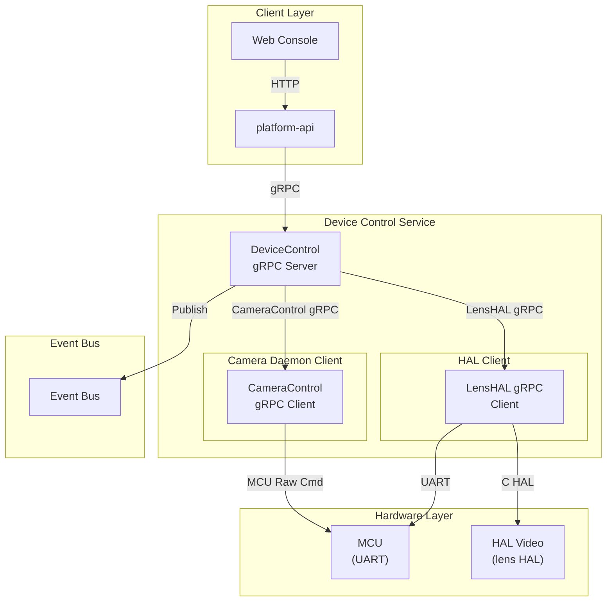
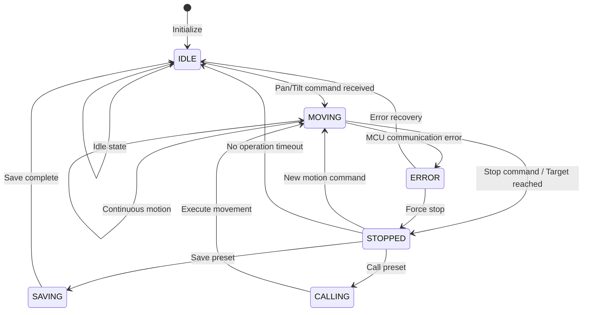
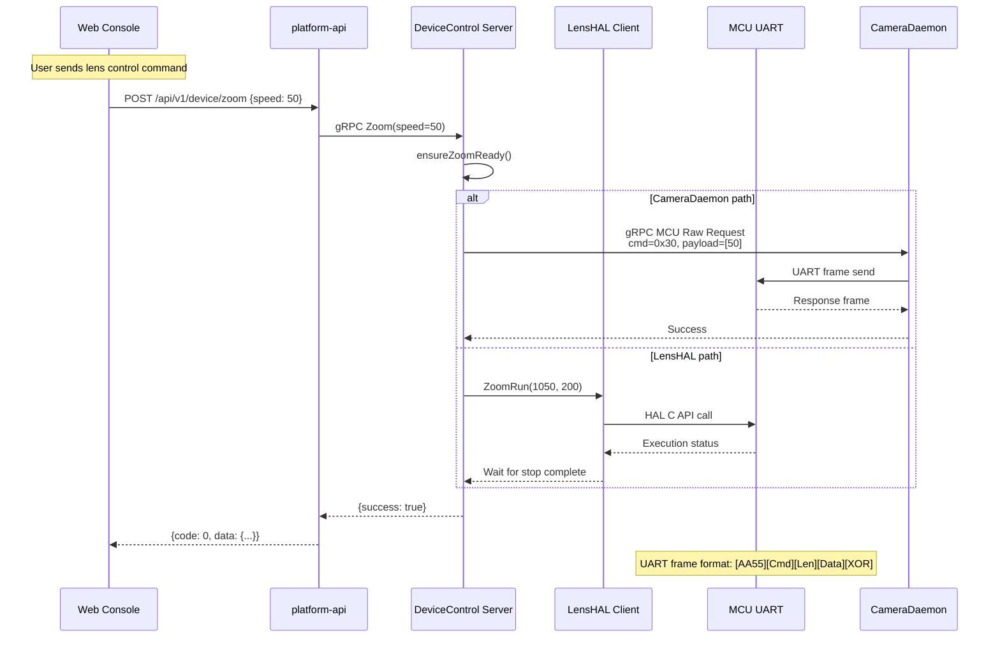
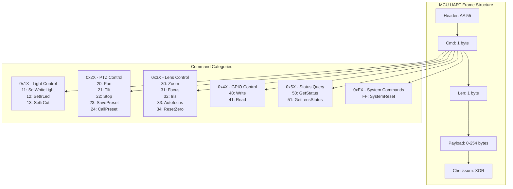
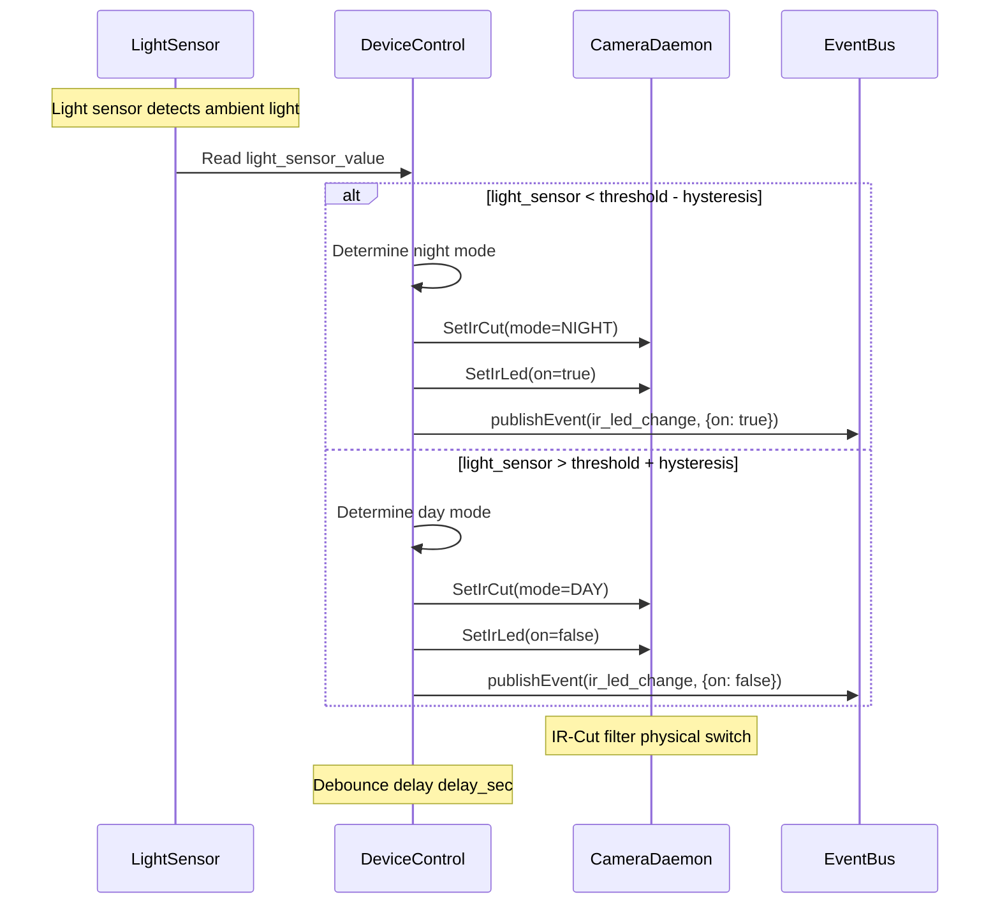
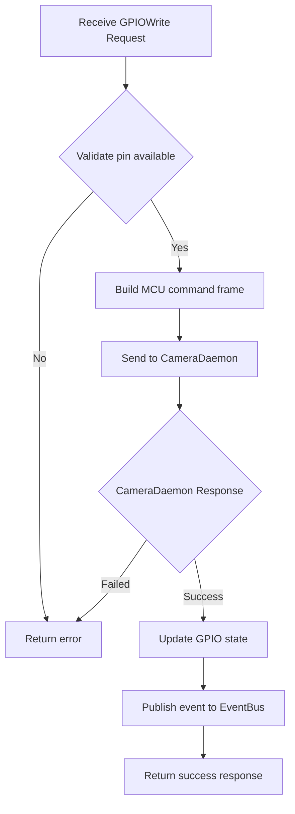
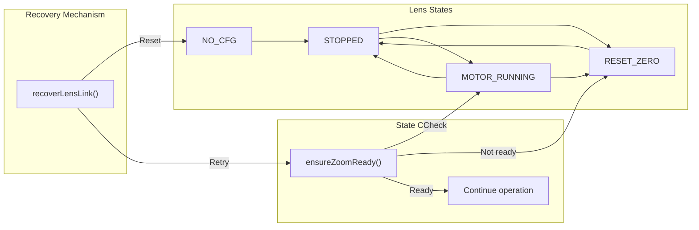

# Device Control Service

## Overview

`device-control` is a hardware peripheral control service that manages lights, PTZ (Pan-Tilt-Zoom), lens, GPIO, and other peripherals through MCU (UART) and HAL. It supports advanced control of AF0832 lenses (autofocus, AF window, iris) and real-time event subscriptions.

Tech stack: Go + gRPC + HAL.

## Directory Structure

```
platform/device-control/
├── proto/
│   └── device.proto          # gRPC definitions
├── hal/
│   └── lens.go               # HAL interface definitions
├── lens/
│   ├── client.go             # Lens HAL client
│   └── lenspb/
│       ├── lens_hal.proto    # Lens HAL gRPC definitions
│       └── lens_hal.pb.go    # Generated code
└── server/
    └── main.go               # Main service implementation
```

## Architecture Diagram



## gRPC API

Service name: `DeviceControl`, listening on `unix:///run/aipc/device-control.sock`.

### PTZ Control State Machine



### Lens Control Flow (API -> gRPC -> MCU UART -> Response)



### MCU UART Protocol Frame Format



## gRPC API

| RPC | Request | Response | Description |
|-----|---------|----------|-------------|
| `SetWhiteLight` | `LightLevelRequest` | `Status` | White light brightness (0-100) |
| `SetIrLed` | `LightSwitchRequest` | `Status` | IR LED switch |
| `SetIrCut` | `IrCutRequest` | `Status` | IR-Cut filter mode |

```protobuf
message LightLevelRequest { uint32 level = 1; }          // 0-100
message LightSwitchRequest { bool on = 1; }
enum IrCutMode { IRCUT_AUTO = 0; IRCUT_DAY = 1; IRCUT_NIGHT = 2; }
```

### PTZ Control

| RPC | Request | Response | Description |
|-----|---------|----------|-------------|
| `Pan` | `PanRequest` | `Status` | Horizontal rotation |
| `Tilt` | `TiltRequest` | `Status` | Vertical rotation |
| `PTZStop` | `PTZStopRequest` | `Status` | Stop motion |
| `SavePreset` | `PresetRequest` | `Status` | Save preset |
| `CallPreset` | `PresetRequest` | `Status` | Call preset |

```protobuf
enum PanDirection { PAN_STOP = 0; PAN_LEFT = 1; PAN_RIGHT = 2; }
enum TiltDirection { TILT_STOP = 0; TILT_UP = 1; TILT_DOWN = 2; }
message PanRequest { PanDirection direction = 1; uint32 speed = 2; }
message TiltRequest { TiltDirection direction = 1; uint32 speed = 2; }
message PresetRequest { uint32 preset_id = 1; }          // 1-255
```

### Lens Control

| RPC | Request | Response | Description |
|-----|---------|----------|-------------|
| `Zoom` | `ZoomRequest` | `Status` | Zoom speed control |
| `Focus` | `FocusRequest` | `Status` | Focus speed control |
| `SetAutofocus` | `AutofocusRequest` | `Status` | Enable/disable autofocus |
| `SetZoomLevel` | `ZoomLevelRequest` | `Status` | Absolute zoom position |
| `SetFocusLevel` | `FocusLevelRequest` | `Status` | Absolute focus position |
| `LensResetZero` | `LensResetRequest` | `Status` | Reset to zero |
| `GetLensStatus` | `Empty` | `LensStatusResponse` | Lens status |
| `ControlIris` | `IrisRequest` | `Status` | Iris speed control |
| `SetIrisTarget` | `IrisTargetRequest` | `Status` | Absolute iris position |
| `SetLensLimits` | `LensLimitsRequest` | `Status` | Set limits |

```protobuf
message ZoomRequest { int32 speed = 1; }                 // -100 ~ 100
message FocusRequest { int32 speed = 1; }                // -100 ~ 100
message ZoomLevelRequest { float level = 1; }            // 0.0 ~ 1.0
message FocusLevelRequest { float level = 1; }           // 0.0 ~ 1.0
```

### AF0832 Advanced API

| RPC | Request | Response | Description |
|-----|---------|----------|-------------|
| `LensInit` | `LensInitRequest` | `Status` | Initialize AF0832 lens |
| `LensGotoRatioDistance` | `GotoRatioDistanceRequest` | `Status` | Position by ratio and distance |
| `SetAfWindows` | `SetAfWindowsRequest` | `Status` | Configure AF windows |
| `GetAfMeasurement` | `Empty` | `AfMeasurementResponse` | Get AF measurements |

```protobuf
message GotoRatioDistanceRequest {
  float zoom_ratio = 1;        // 1.0 ~ 2.88 optical zoom ratio
  float focus_distance_m = 2;  // Focus distance (meters)
}

message AfWindow { int32 x = 1; int32 y = 2; int32 w = 3; int32 h = 4; }
message SetAfWindowsRequest {
  bool enabled = 1;
  repeated AfWindow windows = 2;  // 1-3 windows
}
```

### GPIO

| RPC | Request | Response | Description |
|-----|---------|----------|-------------|
| `GPIOWrite` | `GPIOWriteRequest` | `Status` | Write GPIO |
| `GPIORead` | `GPIOReadRequest` | `GPIOReadResponse` | Read GPIO |

### Status and Events

| RPC | Request | Response | Description |
|-----|---------|----------|-------------|
| `GetDeviceStatus` | `Empty` | `DeviceStatus` | Full device status |
| `SubscribeEvents` | `Empty` | `stream DeviceEvent` | Event stream |

```protobuf
message DeviceStatus {
  float soc_temp_c = 1;
  float mcu_temp_c = 2;
  uint32 light_sensor = 3;
  int32 ptz_pan_pos = 10;
  int32 ptz_tilt_pos = 11;
  uint32 zoom_pos = 20;
  uint32 focus_pos = 21;
  bool autofocus_enabled = 22;
  IrCutMode ircut_mode = 30;
  uint32 white_light_level = 40;
  bool ir_led_on = 41;
  string mcu_version = 50;
}

message DeviceEvent {
  enum EventType {
    GPIO_CHANGE = 0;
    LIGHT_SENSOR_CHANGE = 1;
    TEMPERATURE_ALERT = 2;
    PTZ_MOVE_COMPLETE = 3;
    FOCUS_COMPLETE = 4;
  }
  EventType type = 1;
  uint64 timestamp_ns = 2;
}
```

## Configuration

Configuration file: `configs/platform/device-control.yaml`

```yaml
service:
  name: device-control
  listen: unix:///run/aipc/device-control.sock
  log_level: info

camera_daemon:
  lens_endpoint: /run/aipc/camera-control.sock

mcu:
  protocol: uart
  device: /dev/ttyS0
  baudrate: 921600
  data_bits: 8
  parity: none
  stop_bits: 1
  timeout_ms: 1000
  max_retries: 3
  heartbeat_enabled: true
  heartbeat_interval_sec: 30

capabilities:
  light:
    white_light: true
    ir_led: true
    ir_cut: true
  ptz:
    enabled: true
    pan_range: [-180, 180]
    tilt_range: [-45, 45]
    max_speed: 100
    presets: 16
  lens:
    zoom: true
    focus: true
    autofocus: true
    iris: true
    zoom_range: [1.0, 2.88]
    focus_range: [0.1, 10.0]
  gpio:
    available_pins: [12, 13, 21, 22]

automation:
  day_night_auto:
    enabled: true
    light_sensor_threshold: 300
    hysteresis: 50
    delay_sec: 10
  temperature_protection:
    enabled: true
    warning_temp_c: 75
    critical_temp_c: 85

event_bus:
  enabled: true
  endpoint: unix:///run/aipc/event-bus.sock
```

## Automation Control Flow



## GPIO Control Flow Diagram



## HAL Integration

### Lens HAL

Lens control is implemented through camera-daemon's LensHAL gRPC service (`/run/aipc/camera-control.sock`):
- Motor speed control (-100 to +100)
- Absolute positioning (microstep units)
- Reset-Zero calibration
- Autofocus (with zoom drift compensation)
- Iris ADC control

### MCU UART

Communicates with MCU via UART, frame format:

```
[Header][Cmd][Len][Payload][Checksum]
AA 55   Cmd  Len  Data    XOR
```

Command categories: `0x1X` light, `0x2X` PTZ, `0x3X` lens, `0x4X` GPIO, `0x5X` status query, `0xFX` system.

## Automation

- **Day/Night Switching**: Auto-switch IR-Cut and IR LED based on light sensor
- **Temperature Protection**: Over-temperature warning and auto throttling
- **Event Publishing**: GPIO changes, temperature alerts, etc. pushed to event-bus

## Lens State Management


