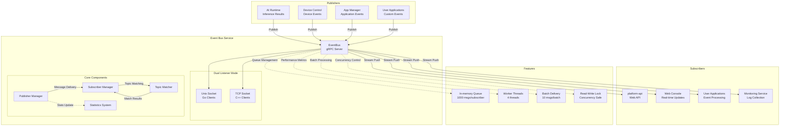
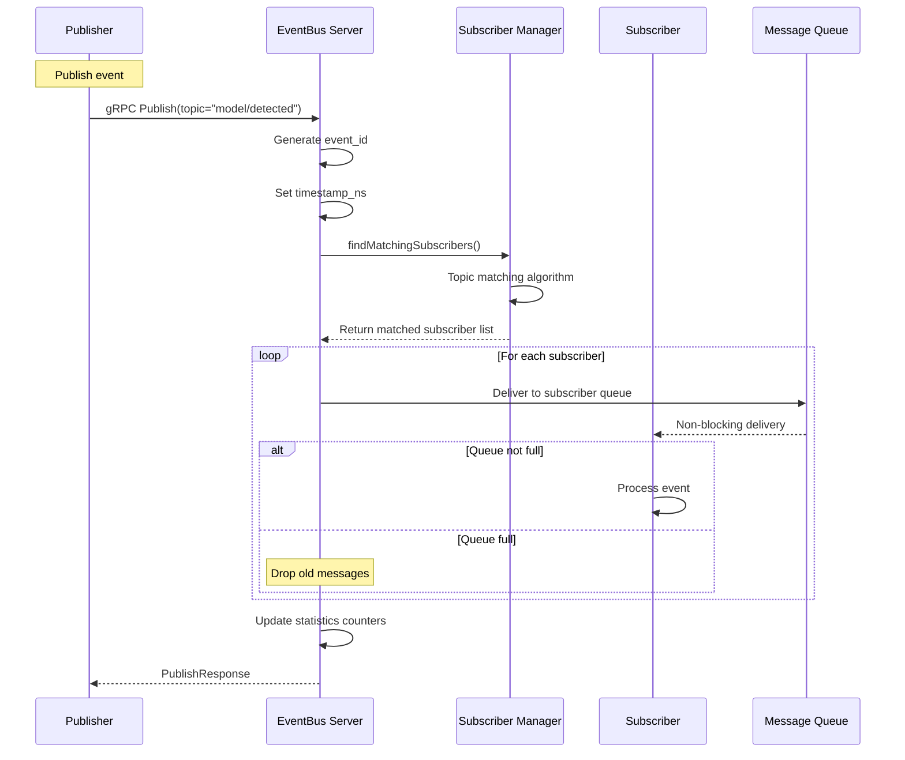
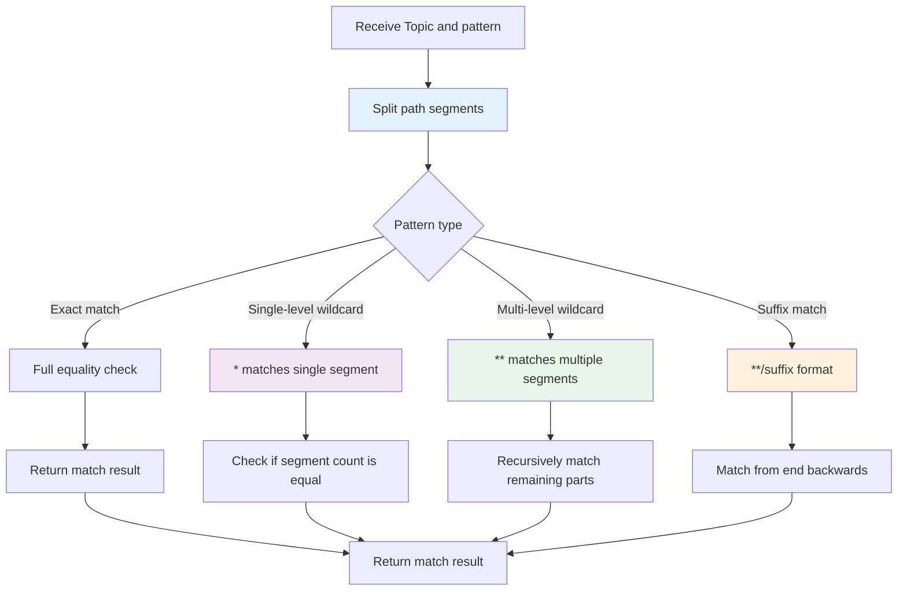
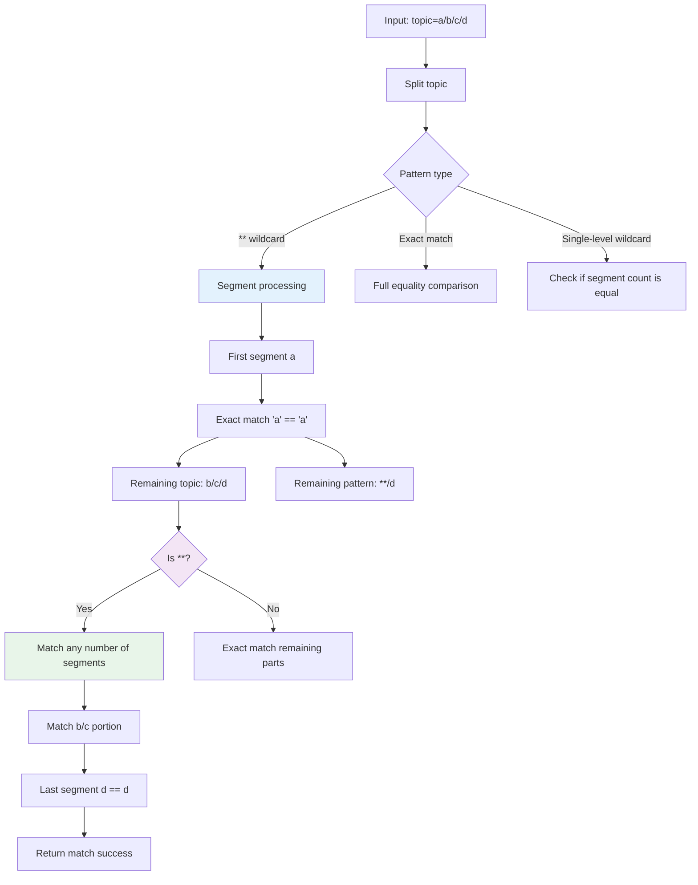
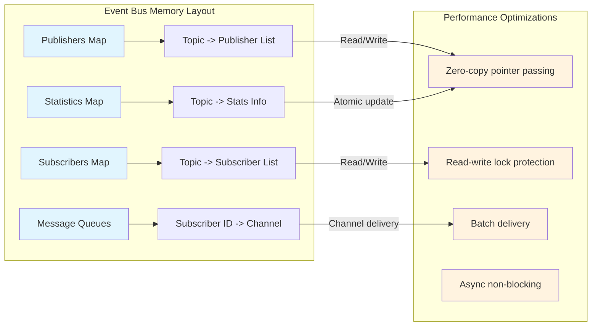
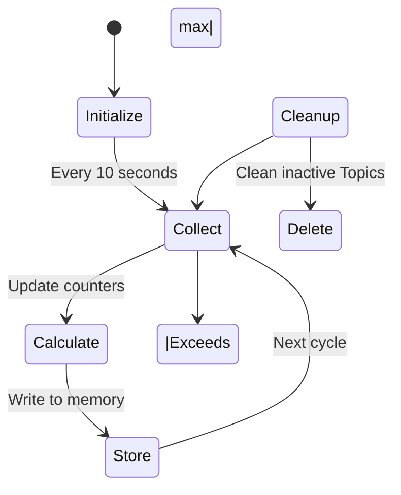
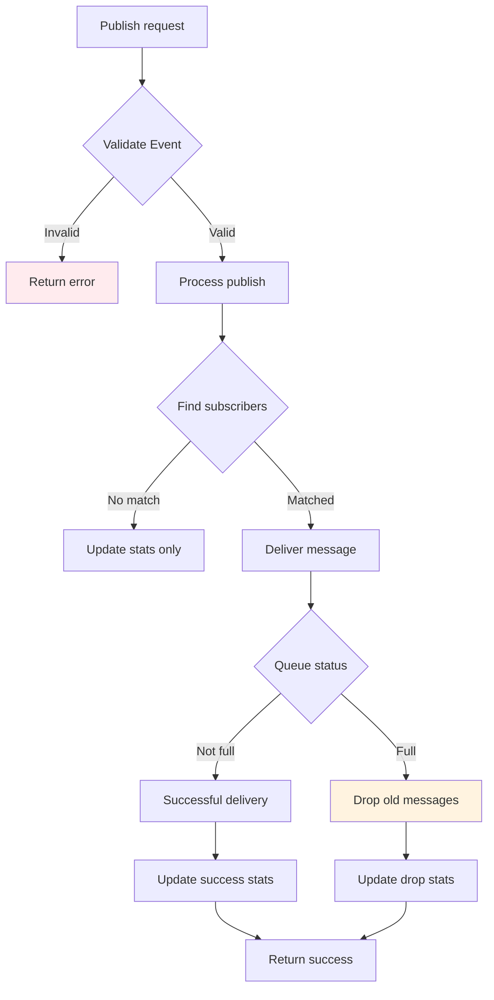

# Event Bus Service

## Overview

`event-bus` is a local Pub/Sub message bus responsible for AI inference result distribution, application event reporting, and system event notification. It supports MQTT-style wildcard Topic matching.

Tech stack: Go + gRPC, pure in-memory implementation, no external dependencies.

## Directory Structure

```
platform/event-bus/
├── proto/
│   ├── event.proto           # gRPC definitions
│   ├── event.pb.go           # Generated code
│   └── event_grpc.pb.go      # Generated gRPC code
└── server/
    ├── main.go               # Service implementation
    └── main_test.go          # Tests
```

## Architecture Diagram



## gRPC API

Service name: `EventBus`, listening on `unix:///run/aipc/event-bus.sock` (TCP: `127.0.0.1:50053`).

### Pub/Sub Message Flow



### Topic Wildcard Matching Flowchart



### Dual Listener Mode Architecture

```mermaid
graph LR
    subgraph "EventBus Service"
        subgraph "Service Instance"
            EB["EventBus Server<br/>Go gRPC Service"]
        end

        subgraph "Listeners"
            US["Unix Socket Listener<br/>/run/aipc/event-bus.sock<br/>Low overhead, Go clients"]
            TS["TCP Listener<br/>127.0.0.1:50053<br/>C++ client compatible"]
        end

        EB --> US
        EB --> TS
    end

    subgraph "Client Types"
        GC["Go Client<br/>Uses Unix Socket<br/>Performance priority"]
        CC["C++ Client<br/>Uses TCP Socket<br/>Compatibility priority"]
    end

    GC --> US
    CC --> TS

    ```

## gRPC API

| RPC | Request | Response | Description |
|-----|---------|----------|-------------|
| `Publish` | `PublishRequest` | `PublishResponse` | Publish single event |
| `PublishBatch` | `stream PublishRequest` | `Status` | Batch publish |
| `Subscribe` | `SubscribeRequest` | `stream Event` | Subscribe to Topic (wildcard supported) |
| `Unsubscribe` | `SubscribeRequest` | `Status` | Unsubscribe |
| `ListTopics` | `Empty` | `TopicListResponse` | List active Topics |
| `GetTopicInfo` | `TopicInfo` | `TopicInfo` | Topic details |
| `GetStats` | `Empty` | `SystemStats` | System statistics |
| `GetTopicStats` | `TopicInfo` | `EventStats` | Topic statistics |

### Key Message Structures

**Event**:
```protobuf
message Event {
  string topic = 1;           // Topic (e.g. "model/person_v1/detections")
  uint64 timestamp_ns = 2;    // Timestamp
  string source = 3;          // Source (app_id / service_name)
  string event_id = 4;        // Event ID (auto-generated)
  bytes payload = 10;         // Payload (JSON or protobuf)
  string payload_type = 11;   // "json" / "protobuf"
  map<string, string> metadata = 20;
}
```

**SubscribeRequest**:
```protobuf
message SubscribeRequest {
  string topic = 1;           // Wildcard supported
  string subscriber_id = 2;   // Subscriber ID
  map<string, string> filters = 10;  // Optional filters
  uint32 queue_size = 20;     // Queue size
  bool drop_old = 21;         // Drop old messages when queue is full
}
```

**Statistics**:
```protobuf
message EventStats {
  string topic = 1;
  uint64 published_count = 2;
  uint64 delivered_count = 3;
  uint64 dropped_count = 4;
  float avg_latency_us = 5;
}

message SystemStats {
  repeated EventStats topic_stats = 1;
  uint32 total_subscribers = 2;
  uint32 total_topics = 3;
  uint64 uptime_ms = 4;
}
```

## Configuration

Configuration file: `configs/platform/event-bus.yaml`

```yaml
service:
  name: event-bus
  listen: unix:///run/aipc/event-bus.sock
  tcp_listen: "127.0.0.1:50053"    # C++ gRPC clients (unix: not supported)
  log_level: info

bus:
  queue_size: 1000          # Per-subscriber queue size
  max_topics: 1000
  workers: 4                # Worker thread count
  batch_size: 10            # Batch delivery size
  inactive_topic_ttl: 3600  # Inactive Topic cleanup interval (seconds)

routing:
  priorities:
    "system/": 10           # Highest priority
    "alert/": 8
    "model/": 5
    "app/": 5
  rate_limits:
    "model/*": 1000         # 1000 msg/sec
    "app/*": 100            # 100 msg/sec

monitoring:
  stats_enabled: true
  stats_interval_sec: 10
  metrics_port: 9091
```

## Topic Wildcard Matching

Supports MQTT-style wildcards:

| Pattern | Description | Example |
|---------|-------------|---------|
| Exact match | Exact Topic match | `app/test/alert` |
| `*` | Matches single level | `app/*/alert` matches `app/test/alert` |
| `**` | Matches multiple levels | `app/**` matches `app/a/b/c` |
| `**/suffix` | Suffix match | `app/**/events` matches `app/a/b/events` |

**Matching rules**:
- `*` matches exactly one path segment (does not cross `/`)
- `**` matches zero or more path segments
- Recursive segment-by-segment matching algorithm

### Topic Matching Algorithm Details



## Message Flow

### Publish

1. Auto-generate `event_id` (if not provided)
2. Auto-set `timestamp_ns`
3. Find subscribers via Topic wildcard matching
4. Non-blocking delivery (drop if queue is full)
5. Update statistics counters

### Subscribe

1. Create buffered channel (configurable size)
2. Register subscriber
3. Stream events to client
4. Auto-cleanup on disconnect

## Pure In-Memory Architecture



## Performance Characteristics

- **Pure in-memory**: No external dependencies, zero disk I/O
- **Zero-copy**: Internal event pointer passing
- **Async publish**: Immediate return, does not wait for delivery
- **Slow consumer handling**: Drop old messages when queue is full
- **Read-write lock**: Allows multiple concurrent publishers
- **Low latency**: < 1ms end-to-end

### Performance Data

| Metric | Value | Description |
|--------|-------|-------------|
| Single message publish latency | < 0.1ms | Including matching and delivery |
| Max throughput | 100,000 msg/s | Batch publish mode |
| Memory usage | < 50MB | Including subscriptions and statistics |
| Max Topics | 1000 | Configurable |
| Queue size | 1000 msgs/subscriber | Configurable |

## CLI Tool

```bash
# List Topics
aipc-cli event topics

# Publish event
aipc-cli event publish app/test '{"msg":"hello"}'

# Subscribe to events (wildcard supported)
aipc-cli event subscribe 'model/*/detections'

# View statistics
aipc-cli event stats
```

### Internal Statistics Management



## Error Handling

