# Media Streaming Architecture

## Overview

NE503 implements a complete low-latency video streaming pipeline, from camera hardware capture to Web frontend playback, supporting both RTSP and WebSocket protocols. The system uses a dual-thread design, Unix Domain Socket communication, zero-copy optimization, and other high-performance techniques to ensure real-time requirements are met.

### Core Features

- **Protocol Support**: RTSP 1.0 (RFC 2326) + RTP/AVP/TCP interleaved transport
- **Encoding/Decoding**: H.264 (RFC 6184) and H.265 (RFC 7798) FU-A fragmentation
- **Concurrency**: Multiple clients can consume the same stream simultaneously
- **Low Latency**: Full pipeline optimized for < 100ms end-to-end
- **Hot Update**: Dynamic encoding parameter adjustment supported
- **Fault Tolerance**: Auto-reconnect, error recovery, stream interruption recovery

## Data Flow Architecture

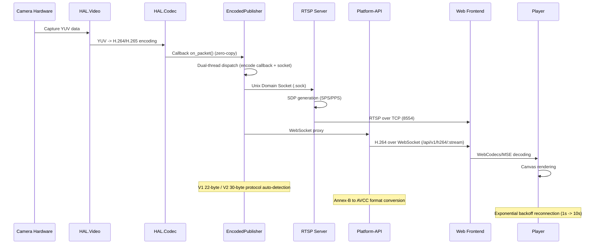

## Component Deep Dive

### 1. RTSP Server (`platform/camera-daemon/src/rtsp_server.cpp`)

#### Architecture Features
- **Protocol Implementation**: RTSP 1.0 + RTP/AVP/TCP (RFC 7826 interleaved transport)
- **Supported Formats**: H.264 (RFC 6184) and H.265 (RFC 7798)
- **Fragmentation Strategy**: FU-A for large NAL units (> 1390 bytes)
- **Multi-client**: Supports 8 concurrent RTSP clients
- **Port**: 8554 (configurable)

#### RTSP State Machine

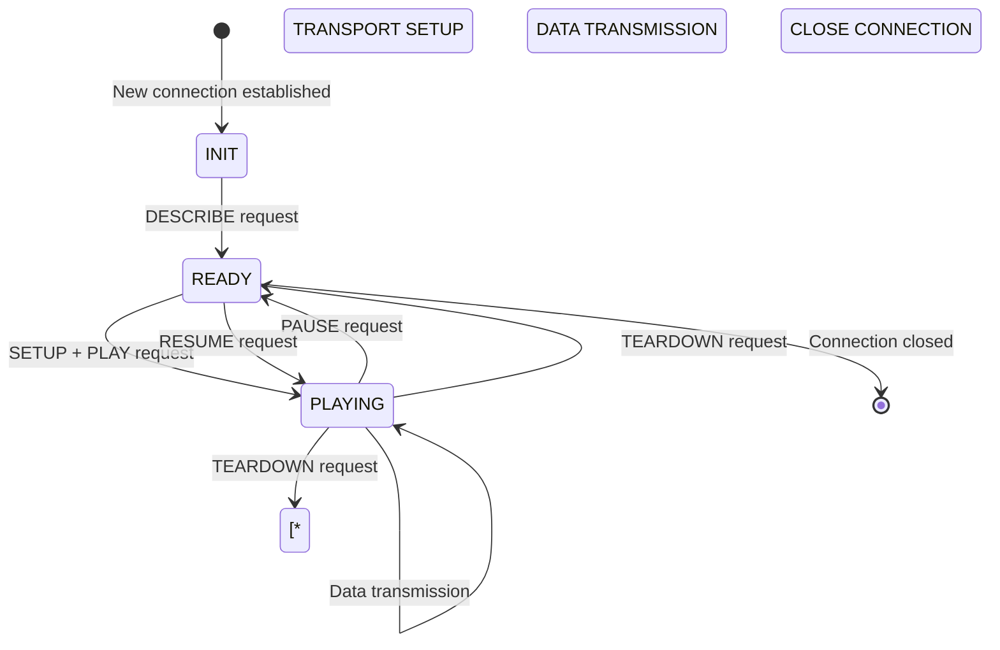

#### RTSP Request Processing Flow

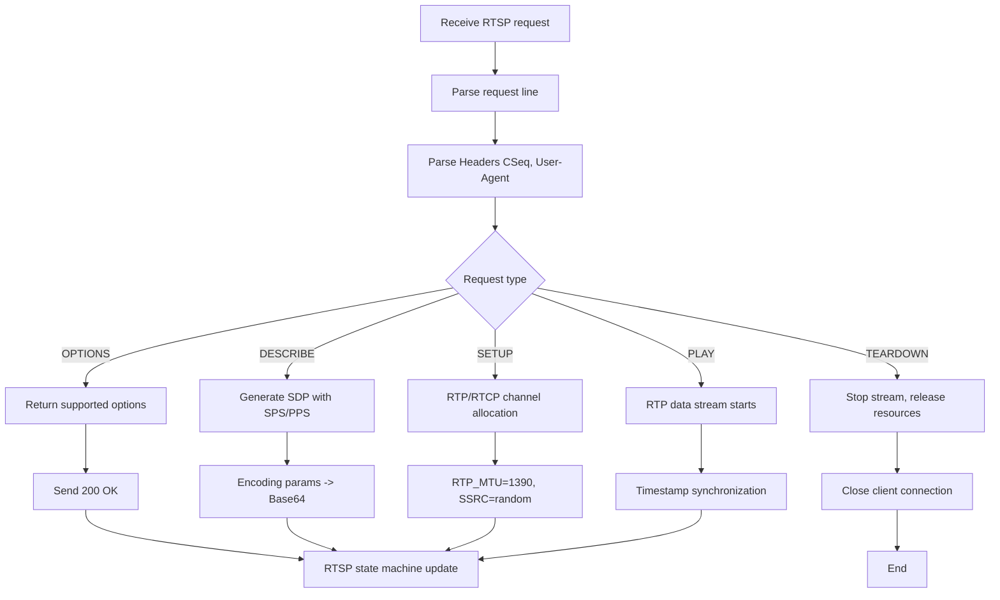

#### RTP Fragmentation Implementation

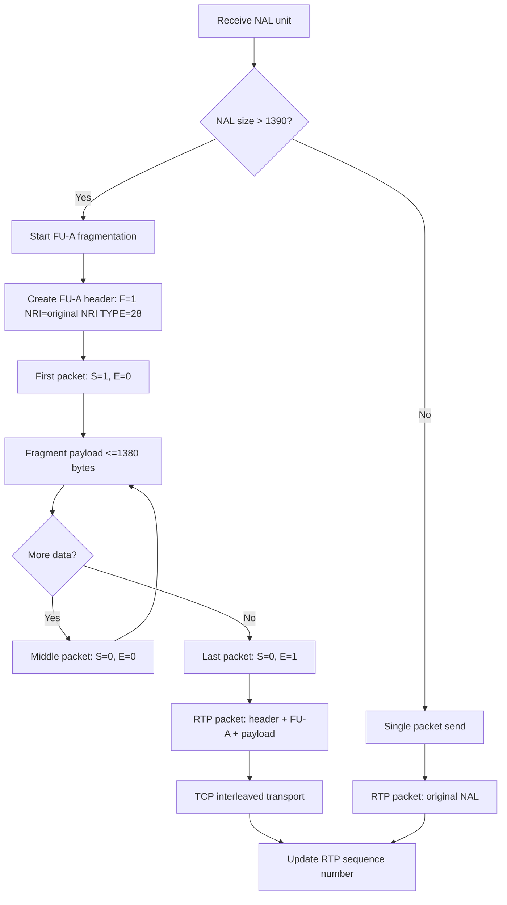

### 2. Encoded Stream Publisher (`platform/camera-daemon/src/encoded_publisher.cpp`)

#### Dual-Thread Architecture Design

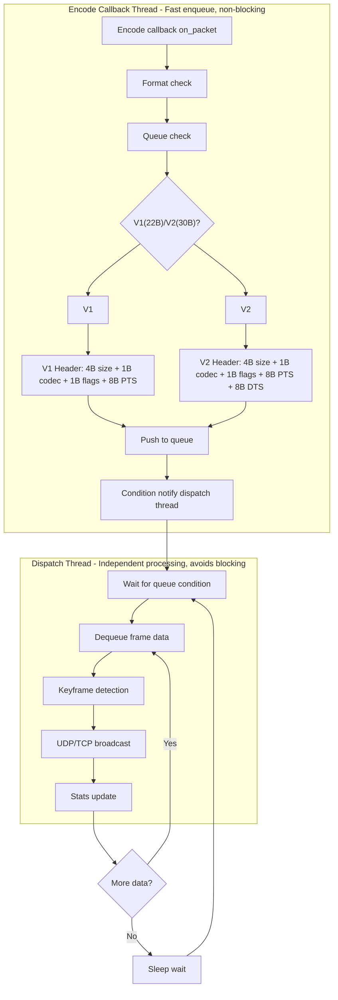

#### Encoded Publisher V2 Protocol Format

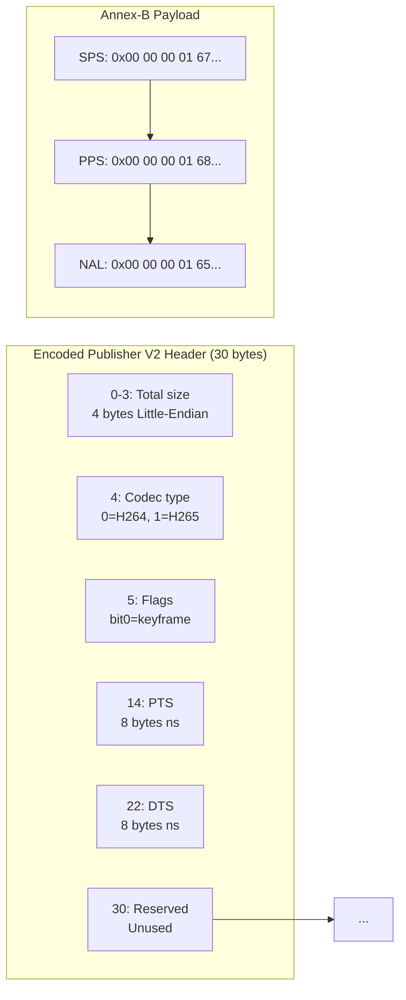

#### Keyframe Detection Algorithm

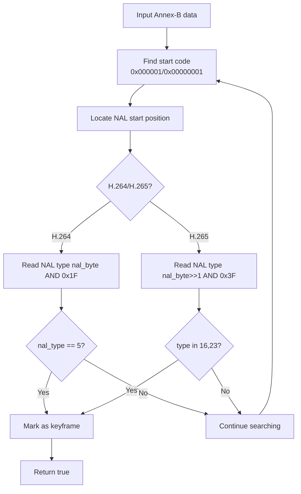

### 3. H.264 Stream API (`platform/platform-api/handlers/h264_stream.go`)

#### WebSocket Connection Handling Flow

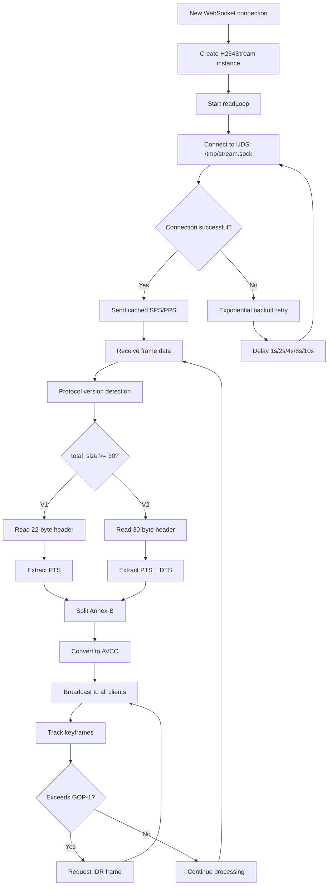

#### Annex-B to AVCC Conversion

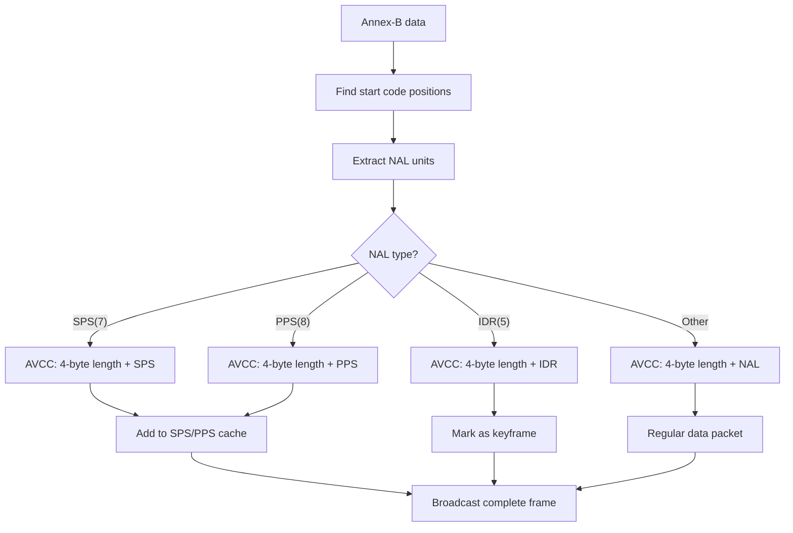

#### Frontend Player Architecture

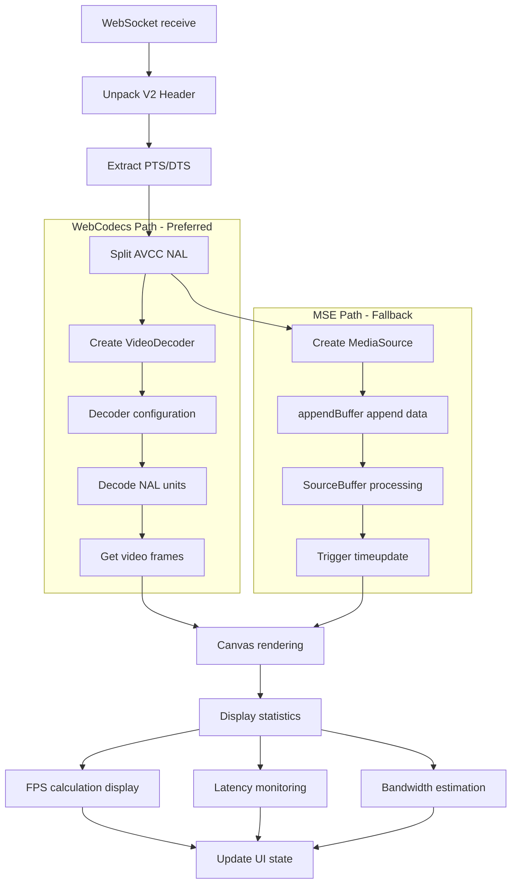

### 4. Stream API (`platform/platform-api/handlers/stream.go`)

#### RESTful Interface Design

| Endpoint | Method | Function | Parameters |
|----------|--------|----------|------------|
| `/api/v1/media/status` | GET | Stream status and config | - |
| `/api/v1/media/rtsp` | PUT | Enable/disable RTSP | `enabled: bool` |
| `/api/v1/media/encoder` | PUT | Hot update encoding params | `bitrate`, `fps`, `gop` |
| `/api/v1/media/encoder/reconfig` | PUT | Full reconfiguration | `width`, `height`, `codec` |
| `/api/v1/media/streams/:name/enable` | POST | Enable stream | - |
| `/api/v1/media/streams/:name/disable` | DELETE | Disable stream | - |
| `/api/v1/h264/:stream_id` | WebSocket | H.264 stream transport | V1/V2 auto-detection |

#### Hot Update vs Full Reconfiguration Comparison

| Operation Type | Hot Update | Full Reconfiguration |
|---------------|------------|---------------------|
| Impact | Seamless, < 50ms | Restart encoder, ~100ms |
| Supported params | Bitrate, frame rate, GOP | Resolution, codec format |
| User experience | No interruption | Brief black screen |
| Use case | Dynamic quality adjustment | Resolution switching |

### 5. Frontend Playback System (`web/src/pages/media/`)

#### Multi-Stream Playback Architecture

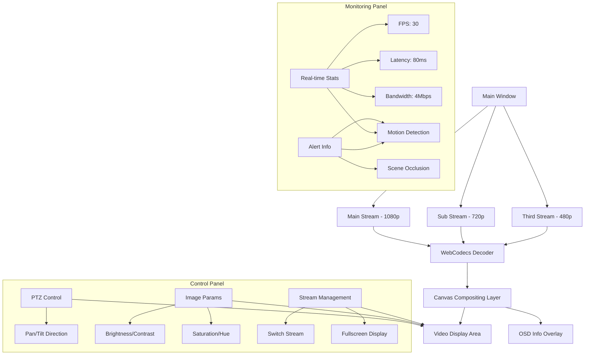

## Key Technical Details

### 1. Performance Optimization Parameters

#### RTSP Server Configuration
- **epoll timeout**: 500ms (balance responsiveness and resources)
- **Send buffer**: 4MB (avoid TCP blocking)
- **Session ID**: 16-byte hex random string
- **RTP_MTU**: 1390 bytes (IP + TCP + RTP + FU-A overhead)
- **Max clients**: 8 concurrent connections

#### Encoded Publisher Configuration
- **Protocol version**: V1 (22-byte) / V2 (30-byte) auto-detection
- **Queue size**: Unlimited (avoid frame drops)
- **Dispatch thread**: Runs independently, does not block encoding
- **Keyframe interval**: Request IDR frame every GOP-1 frames

#### WebSocket Stream Configuration
- **Auto-reconnect**: Exponential backoff 1s -> 2s -> 4s -> 8s -> 10s
- **Buffer**: Dynamically adjusted (avoid memory leaks)
- **Heartbeat**: 30-second interval
- **Timeout**: Auto-disconnect after 5 minutes of no data

### 2. Error Handling Strategy

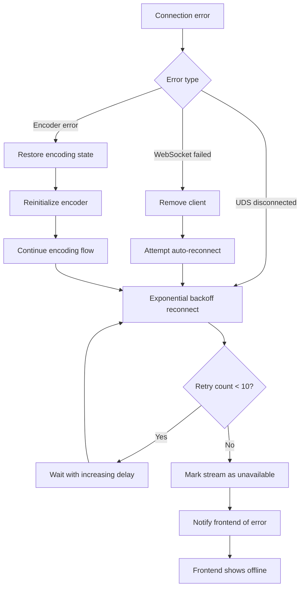

### 3. Cache Management Strategy

#### SPS/PPS Cache Mechanism
- **Trigger condition**: Clear cache when SPS NAL type = 7
- **Cache policy**: Keep latest SPS + PPS combination
- **New clients**: Send cached SPS/PPS immediately upon connection
- **Resolution switch**: Auto-refresh cache to prevent stale data

#### Sequence Number Management
- **Global counter**: Independently maintained per stream ID
- **Monotonically increasing**: Ensures frame order is preserved
- **Persistent**: Maintains continuity across stream rebuilds
- **64-bit width**: Avoids overflow issues

### 4. Timestamp Processing

#### Time Synchronization Mechanism
- **90kHz clock**: RTP standard time base
- **PTS/DTS separation**: V2 protocol supports B-frames
- **Conversion formula**: ns -> 90kHz (divide by 11111.111...)
- **Time base**: First frame set to 0

#### Latency Control
- **End-to-end target**: < 100ms
- **Encoding latency**: ~20ms (determined by GOP size)
- **Network latency**: ~30ms (local network optimized)
- **Rendering latency**: ~30ms (WebCodecs optimized)

## Configuration Examples

### Encoder Configuration
```yaml
encoder:
  main:
    codec: h264
    width: 1920
    height: 1080
    bitrate: 4000000  # 4Mbps
    fps: 30
    gop: 30          # 1-second keyframe interval
    profile: high
    level: 4.1

  sub:
    codec: h264
    width: 1280
    height: 720
    bitrate: 2000000  # 2Mbps
    fps: 25
    gop: 25
```

### RTSP Configuration
```yaml
rtsp:
  enabled: true
  port: 8554
  max_clients: 8
  buffer_size: 4194304  # 4MB
  timeout: 500          # 500ms
```

### WebSocket Configuration
```yaml
websocket:
  path: /api/v1/h264
  max_reconnect_delay: 10
  initial_reconnect_delay: 1
  idle_timeout: 300  # 5 minutes
  ping_interval: 30  # 30 seconds
```

## Monitoring and Diagnostics

### Key Metrics
- **FPS real-time display**: Current frame rate
- **Latency measurement**: End-to-end latency
- **Bandwidth statistics**: Real-time transfer rate
- **Buffer water level**: Decoder buffer usage
- **Error count**: Connection interruption count

### Debug Information
- **NAL unit types**: Encoder output NAL types
- **PTS/DTS delta**: B-frame timestamp difference
- **Keyframe interval**: Actual IDR frame interval
- **Reconnect logs**: Reconnect timestamps and attempt count

## Troubleshooting Guide

### Common Issues
1. **Black screen**: Check if SPS/PPS are sent correctly
2. **Stuttering**: Check network bandwidth and encoding bitrate
3. **Corrupted frames**: Check NAL unit integrity
4. **High latency**: Check GOP size and network latency

### Diagnostic Tools
- **tcpdump**: Capture RTSP/RTP packets
- **wireshark**: Analyze WebSocket streams
- **Frontend console**: Check WebCodecs errors
- **System logs**: View server-side error messages

This implementation fully embodies the design principles of a high-performance, low-latency, fault-tolerant media streaming system, suitable for industrial-grade video monitoring applications.