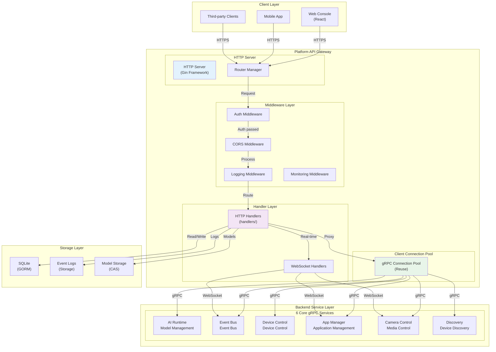
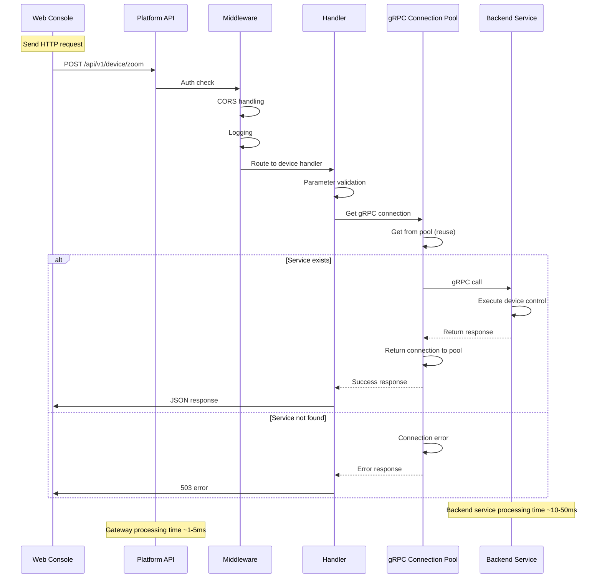
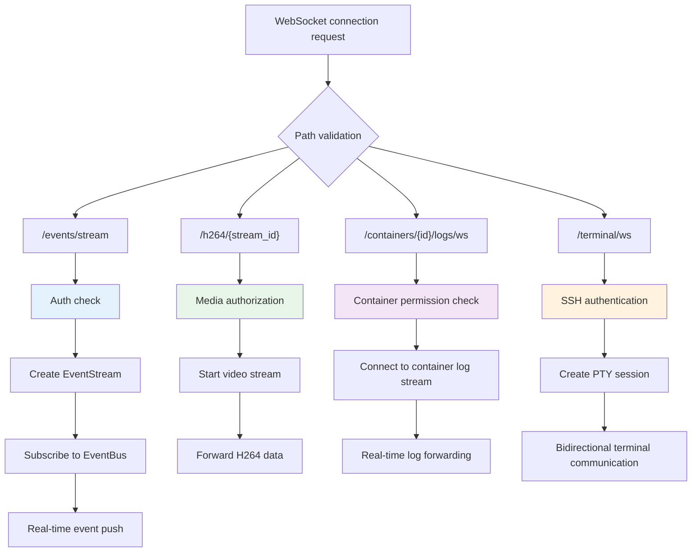
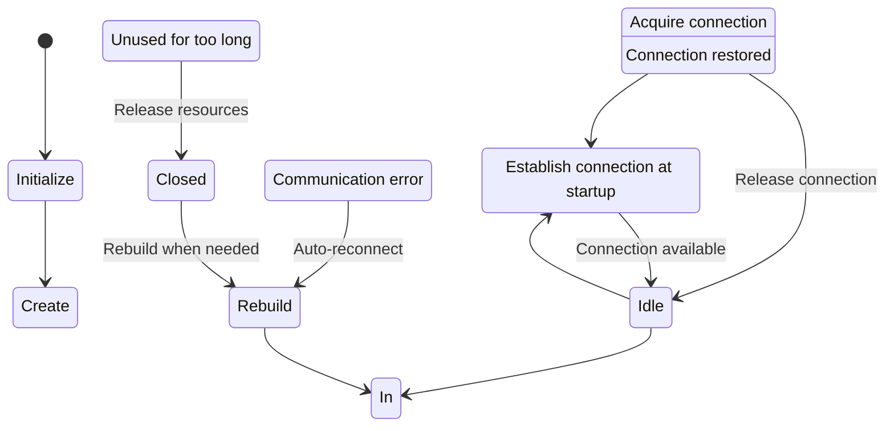
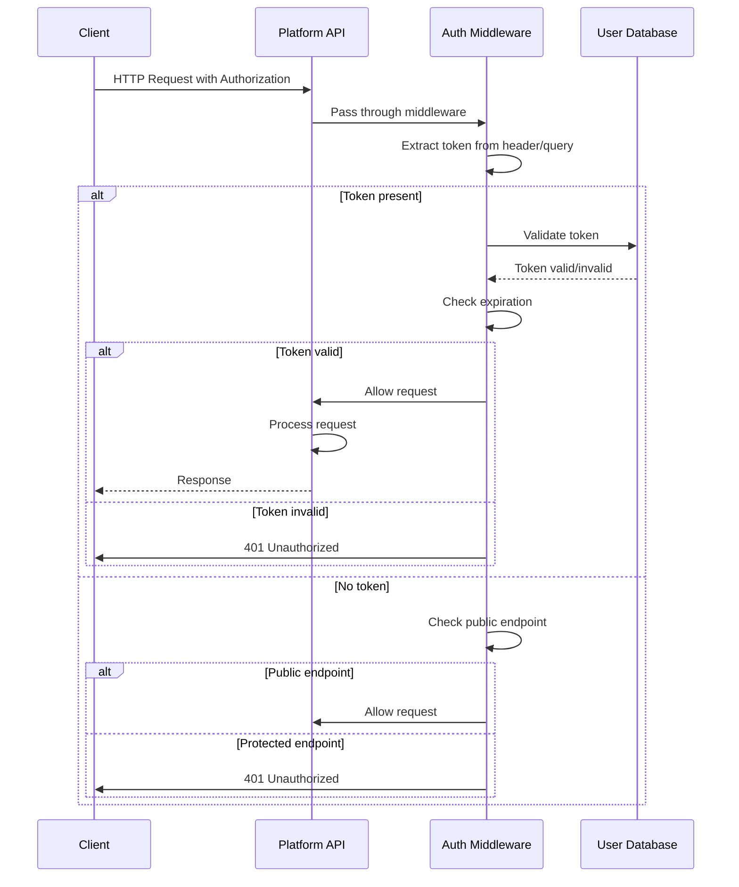

# Platform API Service

## Overview

`platform-api` is the Web API gateway, providing RESTful HTTP interfaces that proxy backend gRPC services. Built with the Gin framework, it supports WebSocket real-time communication (event streams, video streams, terminal, container logs).

Tech stack: Go + Gin + gRPC client + SQLite (GORM).

## Directory Structure

```
platform/platform-api/
├── auth/                     # Authentication middleware
├── db/                       # Database initialization
├── handlers/                 # HTTP handlers
│   ├── ai.go                # AI Runtime
│   ├── app.go               # App Manager
│   ├── container.go         # Container management
│   ├── device.go            # Device control
│   ├── event.go             # Event bus
│   ├── media.go             # Media configuration
│   ├── stream.go            # Stream configuration
│   ├── h264_stream.go       # H.264 video stream
│   ├── monitor.go           # System monitoring
│   ├── network.go           # Network configuration
│   ├── system.go            # System operations
│   ├── terminal.go          # Web terminal
│   ├── settings.go          # Settings management
│   ├── store.go             # App store
│   ├── dev.go               # Development workbench
│   ├── disk.go              # Storage management
│   ├── file.go              # File management
│   ├── log.go               # Log viewer
│   ├── ssh.go               # SSH configuration
│   ├── time.go              # Time synchronization
│   ├── wizard.go            # Setup wizard
│   └── ...
├── model/                    # Data models
├── repo/                     # Data repositories
├── server/
│   └── main.go              # Entry point
├── storage/                  # Model storage
├── websocket/               # WebSocket handling
└── swagger-ui/              # API documentation UI
```

## API Gateway Architecture



### REST API Call Flow



### WebSocket Endpoint Handling Flow



## Backend Service Connections

| Backend Service | Socket Path | Purpose |
|----------------|-------------|---------|
| AI Runtime | `unix:///run/aipc/ai-runtime.sock` | Model management and inference |
| Event Bus | `unix:///run/aipc/event-bus.sock` | Event subscribe/publish |
| Device Control | `unix:///run/aipc/device-control.sock` | Device control |
| App Manager | `unix:///run/aipc/app-manager.sock` | Application management |
| Camera Control | `unix:///run/aipc/camera-control.sock` | Media/lens |
| Discovery | `unix:///run/aipc/discovery.sock` | Device discovery |

### gRPC Connection Pool Management



## API Endpoint Overview

All endpoints are prefixed with `/api/v1`, some are public (no authentication required).

### Route Organization Structure

```mermaid
graph TD
    A["/api/v1"] --> B[System Management]
    A --> C[Time Management]
    A --> D[AI Models]
    A --> E[Event System]
    A --> F[Device Control]
    A --> G[Application Management]
    A --> H[Container Management]
    A --> I[Media Configuration]
    A --> J[Monitoring Stats]
    A --> K[Storage Management]
    A --> L[File Management]
    A --> M[Network Configuration]
    A --> N[Log System]
    A --> O[Development Tools]

    B --> B1["GET /system/info"]
    B --> B2["GET /system/stats"]
    B --> B3["POST /system/password"]
    B --> B4["POST /system/restart"]

    C --> C1["POST /system/time/sync-from-client"]
    C --> C2["GET /system/time/config"]
    C --> C3["PUT /system/time/ntp"]

    D --> D1["GET /ai/models"]
    D --> D2["POST /ai/models"]
    D --> D3["POST /ai/models/load"]
    D --> D4["POST /ai/models/unload"]

    E --> E1["GET /events/topics"]
    E --> E2["POST /events/publish"]
    E --> E3["GET /events/stream<br/>(WebSocket)"]

    F --> F1["GET /device/status"]
    F --> F2["POST /device/ptz"]
    F --> F3["POST /device/lens/zoom"]
    F --> F4["GET /device/lens/status"]

    G --> G1["GET /apps"]
    G --> G2["POST /apps"]
    G --> G3["POST /apps/{id}/start"]
    G --> G4["GET /apps/{id}/logs"]

    H --> H1["GET /containers"]
    H --> H2["GET /containers/{id}/logs/ws<br/>(WebSocket)"]
    H --> H3["GET /containers/{id}/exec/ws<br/>(WebSocket)"]

    I --> I1["GET /media/config"]
    I --> I2["PUT /media/encoder"]
    I --> I3["PUT /media/ai-overlay"]

    J --> J1["GET /monitor/summary"]
    J --> J2["GET /monitor/cpu"]
    J --> J3["GET /monitor/memory"]

    K --> K1["GET /storage/disks"]
    K --> K2["POST /storage/mount"]
    K --> K3["POST /storage/format"]

    L --> L1["GET /files"]
    L --> L2["POST /files/upload"]
    L --> L3["GET /logs/stream/ws<br/>(WebSocket)"]

    M --> M1["GET /network/config"]
    M --> M2["POST /network/config"]
    M --> M3["GET /network/interfaces"]

    O --> O1["GET /dev/projects"]
    O --> O2["POST /dev/projects/{id}/build"]
    O --> O3["GET /terminal/ws<br/>(WebSocket)"]
```



### System

| Method | Path | Description |
|--------|------|-------------|
| GET | `/system/info` | Platform version and service status |
| GET | `/system/stats` | System statistics |
| GET | `/system/health` | Health check (public) |
| POST | `/system/password` | Change password |
| POST | `/system/restart` | Restart system |
| GET/POST | `/system/ota/*` | OTA upgrade |

### Time Management

| Method | Path | Description |
|--------|------|-------------|
| POST | `/system/time/sync-from-client` | Sync time from client |
| GET/POST | `/system/time/*` | Time/timezone/NTP configuration |

### AI Models

| Method | Path | Description |
|--------|------|-------------|
| GET | `/ai/models` | List loaded models |
| POST | `/ai/models` | Register model |
| POST | `/ai/models/upload` | Upload model file |
| POST | `/ai/models/scan` | Scan available models |
| GET/DELETE | `/ai/models/{id}` | Get/delete model |
| POST | `/ai/models/{id}/load` | Load model |
| POST | `/ai/models/{id}/unload` | Unload model |
| GET | `/ai/stats` | AI statistics |
| GET | `/ai/capabilities` | AI capabilities |

### Events

| Method | Path | Description |
|--------|------|-------------|
| GET | `/events/topics` | List Topics |
| POST | `/events/publish` | Publish event |
| GET (WS) | `/events/stream` | Event stream (WebSocket) |

### Device Control

| Method | Path | Description |
|--------|------|-------------|
| GET | `/device/status` | Device status |
| POST | `/device/light` | White light |
| POST | `/device/ir-led` | IR LED |
| POST | `/device/ir-cut` | IR-Cut |
| POST | `/device/ptz` | PTZ control |
| POST | `/device/zoom` | Zoom |
| POST | `/device/focus` | Focus |
| POST | `/device/autofocus` | Auto focus |
| GET/PUT/POST | `/device/lens/*` | Lens operations |
| POST/GET | `/device/gpio/*` | GPIO |

### Application Management

| Method | Path | Description |
|--------|------|-------------|
| GET | `/apps` | List applications |
| POST | `/apps` | Install application |
| POST | `/apps/wizard` | Wizard install |
| POST | `/apps/upload-image` | Upload image |
| GET | `/apps/{id}` | Application details |
| POST | `/apps/{id}/start` | Start |
| POST | `/apps/{id}/stop` | Stop |
| DELETE | `/apps/{id}` | Uninstall |
| GET | `/apps/{id}/stats` | Statistics |
| GET | `/apps/{id}/logs` | Logs |

### Container Management

| Method | Path | Description |
|--------|------|-------------|
| GET | `/containers` | List containers |
| GET | `/containers/{id}` | Container details |
| GET | `/containers/{id}/stats` | Container statistics |
| GET (WS) | `/containers/{id}/logs/ws` | Log stream |
| GET (WS) | `/containers/{id}/exec/ws` | Container terminal |
| POST | `/containers/{id}/start` | Start |
| POST | `/containers/{id}/stop` | Stop |
| DELETE | `/containers/{id}` | Delete |

### Media Configuration

| Method | Path | Description |
|--------|------|-------------|
| GET | `/media/status` | Stream status |
| GET/POST | `/media/config` | Media configuration |
| PUT | `/media/encoder` | Hot update encoding parameters |
| PUT | `/media/rtsp` | RTSP toggle |
| PUT | `/media/ai-overlay` | AI overlay |
| PUT | `/media/osd` | OSD configuration |
| GET/POST | `/media/profiles` | Profile management |
| POST | `/media/streams/{name}/enable` | Enable stream |
| DELETE | `/media/streams/{name}/disable` | Disable stream |

### H.264 Video Stream

| Method | Path | Description |
|--------|------|-------------|
| GET (WS) | `/h264/{stream_id}` | H.264 WebSocket stream |

### System Monitoring

| Method | Path | Description |
|--------|------|-------------|
| GET | `/monitor/summary` | Resource overview |
| GET | `/monitor/cpu` | CPU usage |
| GET | `/monitor/memory` | Memory usage |
| GET | `/monitor/disk` | Disk usage |
| GET | `/monitor/network` | Network usage |

### Storage Management

| Method | Path | Description |
|--------|------|-------------|
| GET | `/storage/disks` | Disk list |
| POST | `/storage/mount` | Mount |
| POST | `/storage/unmount` | Unmount |
| POST | `/storage/format` | Format |

### File Management

| Method | Path | Description |
|--------|------|-------------|
| GET | `/files` | List files |
| GET/POST | `/files/content` | Read/write files |
| POST | `/files/upload` | Upload file |
| GET | `/files/download` | Download file |
| DELETE | `/files` | Delete file |

### Terminal

| Method | Path | Description |
|--------|------|-------------|
| GET (WS) | `/terminal/ws` | Web terminal |

### Network Configuration

| Method | Path | Description |
|--------|------|-------------|
| GET | `/network/config` | Network configuration |
| POST | `/network/config` | Update configuration |
| GET | `/network/interfaces` | Network interface list |

### Logs

| Method | Path | Description |
|--------|------|-------------|
| GET | `/logs/services` | Service list |
| GET | `/logs/content` | Log content |
| GET (WS) | `/logs/stream/ws` | Log stream |

### WebSocket Endpoints

| Path | Purpose |
|------|---------|
| `/api/v1/events/stream?token=` | Event stream |
| `/api/v1/h264/{stream_id}` | H.264 video stream |
| `/api/v1/containers/{id}/logs/ws` | Container log stream |
| `/api/v1/containers/{id}/exec/ws` | Container terminal |
| `/api/v1/terminal/ws` | Web terminal |
| `/api/v1/logs/stream/ws` | Service log stream |

## Authentication

- Optional Bearer Token authentication
- Header: `Authorization: Bearer <token>` or `X-API-Key: <token>`
- WebSocket: `?token=<token>` query parameter
- Public endpoints: `/api/login`, `/api/v1/system/health`

### Authentication Middleware Flow



## Configuration

```yaml
service:
  name: platform-api
  http_addr: ":8080"
  log_level: info

services:
  ai_runtime: "unix:///run/aipc/ai-runtime.sock"
  event_bus: "unix:///run/aipc/event-bus.sock"
  device_control: "unix:///run/aipc/device-control.sock"
  app_manager: "unix:///run/aipc/app-manager.sock"
  camera_control: "unix:///run/aipc/camera-control.sock"
  discovery: "unix:///run/aipc/discovery.sock"

web:
  static_path: "/opt/aipc/web"
  enable_cors: true

auth:
  enabled: false
  token_key: ""
  username: "admin"
  password: ""

stream:
  encoded_pub_dir: "/run/aipc/encoded"

storage:
  root_path: "/opt/aipc"
  model_blob_path: "/opt/aipc/models/blobs"
```

## Response Format

```json
{
  "code": 0,
  "message": "Success",
  "data": { ... }
}
```

## Middleware Chain

```mermaid
flowchart LR
    A[Request arrives] --> B[CORS handling]
    B --> C[Logging]
    C --> D[Auth check]
    D --> E[Route matching]
    E --> F[Parameter validation]
    F --> G[Permission check]
    G --> H[Business logic]
    H --> I[Response wrapping]
    I --> J[Return response]

    style B fill:#e3f2fd
    style D fill:#f3e5f5
    style G fill:#e8f5e9
    style H fill:#fff3e0
```



## API Documentation

Swagger UI is accessible at `/swagger/`.