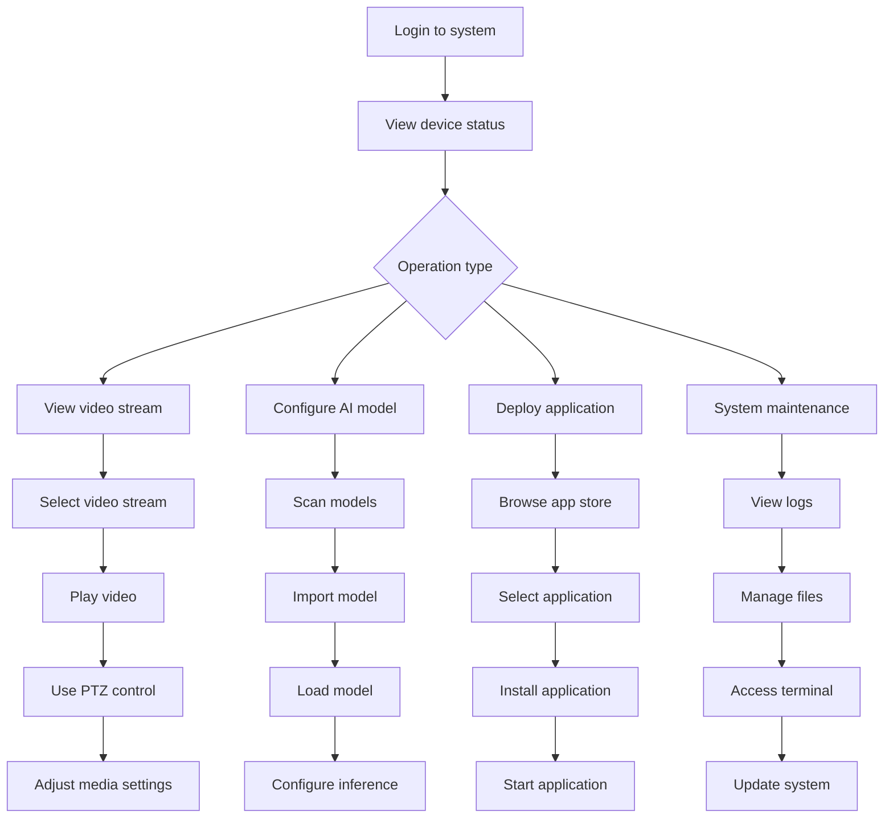
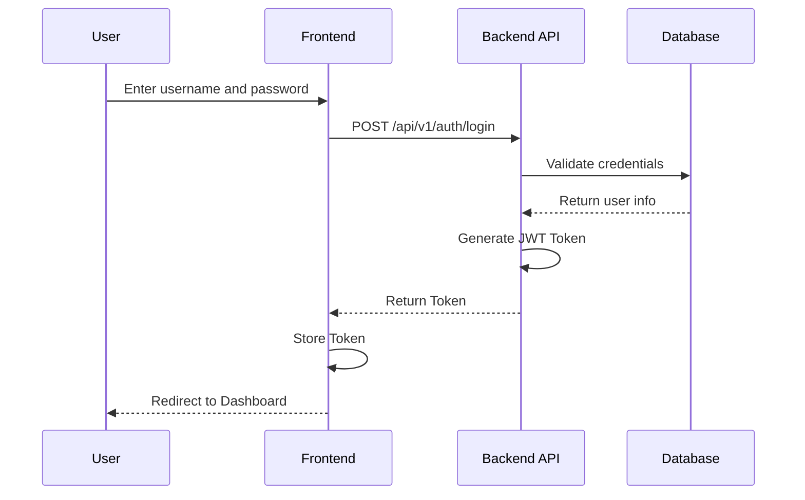
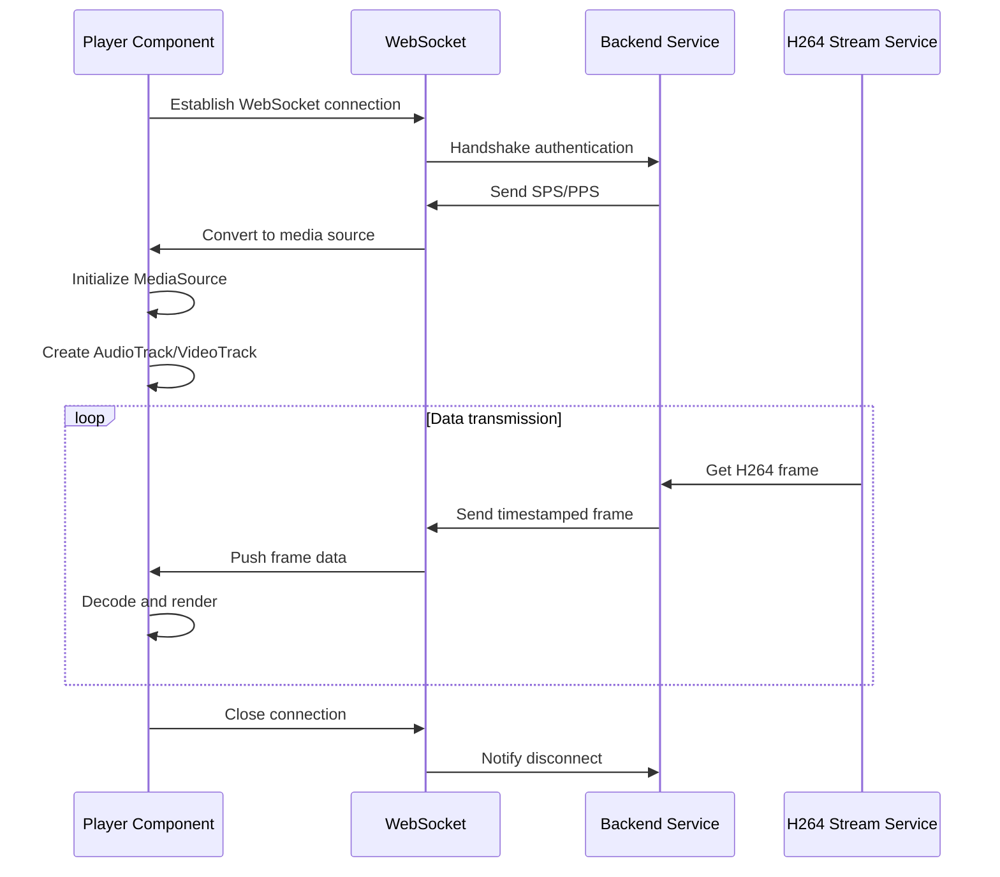
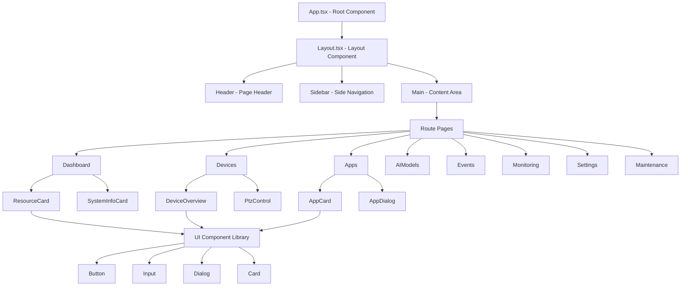
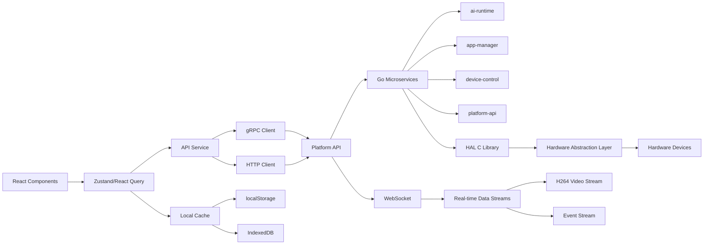
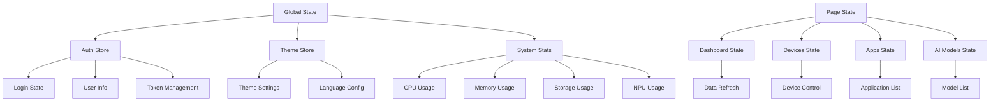

# Web Console User Manual

**Last Updated:** December 27, 2024
**Tech Stack:** React + TypeScript + Vite

## Overview

The NE503 AI IPC Web Console is a web-based device management interface that provides the following core features:

- Device monitoring and control (video streams, PTZ, GPIO)
- AI model management (load, unload, inference)
- Container application management (install, start, stop)
- System monitoring (CPU, memory, storage)
- Event viewing and subscription
- Remote maintenance (terminal, logs, file management)

## Page Navigation Structure

```mermaid
graph TD
    A[Web Console] --> B[Login Page]
    A --> C[Dashboard]
    A --> D[Media/Video]
    A --> E[Device Management]
    A --> F[Application Management]
    A --> G[AI Models]
    A --> H[Event Viewer]
    A --> I[System Monitoring]
    A --> J[System Settings]
    A --> K[Storage Management]
    A --> L[System Maintenance]

    C --> C1[System Overview]
    C --> C2[Resource Cards]
    C --> C3[Device Status]
    C --> C4[Application Stats]
    C --> C5[Model Stats]

    D --> D1[Main Stream Media]
    D --> D2[Sub Stream Media]
    D --> D3[Third-party Stream]
    D --> D4[PTZ Control]
    D --> D5[Media Settings]

    E --> E1[Device Overview]
    E --> E2[Lighting Control]
    E --> E3[Lens Control]
    E --> E4[PTZ Control]
    E --> E5[GPIO Control]

    F --> F1[App Store]
    F --> F2[Installed Apps]
    F --> F3[Running Apps]
    F --> F4[App Details]
    F --> F5[Container Logs]
    F --> F6[Terminal Access]

    G --> G1[Model List]
    G --> G2[Model Details]
    G --> G3[Model Import]
    G --> G4[Inference Config]

    H --> H1[Topic Subscription]
    H --> H2[Publish Event]
    H --> H3[Live Stream]

    I --> I1[CPU Usage]
    I --> I2[NPU Usage]
    I --> I3[Memory Usage]
    I --> I4[Storage Usage]

    J --> J1[Device Info]
    J --> J2[Network Settings]
    J --> J3[Time Settings]
    J --> J4[Video Settings]
    J --> J5[Image Settings]
    J --> J6[Audio Settings]
    J --> J7[Theme Settings]

    K --> K1[Storage Overview]
    K --> K2[Space Analysis]
    K --> K3[Storage Cleanup]

    L --> L1[System Logs]
    L --> L2[File Management]
    L --> L3[Process Management]
    L --> L4[Terminal Access]
```



## Page Feature Details

### 1. Dashboard

System overview page providing a comprehensive view of device running status:

- **System Overview Card**
  - Device name, model, firmware version
  - MAC address, IP address
  - Uptime statistics

- **Resource Monitoring Card**
  - CPU usage and core count
  - NPU usage
  - Memory usage (GB and percentage)
  - Storage usage (eMMC type)

- **Device Status Card**
  - Online/offline camera count
  - Device health status indicators

- **Application Stats Card**
  - Total containers, running, stopped
  - Application detail list

- **Model Stats Card**
  - Number of loaded models
  - Model load time ranking

### 2. Media (Video Stream Management)

Multi-stream video management and playback features:

- **Multi-stream Support**
  - Main stream: Primary video stream
  - Sub stream: Auxiliary video stream
  - Third-party stream: Other sources

- **Video Player Features**
  - Live stream playback (H.264)
  - Double-click fullscreen
  - Control panel toggle
  - Stream statistics display
  - Auto-reconnect mechanism

- **PTZ Control**
  - Directional key control
  - Speed adjustment
  - Preset management
  - Focus and iris control

- **Media Settings**
  - Resolution adjustment
  - Frame rate settings
  - Encoding parameter configuration

### 3. Devices (Device Management)

Device hardware control and management:

- **Device Overview**
  - Basic device information
  - Hardware status monitoring
  - Connection status indicators

- **Lighting Control**
  - LED on/off control
  - Brightness adjustment
  - Color temperature adjustment

- **Lens Control**
  - Focus control
  - Zoom control
  - Iris adjustment

- **PTZ Control**
  - Directional control (up, down, left, right)
  - Speed presets
  - Absolute position control

- **GPIO Control**
  - Input/output status monitoring
  - Level control
  - State toggle

### 4. Apps (Application Management)

Container application lifecycle management:

- **App Store**
  - Application template browsing
  - Search and filter
  - Import new applications

- **Application List Management**
  - Card/list view toggle
  - Status filtering (all/running/stopped/failed)
  - Search functionality

- **Application Operations**
  - Install application
  - Start/stop application
  - Restart application
  - Uninstall application

- **Advanced Features**
  - Container log viewing
  - Terminal access
  - Process management

### 5. AI Models (Model Management)

AI model lifecycle management:

- **Model List**
  - Card/list view
  - Search functionality
  - Status filtering (loaded/unloaded)

- **Model Operations**
  - Load model to NPU
  - Unload model
  - Scan for new models

- **Model Details**
  - Model information viewing
  - Performance metrics
  - Resource usage

- **Inference Configuration**
  - Inference parameter settings
  - Performance optimization options
  - Batch processing configuration

### 6. Events (Event Viewer)

Real-time event monitoring and processing:

- **Topic Subscription**
  - Wildcard pattern support
  - Subscription status management
  - Topic browsing

- **Event Publishing**
  - Manual event publishing
  - Event format configuration
  - Test publishing

- **Live Stream**
  - Real-time event display
  - Scroll and pause
  - Timestamp display
  - Filtering functionality

### 7. Monitoring (System Monitoring)

Real-time system resource monitoring:

- **CPU Monitoring**
  - Usage history chart
  - Core load distribution
  - Temperature monitoring

- **NPU Monitoring**
  - AI accelerator usage
  - Inference task statistics
  - Performance counters

- **Memory Monitoring**
  - Memory usage
  - Available memory
  - Cache usage

- **Storage Monitoring**
  - Disk usage
  I/O performance statistics
  File system status

### 8. Settings (System Settings)

System configuration and management:

- **Device Information**
  - Hardware details
  - System information
  - Network configuration

- **Network Settings**
  - Wired/wireless configuration
  - Static IP settings
  - DNS configuration
  - Network diagnostics

- **Time Settings**
  - Timezone selection
  - NTP configuration
  - Manual time setting

- **Media Settings**
  - Video encoding parameters
  - Image quality
  - Audio configuration

- **Theme Settings**
  - Light/dark theme toggle
  - Custom theme configuration

### 9. Storage (Storage Management)

Storage space management and optimization:

- **Storage Overview**
  - Capacity usage
  - File system type
  - Partition information

- **Space Analysis**
  - Categorized by type
  - Large file finder
  - Usage trends

- **Storage Cleanup**
  - Temporary file cleanup
  - Log file management
  - Cache cleanup

### 10. Maintenance (System Maintenance)

Advanced system maintenance features:

- **System Logs**
  - Real-time log viewing
  - Log level filtering
  - Log export

- **File Management**
  - File browsing
  - File upload/download
  - File permission management

- **Terminal Access**
  - Web terminal
  - Command execution
  - Output viewing

- **Process Management**
  - Process list
  - Process control
  - Resource usage monitoring

## Operation Flows

### Typical User Operation Flow



### Login Authentication Flow



### Video Stream Playback Flow



## Frontend Technical Architecture

### Component Hierarchy



### Data Flow Architecture



### State Management Architecture



## Development and Build Instructions

### Environment Requirements

- Node.js: 18+ / 20+
- Package manager: pnpm
- Operating system: Windows/macOS/Linux

### Quick Start

```bash
# Install dependencies
pnpm install

# Development environment
pnpm dev  # Access at http://localhost:5174

# Production build
pnpm build

# Type check
pnpm exec tsc --noEmit

# Testing
pnpm test
pnpm test:run
pnpm test:coverage

# Linting
pnpm lint
pnpm lint:fix

# Formatting
pnpm format
pnpm format:check
```

### Development Architecture

- **Routing**: React Router v6
- **State Management**: Zustand (lightweight) + React Query (data fetching)
- **UI Components**: shadcn/ui + Tailwind CSS
- **Internationalization**: react-i18next
- **Build Tool**: Vite
- **Testing Framework**: Vitest
- **Linting**: ESLint + Prettier

### Project Structure

```
src/
├── components/          # Shared components
│   ├── ui/            # Base UI components
│   ├── player/        # Player components
│   └── ...
├── pages/             # Page components
│   ├── dashboard/
│   ├── devices/
│   ├── apps/
│   ├── ai-models/
│   ├── events/
│   ├── monitoring/
│   ├── settings/
│   └── maintenance/
├── services/          # API services
├── store/             # State management
├── lib/               # Utility libraries and player
│   ├── videoStream/  # Video stream processing
│   └── ...
├── hooks/             # Custom Hooks
├── styles/            # Style files
└── utils/             # Utility functions
```

### API Interface

In development mode, requests are proxied through Vite:

```typescript
// Development: /api/* -> VITE_API_TARGET (http://127.0.0.1:8080)
// Production: Direct access to backend API

Main API endpoints:
- /api/v1/auth/*          - Authentication
- /api/v1/h264/*         - H264 video stream
- /api/v1/devices/*      - Device management
- /api/v1/apps/*         - Application management
- /api/v1/models/*       - Model management
- /api/v1/events/*       - Event handling
- /api/v1/system/*       - System monitoring
```

## Browser Compatibility

### Minimum Requirements

- **Chrome**: 88+
- **Firefox**: 78+
- **Safari**: 14+
- **Edge**: 88+

### Supported Features

| Feature | Chrome | Firefox | Safari | Edge |
|---------|--------|---------|--------|------|
| WebCodecs | Yes | Yes | No | Yes |
| Media Source Extensions | Yes | Yes | Yes | Yes |
| WebSocket | Yes | Yes | Yes | Yes |
| Service Worker | Yes | Yes | Yes | Yes |
| WebAssembly | Yes | Yes | Yes | Yes |

### Known Limitations

1. **Safari does not support WebCodecs**
   - Falls back to Media Source Extensions
   - Performance may be slightly lower

2. **Mobile limitations**
   - Some features may be restricted
   - Desktop browser recommended

3. **Older browsers**
   - Some modern ES6+ features may require polyfills
   - Video playback may be unstable in older browsers